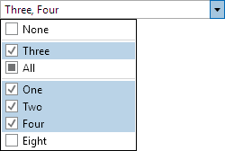

# EnumEditBox

The [EnumEditBox](xref:ActiproSoftware.Windows.Controls.Editors.EnumEditBox) control allows for the input of an `Enum` (flags and non-flags enumeration) value.  It uses the [EnumPicker](../pickers/enumpicker.md) control in its popup.



## Common Capabilities

Each of the features listed in the table below describe functionality that is common to most edit boxes.  Please see the [Edit Box Basics](parteditboxbase.md) topic for details on each of these options and how to set them.

| Feature | Description |
|-----|-----|
| Has a spinner | Yes, and can be hidden or optionally displayed only when the control is active. |
| Has a popup | Yes, and can be hidden or its picker appearance customized. |
| Null value allowed | Yes, and can be prevented. |
| Read-only mode supported | Yes. |
| Non-editable mode supported | Yes.  Non-editable by default. |
| Has multiple parts | No. |
| Placeholder text supported | Yes, and overlays the control. |
| Header content supported | Yes, and appears above the control. |
| Default spin behavior | Simple wrap. |

## Enumeration Value and Type

The [Value](xref:ActiproSoftware.Windows.Controls.Editors.Primitives.PartEditBoxBase`1.Value) property provides a quick and easy way to setup to the list box.  The [EnumType](xref:ActiproSoftware.Windows.Controls.Editors.EnumEditBox.EnumType) property is used to to build the items presented by the `EnumEditBox`. The items are constructed by reflecting the enumeration type, with full support for the `FlagsAttribute`.

When the [Value](xref:ActiproSoftware.Windows.Controls.Editors.Primitives.PartEditBoxBase`1.Value) property is bound/set to a non-null enumeration value, then the enumeration type will be automatically set (if it has not been explicitly set).  Therefore, the [EnumType](xref:ActiproSoftware.Windows.Controls.Editors.EnumEditBox.EnumType) only needs to be set when [Value](xref:ActiproSoftware.Windows.Controls.Editors.Primitives.PartEditBoxBase`1.Value) is bound to a nullable enumeration type.

## Using Display Attributes

Sometimes it is helpful to display an alternate text version of an enumeration value, especially when the values are made of multiple concatenated words.  For instance, an enumeration value named "FooBar" might appear nicer as "Foo Bar".

This scenario is fully supported by [EnumEditBox](xref:ActiproSoftware.Windows.Controls.Editors.EnumEditBox).  A `System.ComponentModel.DataAnnotations.DisplayAttribute` can be applied to a value to give it an alternate textual description.  Then as long as the [UseDisplayAttributes](xref:ActiproSoftware.Windows.Controls.Editors.EnumEditBox.UseDisplayAttributes) property is set to `true`, that alternate text will be used.

If the `DisplayAttribute.ResourceType` property is left blank, it will use the direct value specified by the `Name` property.  Otherwise, it will look in the specified resource `Type` for a localized resource value within the property indicated by `Name`.

In this example, the `DisplayAttribute` will look for a property named `MyFirstValue` in the string resources type `MyResources` and use that property's value:

```csharp
public enum SampleEnum {

	[Display(ResourceType = typeof(MyResources), Name = "MyFirstValue")]
	MyFirstValue = 1

	...
}
```

> [!NOTE]
> The WPF version of [EnumEditBox](xref:ActiproSoftware.Windows.Controls.Editors.EnumEditBox) also supports `System.ComponentModel.DescriptionAttribute` to supply textual descriptions in place of `System.ComponentModel.DataAnnotations.DisplayAttribute`.

## Custom Sorting

By default, values are listed in the order they are defined.  The exception is that in flags enums, group values get placed together.

Sorting can be altered by implementing a custom `IComparer<Enum>` class and assigning it to the [EnumSortComparer](xref:ActiproSoftware.Windows.Controls.Editors.EnumEditBox.EnumSortComparer) property.  The [EnumValueNameSortComparer](xref:ActiproSoftware.Windows.Controls.Editors.Primitives.EnumValueNameSortComparer).[Instance](xref:ActiproSoftware.Windows.Controls.Editors.Primitives.EnumValueNameSortComparer.Instance) static property provides access to a pre-built comparer for listing enumeration values alphabetically by name.

## Hiding Enumeration Values

By default, all values are listed in the control's popup and when cycling through values using arrow keys.  If you wish to hide a specific value from the end user, use `EditorBrowsableAttribute` on the value with `EditorBrowsableState.Never`.

In this example, the `EditorBrowsableAttribute` hides the `MyFirstValue` value from the user interface:

```csharp
public enum SampleEnum {

	[EditorBrowsable(EditorBrowsableState.Never)]
	MyFirstValue = 1

	...
}
```

## Parts and Incrementing/Decrementing

This edit box has a single part.

When the caret is over a part, the part value may be incremented or decremented as long as a single value is specified.  Please see the [Edit Box Basics](parteditboxbase.md) topic for information on how to do this.

## Sample XAML

This control can be placed within any other XAML container control, such as a `Page` or `Panel` with this sort of XAML:

```xaml
<editors:EnumEditBox Value="{Binding Path=YourVMProperty, Mode=TwoWay}" />
```
