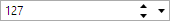
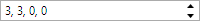
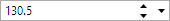
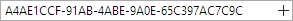
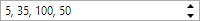
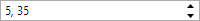
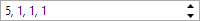
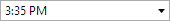
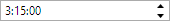

# Overview

Actipro Editors includes a number of edit boxes, which are controls that allow for the editing/selection of common data type values.  They are designed to visually fit right in with the standard Windows controls.

## Edit Box Basics

All of the edit box controls listed below share a base class that provides common core functionality.

See the [Edit Box Basics](parteditboxbase.md) topic for more information.

## Edit Box Controls

This table shows the edit box controls that are included in the product:

<table>
<thead>

<tr>
<th>Name</th>
<th>Description</th>
</tr>

</thead>
<tbody>

<tr>
<td>

[BrushEditBox](brusheditbox.md)

</td>
<td>

Allows for the input of a `Brush` value.

</td>
</tr>

<tr>
<td>

[ByteEditBox](byteeditbox.md)

</td>
<td>

Allows for the input of a `Byte` (8-bit positive integer) value.

</td>
</tr>

<tr>
<td>

[ColorEditBox](coloreditbox.md)

</td>
<td>

Allows for the input of a `Color` value.

</td>
</tr>

<tr>
<td>

[CornerRadiusEditBox](cornerradiuseditbox.md)

</td>
<td>

Allows for the input of a `CornerRadius` (top-left, top-right, bottom-right, bottom-left) value.

</td>
</tr>

<tr>
<td>

[DateEditBox](dateeditbox.md)

</td>
<td>

Allows for the input of a `DateTime` value's date component.

</td>
</tr>

<tr>
<td>

[DateTimeEditBox](datetimeeditbox.md)

</td>
<td>

Allows for the input of a `DateTime` value.

</td>
</tr>

<tr>
<td>

[DoubleEditBox](doubleeditbox.md)

</td>
<td>

Allows for the input of a `Double` (floating-point number) value.

</td>
</tr>

<tr>
<td>

[EnumEditBox](enumeditbox.md)

</td>
<td>

Allows for the input of an `Enum` (flags and non-flags enumeration) value.

</td>
</tr>

<tr>
<td>

[GuidEditBox](guideditbox.md)

</td>
<td>

Allows for the input of a `Guid` (unique ID) value.

</td>
</tr>

<tr>
<td>

[Int16EditBox](int16editbox.md)

</td>
<td>

Allows for the input of an `Int16` (16-bit integer) value.

</td>
</tr>

<tr>
<td>

[Int32EditBox](int32editbox.md)

</td>
<td>

Allows for the input of an `Int32` (32-bit integer) value.

</td>
</tr>

<tr>
<td>

[Int32RectEditBox](int32recteditbox.md)

</td>
<td>

Allows for the input of an `Int32Rect` (X, Y, width, height) value.

</td>
</tr>

<tr>
<td>

[Int64EditBox](int64editbox.md)

</td>
<td>

Allows for the input of an `Int64` (64-bit integer) value.

</td>
</tr>

<tr>
<td>

[PointEditBox](pointeditbox.md)

</td>
<td>

Allows for the input of a `Point` (X, Y) value.

</td>
</tr>

<tr>
<td>

[RectEditBox](recteditbox.md)

</td>
<td>

Allows for the input of a `Rect` (X, Y, width, height) value.

</td>
</tr>

<tr>
<td>

[SingleEditBox](singleeditbox.md)

</td>
<td>

Allows for the input of a `Single` (floating-point number) value.

</td>
</tr>

<tr>
<td>

[SizeEditBox](sizeeditbox.md)

</td>
<td>

Allows for the input of a `Size` (width, height) value.

</td>
</tr>

<tr>
<td>

[ThicknessEditBox](thicknesseditbox.md)

</td>
<td>

Allows for the input of a `Thickness` (left, top, right, bottom) value.

</td>
</tr>

<tr>
<td>

[TimeEditBox](timeeditbox.md)

</td>
<td>

Allows for the input of a `DateTime` value's time component.

</td>
</tr>

<tr>
<td>

[TimeSpanEditBox](timespaneditbox.md)

</td>
<td>

Allows for the input of a `TimeSpan` (days, hours, minutes, seconds, milliseconds) value.

</td>
</tr>

<tr>
<td>

[VectorEditBox](vectoreditbox.md)

</td>
<td>

Allows for the input of a `Vector` (X, Y) value.

</td>
</tr>

</tbody>
</table>
