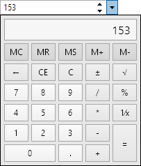

# Int16EditBox

The [Int16EditBox](xref:ActiproSoftware.Windows.Controls.Editors.Int16EditBox) control allows for the input of an `Int16` (16-bit integer) value.  It uses the [Int16Picker](../pickers/int16picker.md) control in its popup.


## Common Capabilities

Each of the features listed in the table below describe functionality that is common to most edit boxes.  Please see the [Edit Box Basics](parteditboxbase.md) topic for details on each of these options and how to set them.

| Feature | Description |
|-----|-----|
| Has a spinner | Yes, and can be hidden or optionally displayed only when the control is active. |
| Has a popup | Yes, and can be hidden or its picker appearance customized. |
| Null value allowed | Yes, and can be prevented. |
| Read-only mode supported | Yes. |
| Non-editable mode supported | Yes. |
| Has multiple parts | No. |
| Placeholder text supported | Yes, and overlays the control. |
| Header content supported | Yes, and appears above the control. |
| Default spin behavior | No wrap. |

## Number Formats

[Standard .NET numeric formats](https://docs.microsoft.com/en-us/dotnet/standard/base-types/standard-numeric-format-strings) are supported via the [Format](xref:ActiproSoftware.Windows.Controls.Editors.Int16EditBox.Format) property and affect the textual value display.  These formats are recommended:

- C0 (currency without decimals)
- D
- Dx, where x is the number of zero-padded digits (e.g. D3)
- G
- N0
- X (uppercase hexadecimal)
- x (lowercase hexadecimal)

Basic custom numeric formats are also supported, such as:

- 0' days'

## Minimum and Maximum Values

Minimum and maximum values may be assigned via the [Maximum](xref:ActiproSoftware.Windows.Controls.Editors.Int16EditBox.Maximum) and [Minimum](xref:ActiproSoftware.Windows.Controls.Editors.Int16EditBox.Minimum) properties.

No values can be committed that lay outside of the inclusive range created by those properties.

## Parts and Incrementing/Decrementing

This edit box has a single part.

When the caret is over a part, the part value may be incremented or decremented.  Please see the [Edit Box Basics](parteditboxbase.md) topic for information on how to do this.

Small value changes alter the current number component by `1`, which is the default for the [SmallChange](xref:ActiproSoftware.Windows.Controls.Editors.Int16EditBox.SmallChange) property.  Large value changes alter the current number component by `5`, which is the default for the [LargeChange](xref:ActiproSoftware.Windows.Controls.Editors.Int16EditBox.LargeChange) property.

The [DefaultValue](xref:ActiproSoftware.Windows.Controls.Editors.Int16EditBox.DefaultValue) property sets the value that will be set when incrementing or decrementing from a null value.

## Built-in Picker Kinds

This edit box has multiple built-in picker kinds that can be set via the [Int16EditBox](xref:ActiproSoftware.Windows.Controls.Editors.Int16EditBox).[PickerKind](xref:ActiproSoftware.Windows.Controls.Editors.Int16EditBox.PickerKind) property, which is of type [Int16EditBoxPickerKind](xref:ActiproSoftware.Windows.Controls.Editors.Int16EditBoxPickerKind).

The default value in WPF is `Calculator`.

The `Default` picker kind renders using a radial slider, while the `Calculator` picker kind utilizes the [Calculator](../other-controls/calculator.md) control.



## Sample XAML

This control can be placed within any other XAML container control, such as a `Page` or `Panel` with this sort of XAML:

```xaml
<editors:Int16EditBox Value="{Binding Path=YourVMProperty, Mode=TwoWay}" />
```
