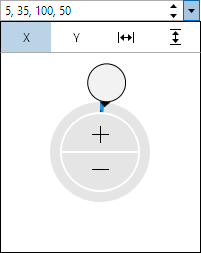

# Int32RectEditBox

The [Int32RectEditBox](xref:@ActiproUIRoot.Controls.Editors.Int32RectEditBox) control allows for the input of an `Int32Rect` (X, Y, width, height) value.  It uses the [Int32RectPicker](../pickers/int32rectpicker.md) control in its popup.



## Common Capabilities

Each of the features listed in the table below describe functionality that is common to most edit boxes.  Please see the [Edit Box Basics](parteditboxbase.md) topic for details on each of these options and how to set them.

<table>
<thead>

<tr>
<th>Feature</th>
<th>Description</th>
</tr>

</thead>
<tbody>

<tr>
<td>Has a spinner</td>
<td>Yes, and can be hidden or optionally displayed only when the control is active.</td>
</tr>

<tr>
<td>Has a popup</td>
<td>Yes, and can be hidden or its picker appearance customized.</td>
</tr>

<tr>
<td>Null value allowed</td>
<td>Yes, and can be prevented.</td>
</tr>

<tr>
<td>Read-only mode supported</td>
<td>Yes.</td>
</tr>

<tr>
<td>Non-editable mode supported</td>
<td>Yes.</td>
</tr>

<tr>
<td>Has multiple parts</td>
<td>Yes, and supports optional arrow key navigation.</td>
</tr>

<tr>
<td>Placeholder text supported</td>
<td>Yes, and overlays the control.</td>
</tr>

<tr>
<td>Header content supported</td>
<td>Yes, and appears above the control.</td>
</tr>

<tr>
<td>Default spin behavior</td>
<td>No wrap.</td>
</tr>

<tr>
<td>Input filtering</td>
<td>Yes, as noted below.</td>
</tr>

</tbody>
</table>

## Number Formats

[Standard .NET numeric formats](https://docs.microsoft.com/en-us/dotnet/standard/base-types/standard-numeric-format-strings) are supported via the [Format](xref:@ActiproUIRoot.Controls.Editors.Int32RectEditBox.Format) property and affect the textual value display.  These formats are recommended:

- `"D"`
- `"Dx"`, where x is the number of digits (e.g., `"D2"`)
- `"G"`

Composite numeric formats (e.g., `"{0:D}"`) are also supported.

## Minimum and Maximum Values

Minimum and maximum values may be assigned via the [Maximum](xref:@ActiproUIRoot.Controls.Editors.Int32RectEditBox.Maximum) and [Minimum](xref:@ActiproUIRoot.Controls.Editors.Int32RectEditBox.Minimum) properties.

No values can be committed that lay outside of the inclusive range created by those properties.

## Parts and Incrementing/Decrementing

This edit box has multiple parts:

- X
- Y
- Width
- Height

When the caret is over a part, the part value may be incremented or decremented.  Please see the [Edit Box Basics](parteditboxbase.md) topic for information on how to do this.

Small value changes alter the current number component by `1`, which is the default for the [SmallChange](xref:@ActiproUIRoot.Controls.Editors.Int32RectEditBox.SmallChange) property.  Large value changes alter the current number component by `5`, which is the default for the [LargeChange](xref:@ActiproUIRoot.Controls.Editors.Int32RectEditBox.LargeChange) property.

The [DefaultValue](xref:@ActiproUIRoot.Controls.Editors.Int32RectEditBox.DefaultValue) property sets the value that will be set when incrementing or decrementing from a `null` value.

## Input Filtering

When [IsInputFilteringEnabled](xref:@ActiproUIRoot.Controls.Editors.Primitives.PartEditBoxBase`1.IsInputFilteringEnabled) is set to `true`, only the following text may be entered into the edit box:
- Valid input for a numeric part based on the current format.
- The part separator character `,` (or `;` if the current culture uses `,` as the decimal separator).
- The space character.

Please see the [Edit Box Basics](parteditboxbase.md) topic for additional details input filtering.

## Sample XAML

This control can be placed within any other XAML container control, such as a `Page` or `Panel` with this sort of XAML:

```xaml
<editors:Int32RectEditBox Value="{Binding Path=YourVMProperty, Mode=TwoWay}" />
```
