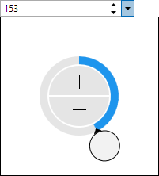
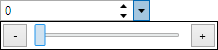

# Edit Box Basics

All of the edit box controls share a [PartEditBoxBase<T>](xref:@ActiproUIRoot.Controls.Editors.Primitives.PartEditBoxBase`1) base class that provides common core functionality.

## Designed for Keyboard, Mouse, and Touch Input

Unlike many other third-party editor controls, the Actipro Editors have been specifically designed to work great for whichever form of input (keyboard, mouse, or touch) is utilized by the end user.

Each editor's main appearance is similar to a standard `TextBox`, where the value can be typed in via a keyboard for maximum efficiency.  Certain keyboard keys and the mouse wheel can often be used to increment/cycle values.  See the related section below for more information.

Most editors also contain a default popup picker that is geared for mouse and touch-based input.  The popup can easily be invoked by tapping the edit box's drop-down button, if it is optionally displayed.

## Values

The [Value](xref:@ActiproUIRoot.Controls.Editors.Primitives.PartEditBoxBase`1.Value) property gets/sets the value that is being edited by the edit box.  When using an edit box in your UI, you generally want to bind this property to your view model via two-way binding.

As the user types in a value, the temporary value derived from the text being typed is available in the [IntermediateValue](xref:@ActiproUIRoot.Controls.Editors.Primitives.PartEditBoxBase`1.IntermediateValue) property.  This intermediate value gets "committed" (or set to the [Value](xref:@ActiproUIRoot.Controls.Editors.Primitives.PartEditBoxBase`1.Value) property) by default when <kbd>Enter</kbd> is pressed, a spin occurs, or the control loses focus.  The [CommitTriggers](xref:@ActiproUIRoot.Controls.Editors.Primitives.PartEditBoxBase`1.CommitTriggers) property has enumeration flags to determine exactly what triggers a commit.  Modify this property if you wish to commit immediately whenever typing occurs.  There also is a [Commit](xref:@ActiproUIRoot.Controls.Editors.Primitives.PartEditBoxBase`1.Commit*) method that will programmatically commit the intermediate value.  In the event that a typed value isn't desired, the user can press <kbd>Esc</kbd> to revert back to the last committed value.

When the [Value](xref:@ActiproUIRoot.Controls.Editors.Primitives.PartEditBoxBase`1.Value) property is changed, the `ValueChanged` event is raised.

## Null Values

The [IsNullAllowed](xref:@ActiproUIRoot.Controls.Editors.Primitives.PartEditBoxBase`1.IsNullAllowed) property determines if a `null` value is permitted.  It can be set to `false` to designate that a non-`null` value is required.

Many of the [Value](xref:@ActiproUIRoot.Controls.Editors.Primitives.PartEditBoxBase`1.Value) properties are implemented as nullable types.  For instance, the [Int32EditBox](xref:@ActiproUIRoot.Controls.Editors.Int32EditBox).[Value](xref:@ActiproUIRoot.Controls.Editors.Primitives.PartEditBoxBase`1.Value) property is of type `Nullable<Int32>`.  When [IsNullAllowed](xref:@ActiproUIRoot.Controls.Editors.Primitives.PartEditBoxBase`1.IsNullAllowed) is `false`, an integer will always be returned in the `Value` property and the control will make its default value show `0` instead of blank text.

## Value Validation

Value validation occurs when the user types in a value and attempts to commit it.  In this scenario, the protected [TryConvertFromString](xref:@ActiproUIRoot.Controls.Editors.Primitives.PartEditBoxBase`1.TryConvertFromString*) method is called and the edit box attempts to convert the typed text into a value.  Then that value is checked via a call to the [IsValidValue](xref:@ActiproUIRoot.Controls.Editors.Primitives.PartEditBoxBase`1.IsValidValue*) method.  If no conversion is possible or if the value fails validation, the value is not committed.

Custom conversion and validation logic can be implemented by overriding the [TryConvertFromString](xref:@ActiproUIRoot.Controls.Editors.Primitives.PartEditBoxBase`1.TryConvertFromString*) and its related [ConvertToString](xref:@ActiproUIRoot.Controls.Editors.Primitives.PartEditBoxBase`1.ConvertToString*) method.

## Incrementing/Cycling Values

<kbd>Up Arrow</kbd>/<kbd>Down Arrow</kbd> keys, <kbd>PgUp</kbd>/<kbd>PgDn</kbd> keys, and the mouse wheel can all be used to increment and decrement the value in many edit boxes.

The <kbd>Up Arrow</kbd>/<kbd>Down Arrow</kbd> keys and mouse wheel will cycle values by a small amount (in the case of numbers) and <kbd>PgUp</kbd>/<kbd>PgDn</kbd> keys will cycle values by a larger amount.  For numbers, holding the <kbd>Shift</kbd> key while pressing the <kbd>Up Arrow</kbd>/<kbd>Down Arrow</kbd> keys or using the mouse wheel will also cycle values by a larger amount.

The [SpinWrapping](xref:@ActiproUIRoot.Controls.Editors.Primitives.PartEditBoxBase`1.SpinWrapping) property determines the wrapping behavior used when spinning past a minimum or maximum value in the active part.  See the documentation on the [SpinWrapping](xref:@ActiproUIRoot.Controls.Editors.SpinWrapping) enumeration for more information on the available options.

All edit boxes have a protected virtual [CreateIncrementalChangeRequest](xref:@ActiproUIRoot.Controls.Editors.Primitives.PartEditBoxBase`1.CreateIncrementalChangeRequest*) method that is called when any kind of incremental change is requested.  Each edit box's default implementation of that method creates an [IncrementalChangeRequest<T>](xref:@ActiproUIRoot.Controls.Editors.Primitives.IncrementalChangeRequest`1) instance that passes along information like the current value, small/large change amounts, minimum/maximum, etc. to the core increment logic.  While this works great for most cases, there may be cases where the small/large change amounts need to be dynamically-altered based on the current value.  In these scenarios, override the method and adjust the properties of the returned [IncrementalChangeRequest<T>](xref:@ActiproUIRoot.Controls.Editors.Primitives.IncrementalChangeRequest`1) instance.

## Moving Between Parts

Some edit boxes have multiple component parts.  An example is the [TimeEditBox](xref:@ActiproUIRoot.Controls.Editors.TimeEditBox), which generally has hour, minute, and AM/PM parts.


For these types of edit boxes, the [IsArrowKeyPartNavigationEnabled](xref:@ActiproUIRoot.Controls.Editors.Primitives.PartEditBoxBase`1.IsArrowKeyPartNavigationEnabled) property determines if the <kbd>Left Arrow</kbd>/<kbd>Right Arrow</kbd> keys move between parts.  When `true`, pressing one of those arrow keys will move to the previous/next part and select its text.  This makes it easy to quickly jump to a certain component of the value being edited and then either type over that component value or increment/cycle it.

## Input Scope Hints

The [InputScopeNameValue](xref:@ActiproUIRoot.Controls.Editors.Primitives.PartEditBoxBase`1.InputScopeNameValue) property accepts a value of type `InputScopeNameValue`, which provides a hint of how non-read-only edit boxes should display their soft keyboards.  Edit boxes with number, date, and time values will default to a `Number` setting, while all others will use the `Default` setting.

## Read-Only Mode

When the [IsReadOnly](xref:@ActiproUIRoot.Controls.Editors.Primitives.PartEditBoxBase`1.IsReadOnly) property is `true`, the text in the edit box remains selectable but is read-only and can't be changed.  Some edit boxes may still show a popup but the picker on the popup will remain read-only as well.

## Non-Editable Mode

When the [IsEditable](xref:@ActiproUIRoot.Controls.Editors.Primitives.PartEditBoxBase`1.IsEditable) property is `false`, the edit box converts its appearance and behavior to that of a standard `ComboBox` as long as the edit box indicates it has a popup.  Tapping anywhere on the edit box will open an available popup, if there is one.  The popup can be used to alter the value.

<kbd>Up Arrow</kbd>/<kbd>Down Arrow</kbd> keys, <kbd>PgUp</kbd>/<kbd>PgDn</kbd> keys, and the mouse wheel can be used to increment and decrement the value in non-editable edit boxes that have a single part.

When in non-editable mode, the standard clipboard keyboard shortcuts (<kbd>Ctrl</kbd>+<kbd>C</kbd>, <kbd>Ctrl</kbd>+<kbd>X</kbd>, and <kbd>Ctrl</kbd>+<kbd>V</kbd>) are available to get/set the text value of the edit box.  Cut and paste will not modify the value if the control is in read-only mode.

@if (winrt) {

## Clear Button

A clear button (with X icon) normally appears when the control has focus (in Windows apps) or all the time (in Windows Phone apps).  The button can be tapped to clear or reset the value in the edit box, which is done via a call to the protected [ResetValue](xref:@ActiproUIRoot.Controls.Editors.Primitives.PartEditBoxBase`1.ResetValue*) method.

The clear button can be hidden by setting the [HasClearButton](xref:@ActiproUIRoot.Controls.Editors.Primitives.PartEditBoxBase`1.HasClearButton) property to `false`.

}

## Popups and Picker Customization

Most edit boxes have popups that can optionally be displayed, which contain pickers that are geared for mouse/touch data input.  If a popup is available, a drop-down button will be displayed in the right side of the edit box.  This drop-down button can be hidden by setting the [HasPopup](xref:@ActiproUIRoot.Controls.Editors.Primitives.PartEditBoxBase`1.HasPopup) property to `false`.



Each edit box with a popup has a default picker control associated with it.  For instance, the [Int32EditBox](xref:@ActiproUIRoot.Controls.Editors.Int32EditBox) control has a related separate [Int32Picker](xref:@ActiproUIRoot.Controls.Editors.Int32Picker) control that is used in its popup.  The edit box and pickers are named with the same prefix so that it's easy to know how they are paired up.



A custom picker style can be easily assigned to an edit box to give the picker a unique custom user interface.  In the screenshot above, we've made a new `Style` for [Int32Picker](xref:@ActiproUIRoot.Controls.Editors.Int32Picker) that uses a linear slider and assigned that style to the [Int32EditBox](xref:@ActiproUIRoot.Controls.Editors.Int32EditBox).[PopupPickerStyle](xref:@ActiproUIRoot.Controls.Editors.Primitives.PartEditBoxBase`1.PopupPickerStyle) property.

## Placeholder Text

Edit boxes support placeholder text that is rendered when there is no value in the control.  This text can be designated via the [PlaceholderText](xref:@ActiproUIRoot.Controls.Editors.Primitives.PartEditBoxBase`1.PlaceholderText) property.


@if (winrt) {

## Header

Header content that optionally appears above the control can also be used to label what data the control is collecting.  This header content is set via the [Header](xref:@ActiproUIRoot.Controls.Editors.Primitives.PartEditBoxBase`1.Header) and [HeaderTemplate](xref:@ActiproUIRoot.Controls.Editors.Primitives.PartEditBoxBase`1.HeaderTemplate) properties.

}

@if (wpf) {

## Disabling Undo/Redo

The [IsUndoEnabled](xref:@ActiproUIRoot.Controls.Editors.Primitives.PartEditBoxBase`1.IsUndoEnabled) property, which defaults to `true`, can be set to `false` to prevent the text-editing portion of the control from supporting undo/redo.

}

## Inline UI Elements

Edit boxes support the insertion of inline UI elements.  For instance, you can inject a unit `TextBlock` in a [DoubleEditBox](doubleeditbox.md), or a button that sets the current time in a [TimeEditBox](timeeditbox.md).

Inlines are specified via instances of the [PartEditBoxInline](xref:@ActiproUIRoot.Controls.Editors.PartEditBoxInline) class.  The class requires that you set a `DataTemplate` to its [ContentTemplate](xref:@ActiproUIRoot.Controls.Editors.PartEditBoxInline.ContentTemplate) property.  This `DataTemplate` will contain the UI elements for the inline.

The `ContentPresenter` that is generated behind the scenes to host the `DataTemplate` will have a `WeakReference` to the edit box as its `Content`/`DataContext`.  We cannot pass the edit box control itself as `Content` since this `ContentPresenter` is inserted into the edit box, which could lead to issues with the framework.  By passing a `WeakReference`, we can still provide the edit box as a data context while not triggering any framework issues.  The distinction here is that you need to reference any properties on the edit box by prefixing the `Path` with `"Target."`, as in the example below.

@if (winrt) {

This example shows how to insert a **Now** button into a [TimeEditBox](timeeditbox.md) that uses the built-in [SetValueToNowCommand](xref:@ActiproUIRoot.Controls.Editors.DateTimeEditBox.SetValueToNowCommand).

```xaml
<editors:TimeEditBox>
	<editors:TimeEditBox.Inlines>
		<editors:PartEditBoxInlineCollection>
			<editors:PartEditBoxInline>
				<DataTemplate>
					<Button Content="Now" Command="{Binding Target.SetValueToNowCommand}"
							Padding="4,0" FontSize="10" Background="Transparent" VerticalAlignment="Stretch" />
				</DataTemplate>
			</editors:PartEditBoxInline>
		</editors:PartEditBoxInlineCollection>
	</editors:TimeEditBox.Inlines>
</editors:TimeEditBox>
```

}

@if (wpf) {

This example shows how to insert a **Now** button into a [TimeEditBox](timeeditbox.md) that uses the built-in [SetValueToNowCommand](xref:@ActiproUIRoot.Controls.Editors.DateTimeEditBox.SetValueToNowCommand).

```xaml
<editors:TimeEditBox>
	<editors:TimeEditBox.Inlines>
		<editors:PartEditBoxInlineCollection>
			<editors:PartEditBoxInline>
				<DataTemplate>
					<Button Content="Now" Command="{Binding Target.SetValueToNowCommand}"
							Style="{StaticResource {x:Static themes:SharedResourceKeys.EmbeddedButtonBaseStyleKey}}"
							Padding="4,0" VerticalAlignment="Stretch" />
				</DataTemplate>
			</editors:PartEditBoxInline>
		</editors:PartEditBoxInlineCollection>
	</editors:TimeEditBox.Inlines>
</editors:TimeEditBox>
```

}

A similar [SetValueToTodayCommand](xref:@ActiproUIRoot.Controls.Editors.DateTimeEditBox.SetValueToTodayCommand) could also be used in a [DateEditBox](dateeditbox.md) to change the value to today's date.

## Appearances That Match Native Controls

The edit boxes have been carefully crafted to match the standard UI of related native controls found in Windows.


Above we see how a [ColorEditBox](xref:@ActiproUIRoot.Controls.Editors.ColorEditBox) fits right in with any standard Windows app `TextBox` or `ComboBox`.
