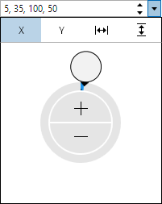

# RectEditBox

The [RectEditBox](xref:ActiproSoftware.Windows.Controls.Editors.RectEditBox) control allows for the input of a `Rect` (X, Y, width, height) value.  It uses the [RectPicker](../pickers/rectpicker.md) control in its popup.



## Common Capabilities

Each of the features listed in the table below describe functionality that is common to most edit boxes.  Please see the [Edit Box Basics](parteditboxbase.md) topic for details on each of these options and how to set them.

| Feature | Description |
|-----|-----|
| Has a spinner | Yes, and can be hidden or optionally displayed only when the control is active. |
| Has a popup | Yes, and can be hidden or its picker appearance customized. |
| Null value allowed | Yes, and can be prevented. |
| Read-only mode supported | Yes. |
| Non-editable mode supported | Yes. |
| Has multiple parts | Yes, and supports optional arrow key navigation. |
| Placeholder text supported | Yes, and overlays the control. |
| Header content supported | Yes, and appears above the control. |
| Default spin behavior | No wrap. |

## Number Formats

[Standard .NET numeric formats](https://docs.microsoft.com/en-us/dotnet/standard/base-types/standard-numeric-format-strings) are supported via the [Format](xref:ActiproSoftware.Windows.Controls.Editors.RectEditBox.Format) property and affect the textual value display.  These formats are recommended:

- F
- Fx, where x is the number of decimal places (e.g. F1)
- G

## Minimum and Maximum Values

Minimum and maximum values may be assigned via the [Maximum](xref:ActiproSoftware.Windows.Controls.Editors.RectEditBox.Maximum) and [Minimum](xref:ActiproSoftware.Windows.Controls.Editors.RectEditBox.Minimum) properties.

No values can be committed that lay outside of the inclusive range created by those properties.

## Parts and Incrementing/Decrementing

This edit box has multiple parts:

- X
- Y
- Width
- Height

When the caret is over a part, the part value may be incremented or decremented.  Please see the [Edit Box Basics](parteditboxbase.md) topic for information on how to do this.

Small value changes alter the current number component by `1`, which is the default for the [SmallChange](xref:ActiproSoftware.Windows.Controls.Editors.RectEditBox.SmallChange) property.  Large value changes alter the current number component by `5`, which is the default for the [LargeChange](xref:ActiproSoftware.Windows.Controls.Editors.RectEditBox.LargeChange) property.

The [DefaultValue](xref:ActiproSoftware.Windows.Controls.Editors.RectEditBox.DefaultValue) property sets the value that will be set when incrementing or decrementing from a null value.

## Rounding Decimal Places

The [RoundingDecimalPlace](xref:ActiproSoftware.Windows.Controls.Editors.RectEditBox.RoundingDecimalPlace) property determines the maximum decimal place at which to round floating-point numbers.  It defaults to `8`, but can be set to any value in the range `0` to `15`.  Or set the value to `null` to prevent rounding.

## Allowing NaN or Infinity Values

Text entry of `NaN` (not-a-number) and infinity component values into the edit box is not allowed by default.

Set the [IsNaNAllowed](xref:ActiproSoftware.Windows.Controls.Editors.RectEditBox.IsNaNAllowed) property to `true` to allow a `NaN` value to be entered by typing the letter 'n'.

Set the [IsNegativeInfinityAllowed](xref:ActiproSoftware.Windows.Controls.Editors.RectEditBox.IsNegativeInfinityAllowed) property to `true` to allow a negative infinity value to be entered by typing a negative sign and then the letter 'i'.

Set the [IsPositiveInfinityAllowed](xref:ActiproSoftware.Windows.Controls.Editors.RectEditBox.IsPositiveInfinityAllowed) property to `true` to allow a positive infinity value to be entered by typing the letter 'i'.

## Sample XAML

This control can be placed within any other XAML container control, such as a `Page` or `Panel` with this sort of XAML:

```xaml
<editors:RectEditBox Value="{Binding Path=YourVMProperty, Mode=TwoWay}" />
```
