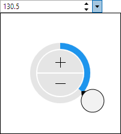
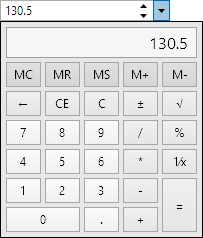

# SingleEditBox

The [SingleEditBox](xref:@ActiproUIRoot.Controls.Editors.SingleEditBox) control allows for the input of a `Single` (floating-point number) value.  It uses the [SinglePicker](../pickers/singlepicker.md) control in its popup.



## Common Capabilities

Each of the features listed in the table below describe functionality that is common to most edit boxes.  Please see the [Edit Box Basics](parteditboxbase.md) topic for details on each of these options and how to set them.

<table>
<thead>

<tr>
<th>Feature</th>
<th>Description</th>
</tr>

</thead>
<tbody>

@if (winrt) {
<tr>
<td>Has a clear button</td>
<td>Yes, and can be hidden.</td>
</tr>
}

@if (wpf) {
<tr>
<td>Has a spinner</td>
<td>Yes, and can be hidden or optionally displayed only when the control is active.</td>
</tr>
}

<tr>
<td>Has a popup</td>
<td>Yes, and can be hidden or its picker appearance customized.</td>
</tr>

<tr>
<td>Null value allowed</td>
<td>Yes, and can be prevented.</td>
</tr>

<tr>
<td>Read-only mode supported</td>
<td>Yes.</td>
</tr>

<tr>
<td>Non-editable mode supported</td>
<td>Yes.</td>
</tr>

<tr>
<td>Has multiple parts</td>
<td>No.</td>
</tr>

<tr>
<td>Placeholder text supported</td>
<td>Yes, and overlays the control.</td>
</tr>

<tr>
<td>Header content supported</td>
<td>Yes, and appears above the control.</td>
</tr>

<tr>
<td>Default spin behavior</td>
<td>No wrap.</td>
</tr>

</tbody>
</table>

## Number Formats

[Standard .NET numeric formats](https://docs.microsoft.com/en-us/dotnet/standard/base-types/standard-numeric-format-strings) are supported via the [Format](xref:@ActiproUIRoot.Controls.Editors.SingleEditBox.Format) property and affect the textual value display.  These formats are recommended:

- C (currency)
- F
- Fx, where x is the number of decimal places (e.g. F1)
- G
- N
- Nx, where x is the number of decimal places (e.g. N1)
- P (percentage)

Basic custom numeric formats are also supported, such as:

- 0.0#' ft'

## Minimum and Maximum Values

Minimum and maximum values may be assigned via the [Maximum](xref:@ActiproUIRoot.Controls.Editors.SingleEditBox.Maximum) and [Minimum](xref:@ActiproUIRoot.Controls.Editors.SingleEditBox.Minimum) properties.

No values can be committed that lay outside of the inclusive range created by those properties.

## Parts and Incrementing/Decrementing

This edit box has a single part.

When the caret is over a part, the part value may be incremented or decremented.  Please see the [Edit Box Basics](parteditboxbase.md) topic for information on how to do this.

Small value changes alter the current number component by `1`, which is the default for the [SmallChange](xref:@ActiproUIRoot.Controls.Editors.SingleEditBox.SmallChange) property.  Large value changes alter the current number component by `5`, which is the default for the [LargeChange](xref:@ActiproUIRoot.Controls.Editors.SingleEditBox.LargeChange) property.

The [DefaultValue](xref:@ActiproUIRoot.Controls.Editors.SingleEditBox.DefaultValue) property sets the value that will be set when incrementing or decrementing from a null value.

## Rounding Decimal Places

The [RoundingDecimalPlace](xref:@ActiproUIRoot.Controls.Editors.SingleEditBox.RoundingDecimalPlace) property determines the maximum decimal place at which to round floating-point numbers.  It defaults to `7`, but can be set to any value in the range `0` to `7`.  Or set the value to `null` to prevent rounding.

## Allowing NaN or Infinity Values

Text entry of `NaN` (not-a-number) and infinity values into the edit box is not allowed by default.

Set the [IsNaNAllowed](xref:@ActiproUIRoot.Controls.Editors.SingleEditBox.IsNaNAllowed) property to `true` to allow a `NaN` value to be entered by typing the letter 'n'.

Set the [IsNegativeInfinityAllowed](xref:@ActiproUIRoot.Controls.Editors.SingleEditBox.IsNegativeInfinityAllowed) property to `true` to allow a negative infinity value to be entered by typing a negative sign and then the letter 'i'.

Set the [IsPositiveInfinityAllowed](xref:@ActiproUIRoot.Controls.Editors.SingleEditBox.IsPositiveInfinityAllowed) property to `true` to allow a positive infinity value to be entered by typing the letter 'i'.

## Sample XAML

This control can be placed within any other XAML container control, such as a `Page` or `Panel` with this sort of XAML:

```xaml
<editors:SingleEditBox Value="{Binding Path=YourVMProperty, Mode=TwoWay}" />
```

## Built-in Picker Kinds

This edit box has multiple built-in picker kinds that can be set via the [SingleEditBox](xref:@ActiproUIRoot.Controls.Editors.SingleEditBox).[PickerKind](xref:@ActiproUIRoot.Controls.Editors.SingleEditBox.PickerKind) property, which is of type [SingleEditBoxPickerKind](xref:@ActiproUIRoot.Controls.Editors.SingleEditBoxPickerKind).

@if (wpf) {

The default value in WPF is `Calculator`. 

}

@if (winrt) {

The default value in UWP is `Default`. 

}

The `Default` picker kind renders using a radial slider, while the `Calculator` picker kind utilizes the [Calculator](../other-controls/calculator.md) control.



## Sample XAML for Currency Input


This control is great for currency input, which can be implemented with this XAML:

```xaml
<editors:SingleEditBox Format="C" Value="{Binding Path=YourVMProperty, Mode=TwoWay}" />
```
