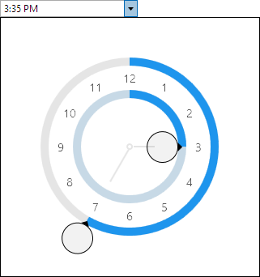

# TimeEditBox

The [TimeEditBox](xref:ActiproSoftware.Windows.Controls.Editors.TimeEditBox) control allows for the input of a `DateTime` value's time component.  It uses the [TimePicker](../pickers/timepicker.md) control in its popup.



## Common Capabilities

Each of the features listed in the table below describe functionality that is common to most edit boxes.  Please see the [Edit Box Basics](parteditboxbase.md) topic for details on each of these options and how to set them.

| Feature | Description |
|-----|-----|
| Has a spinner | Yes, and can be hidden or optionally displayed only when the control is active. |
| Has a popup | Yes, and can be hidden or its picker appearance customized. |
| Null value allowed | Yes, and can be prevented. |
| Read-only mode supported | Yes. |
| Non-editable mode supported | Yes. |
| Has multiple parts | Yes, and supports optional arrow key navigation. |
| Placeholder text supported | Yes, and overlays the control. |
| Header content supported | Yes, and appears above the control. |
| Default spin behavior | Wrap. |

## Formats

Standard time formats are supported via the [Format](xref:ActiproSoftware.Windows.Controls.Editors.DateTimeEditBox.Format) property and affect the textual value display.  These formats are recommended:

- t
- T
- hh:mm tt
- h:mm:ss tt
- HH:mm:ss
- HH:mm

## Minimum and Maximum Values

Minimum and maximum values may be assigned via the [Maximum](xref:ActiproSoftware.Windows.Controls.Editors.DateTimeEditBox.Maximum) and [Minimum](xref:ActiproSoftware.Windows.Controls.Editors.DateTimeEditBox.Minimum) properties.

No values can be committed that lay outside of the inclusive range created by those properties.

## Parts and Incrementing/Decrementing

This edit box has multiple parts:

- Hour
- Minute
- Second
- AM/PM

When the caret is over a part, the part value may be incremented or decremented.  Please see the [Edit Box Basics](parteditboxbase.md) topic for information on how to do this.

## Sample XAML

This control can be placed within any other XAML container control, such as a `Page` or `Panel` with this sort of XAML:

```xaml
<editors:TimeEditBox Value="{Binding Path=YourVMProperty, Mode=TwoWay}" />
```
