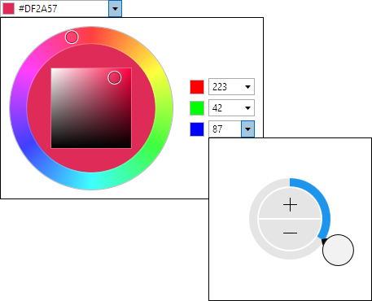

# Overview

Actipro Editors provide a number of edit controls for common .NET data types such as dates, times, numbers, brushes, colors, enumerations, sizes, and many more.  Other miscellaneous controls include a regex-based masked textbox, auto-complete box, calculator, month calendar, star rating, gradient stop slider, and various color component pickers.

Each of the controls features unique designs that have been specifically crafted to support input by keyboard, mouse, and touch.  The control appearances align with other native controls, allowing them to be dropped right into an app and be instantly approachable by end users.

## Features

### Edit Boxes

- Common Features
  
  - Ability to type values directly in, or use mouse/touch to show advanced picker drop-downs.
  - Typed-in values are validated when committed.
  - Use up/down arrow and PgUp/PgDn keys to cycle through known values in a current part.
  - Use left/right arrow keys to move between parts in multi-part edit boxes.
  - Optional null value support.
  - Optional clear and popup buttons.
  - Optional read-only mode.
  - Optional non-editable mode, changing behavior to be similar to a ComboBox.
  - Placeholder text and header support.
  - Drop-down picker customization options.
  - Renders just like a standard ComboBox.
  - Alternate appearance that automatically kicks in for Windows Phone usage.

- .NET Types Supported
  
  - Brush - Shows brush swatch and optionally allows alpha component and gradients.
  - Byte - Display format, min/max values, and small/large change values supported.
  - Color - Shows color swatch and optionally allows alpha component.
  - CornerRadius - Display format, min/max values, and small/large change values supported.
  - Date - Display format, and min/max values supported.  Can optionally retain time component.
  - DateTime - Display format, and min/max values supported.
  - Double - Display format, min/max values, and small/large change values supported.
  - Enum - Supports flags and non-flags enums.  Optional custom sorting and use of display attributes.
  - Guid - New GUID generation button.
  - Int16 - Display format, min/max values, and small/large change values supported.
  - Int32 - Display format, min/max values, and small/large change values supported.
  - Int32Rect - Display format, min/max values, and small/large change values supported.
  - Int64 - Display format, min/max values, and small/large change values supported.
  - Point - Display format, min/max values, and small/large change values supported.
  - Rect - Display format, min/max values, and small/large change values supported.
  - Size - Display format, min/max values, and small/large change values supported.
  - Thickness - Display format, min/max values, and small/large change values supported.
  - Time - Display format, and min/max values supported.
  - TimeSpan - Display format, min/max values, and small/large change values supported.
  - Vector - Display format, min/max values, and small/large change values supported.

### Pickers

- Common Features
  
  - Designed for keyboard, mouse, and touch support and generally used in drop-downs.
  - Has many of the same options found in the related edit box.

- .NET Types Supported
  
  - Brush - Combines a ColorPicker with GradientStopSlider for brush entry.
  - Byte - Uses a radial slider or calculator.
  - Color - Combines a HsbColorPicker with multiple Int32EditBox controls for ARGB component entry.
  - CornerRadius - Uses tabbed radial sliders.
  - Date - Users a MonthCalendar.
  - DateTime - Combines a MonthCalendar and TimePicker.
  - Double - Uses a radial slider or calculator.
  - Enum - Uses an EnumListBox.
  - Int16 - Uses a radial slider or calculator.
  - Int32 - Uses a radial slider or calculator.
  - Int32Rect - Uses tabbed radial sliders.
  - Int64 - Uses a radial slider or calculator.
  - Point - Uses tabbed radial sliders.
  - Rect - Uses tabbed radial sliders.
  - Single - Uses a radial slider or calculator.
  - Size - Uses tabbed radial sliders.
  - Thickness - Uses tabbed radial sliders.
  - Time - Uses radial sliders to input hour and minute values, similar to an analog clock.
  - TimeSpan - Uses tabbed radial sliders.
  - Vector - Uses tabbed radial sliders.

### Other Controls

- AutoCompleteBox - Text entry with auto-completion, useful for search query and quick launch box scenarios.
- Calculator - Provides a familiar calculator interface to interactively calculate numeric values.
- CountryComboBox - Includes a complete country list as defined by the ISO.
- CurrencyComboBox - Includes a complete currency list as defined by the ISO.
- EnumListBox - Presents the values of an enumeration in a list box.  Supports flags and non-flags enums.
- GradientStopSlider - Modify the stops within a gradient brush.
- HsbColorPicker - Selects a HSB (hue, saturation, brightness) color via a RadialHuePicker and SaturationBrightnessPicker.
- MaskedTextBox - A text box that restricts input based on a specified regular expression mask.  Support for input prompts and literal completion is included.
- MonthCalendar - Month, year, decade, and century views with animated changes.  Appearance customization supported.
- RadialHuePicker - Uses a radial slider to select a color hue.
- Rating - Renders glyphs that can be used present an average rating or collect a user rating.
- SaturationBrightnessPicker - Uses a 2D slider to select saturation/brightness values in a square.

*This product is written in 100% pure C#, and includes detailed documentation and samples.*
