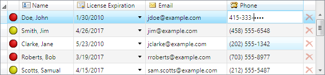

# DataGrid

The controls provided by the Editors product can be easily integrated into Microsoft's WPF `DataGrid`, through the use of custom `DataGridColumn` objects.  An Interop assembly is provided that ties the two products together.  This topic convers the various aspects of the Interop assembly.



*DataGrid with Editors integrated using the Interop assembly*

## Interop Assembly

The Interop functionality is provided through a separate assembly, which is called `ActiproSoftware.Editors.Interop.DataGrid.Wpf.dll`.  Therefore, a reference to this assembly must be added in order to leverage the custom `DataGridColumn` objects it provides.  This assembly should have been installed in the GAC during the control installation process.  However they also will be located in the appropriate Program Files folders.  See the product's Readme for details on those locations.

## Columns

The `DataGrid` allows the columns to be statically defined in XAML via the `Columns` property.  The Interop assembly provides several `DataGridColumn`-derived classes that leverage Editors' controls.

> [!NOTE]
> The Editors' controls can be used in a `DataGridTemplateColumn` as well, but the columns provided by the Interop assembly are typically more convenient.

The Interop assembly provides a set of classes that derive from `DataGridBoundColumn`, which derives from `DataGridColumn`.  These classes include:

| Class | Description |
|-----|-----|
| [DataGridBrushColumn](xref:ActiproSoftware.Windows.Controls.Editors.Interop.DataGrid.DataGridBrushColumn) | Represents an property editor that uses a [BrushEditBox](xref:ActiproSoftware.Windows.Controls.Editors.BrushEditBox) for editing `Brush` property values. |
| [DataGridByteColumn](xref:ActiproSoftware.Windows.Controls.Editors.Interop.DataGrid.DataGridByteColumn) | Represents an property editor that uses a [ByteEditBox](xref:ActiproSoftware.Windows.Controls.Editors.ByteEditBox) for editing `Byte` property values. |
| [DataGridColorColumn](xref:ActiproSoftware.Windows.Controls.Editors.Interop.DataGrid.DataGridColorColumn) | Represents an property editor that uses a [ColorEditBox](xref:ActiproSoftware.Windows.Controls.Editors.ColorEditBox) for editing `Color` property values. |
| [DataGridCornerRadiusColumn](xref:ActiproSoftware.Windows.Controls.Editors.Interop.DataGrid.DataGridCornerRadiusColumn) | Represents an property editor that uses a [CornerRadiusEditBox](xref:ActiproSoftware.Windows.Controls.Editors.CornerRadiusEditBox) for editing `CornerRadius` property values. |
| [DataGridDateColumn](xref:ActiproSoftware.Windows.Controls.Editors.Interop.DataGrid.DataGridDateColumn) | Represents an property editor that uses a [DateEditBox](xref:ActiproSoftware.Windows.Controls.Editors.DateEditBox) for editing `DateTime` (date-only) property values. |
| [DataGridDateTimeColumn](xref:ActiproSoftware.Windows.Controls.Editors.Interop.DataGrid.DataGridDateTimeColumn) | Represents an property editor that uses a [DateTimeEditBox](xref:ActiproSoftware.Windows.Controls.Editors.DateTimeEditBox) for editing `DateTime` property values. |
| [DataGridDoubleColumn](xref:ActiproSoftware.Windows.Controls.Editors.Interop.DataGrid.DataGridDoubleColumn) | Represents an property editor that uses a [DoubleEditBox](xref:ActiproSoftware.Windows.Controls.Editors.DoubleEditBox) for editing `Double` property values. |
| [DataGridEnumColumn](xref:ActiproSoftware.Windows.Controls.Editors.Interop.DataGrid.DataGridEnumColumn) | Represents an property editor that uses a [EnumEditBox](xref:ActiproSoftware.Windows.Controls.Editors.EnumEditBox) for editing `Enum` property values. |
| [DataGridGuidColumn](xref:ActiproSoftware.Windows.Controls.Editors.Interop.DataGrid.DataGridGuidColumn) | Represents an property editor that uses a [GuidEditBox](xref:ActiproSoftware.Windows.Controls.Editors.GuidEditBox) for editing `Guid` property values. |
| [DataGridInt16Column](xref:ActiproSoftware.Windows.Controls.Editors.Interop.DataGrid.DataGridInt16Column) | Represents an property editor that uses a [Int16EditBox](xref:ActiproSoftware.Windows.Controls.Editors.Int16EditBox) for editing `Int16` property values. |
| [DataGridInt32Column](xref:ActiproSoftware.Windows.Controls.Editors.Interop.DataGrid.DataGridInt32Column) | Represents an property editor that uses a [Int32EditBox](xref:ActiproSoftware.Windows.Controls.Editors.Int32EditBox) for editing `Int32` property values. |
| [DataGridInt32RectColumn](xref:ActiproSoftware.Windows.Controls.Editors.Interop.DataGrid.DataGridInt32RectColumn) | Represents an property editor that uses a [Int32RectEditBox](xref:ActiproSoftware.Windows.Controls.Editors.Int32RectEditBox) for editing `Int32Rect` property values. |
| [DataGridInt64Column](xref:ActiproSoftware.Windows.Controls.Editors.Interop.DataGrid.DataGridInt64Column) | Represents an property editor that uses a [Int64EditBox](xref:ActiproSoftware.Windows.Controls.Editors.Int64EditBox) for editing `Int64` property values. |
| [DataGridMaskedStringColumn](xref:ActiproSoftware.Windows.Controls.Editors.Interop.DataGrid.DataGridMaskedStringColumn) | Represents an property editor that uses a [MaskedTextBox](xref:ActiproSoftware.Windows.Controls.Editors.MaskedTextBox) for editing `String` property values. |
| [DataGridPointColumn](xref:ActiproSoftware.Windows.Controls.Editors.Interop.DataGrid.DataGridPointColumn) | Represents an property editor that uses a [PointEditBox](xref:ActiproSoftware.Windows.Controls.Editors.PointEditBox) for editing `Point` property values. |
| [DataGridRectColumn](xref:ActiproSoftware.Windows.Controls.Editors.Interop.DataGrid.DataGridRectColumn) | Represents an property editor that uses a [RectEditBox](xref:ActiproSoftware.Windows.Controls.Editors.RectEditBox) for editing `Rect` property values. |
| [DataGridSingleColumn](xref:ActiproSoftware.Windows.Controls.Editors.Interop.DataGrid.DataGridSingleColumn) | Represents an property editor that uses a [SingleEditBox](xref:ActiproSoftware.Windows.Controls.Editors.SingleEditBox) for editing `Single` property values. |
| [DataGridSizeColumn](xref:ActiproSoftware.Windows.Controls.Editors.Interop.DataGrid.DataGridSizeColumn) | Represents an property editor that uses a [SizeEditBox](xref:ActiproSoftware.Windows.Controls.Editors.SizeEditBox) for editing `Size` property values. |
| [DataGridThicknessColumn](xref:ActiproSoftware.Windows.Controls.Editors.Interop.DataGrid.DataGridThicknessColumn) | Represents an property editor that uses a [ThicknessEditBox](xref:ActiproSoftware.Windows.Controls.Editors.ThicknessEditBox) for editing `Thickness` property values. |
| [DataGridTimeColumn](xref:ActiproSoftware.Windows.Controls.Editors.Interop.DataGrid.DataGridTimeColumn) | Represents an property editor that uses a [TimeEditBox](xref:ActiproSoftware.Windows.Controls.Editors.TimeEditBox) for editing `DateTime` (time-only) property values. |
| [DataGridTimeSpanColumn](xref:ActiproSoftware.Windows.Controls.Editors.Interop.DataGrid.DataGridTimeSpanColumn) | Represents an property editor that uses a [TimeSpanEditBox](xref:ActiproSoftware.Windows.Controls.Editors.TimeSpanEditBox) for editing `TimeSpan` property values. |
| [DataGridVectorColumn](xref:ActiproSoftware.Windows.Controls.Editors.Interop.DataGrid.DataGridVectorColumn) | Represents an property editor that uses a [VectorEditBox](xref:ActiproSoftware.Windows.Controls.Editors.VectorEditBox) for editing `Vector` property values. |

Each column exposes some of the more common settings available on their associated control.  For example, the [DataGridMaskedStringColumn](xref:ActiproSoftware.Windows.Controls.Editors.Interop.DataGrid.DataGridMaskedStringColumn) has a [Mask](xref:ActiproSoftware.Windows.Controls.Editors.Interop.DataGrid.DataGridMaskedStringColumn.Mask) property that allows you to set the associated [Mask](xref:ActiproSoftware.Windows.Controls.Editors.MaskedTextBox.Mask) on the underlying [MaskedTextBox](xref:ActiproSoftware.Windows.Controls.Editors.MaskedTextBox).

## Adding to DataGrid

The Interop columns can be defined on a single instance of the `DataGrid` control using the `Columns` collection.

This code shows how add the Interop column definitions to a single `DataGrid`:

```xaml
xmlns:datagrideditors="http://schemas.actiprosoftware.com/winfx/xaml/datagrideditors"
xmlns:toolkit="http://schemas.microsoft.com/wpf/2008/toolkit"


<toolkit:DataGrid AutoGenerateColumns="False" ItemsSource="...">
	<toolkit:DataGrid.Columns>
		<datagrideditors:DataGridBrushColumn Binding="{Binding BrushValue}" Header="Brush" />
		<datagrideditors:DataGridByteColumn Binding="{Binding ByteValue}" Header="Byte" />
		<datagrideditors:DataGridColorColumn Binding="{Binding ColorValue}" Header="Color" />
		<datagrideditors:DataGridCornerRadiusColumn Binding="{Binding CornerRadiusValue}" Header="CornerRadius" />
		<datagrideditors:DataGridDateColumn Binding="{Binding DateValue}" Header="Date" />
		<datagrideditors:DataGridDateTimeColumn Binding="{Binding DateTimeValue}" Header="DateTime" />
		<datagrideditors:DataGridDoubleColumn Binding="{Binding DoubleValue}" Header="Double" />
		<datagrideditors:DataGridEnumColumn Binding="{Binding EnumValue}" Header="Enum" />
		<datagrideditors:DataGridGuidColumn Binding="{Binding GuidValue}" Header="Guid" />
		<datagrideditors:DataGridInt16Column Binding="{Binding Int16Value}" Header="Int16" />
		<datagrideditors:DataGridInt32Column Binding="{Binding Int32Value}" Header="Int32" />
		<datagrideditors:DataGridInt32RectColumn Binding="{Binding Int32RectValue}" Header="Int32Rect" />
		<datagrideditors:DataGridInt64Column Binding="{Binding Int64Value}" Header="Int64" />
		<datagrideditors:DataGridMaskedStringColumn Binding="{Binding StringValue}" Header="String" />
		<datagrideditors:DataGridPointColumn Binding="{Binding PointValue}" Header="Point" />
		<datagrideditors:DataGridRectColumn Binding="{Binding RectValue}" Header="Rect" />
		<datagrideditors:DataGridSingleColumn Binding="{Binding SingleValue}" Header="Single" />
		<datagrideditors:DataGridSizeColumn Binding="{Binding SizeValue}" Header="Size" />
		<datagrideditors:DataGridThicknessColumn Binding="{Binding ThicknessValue}" Header="Thickness" />
		<datagrideditors:DataGridTimeColumn Binding="{Binding TimeValue}" Header="Time" />
		<datagrideditors:DataGridTimeSpanColumn Binding="{Binding TimeSpanValue}" Header="TimeSpan" />
		<datagrideditors:DataGridVectorColumn Binding="{Binding VectorValue}" Header="Vector" />
	</toolkit:DataGrid.Columns>
</toolkit:DataGrid>
```
