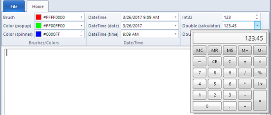

# Ribbon

The controls provided by the Editors product can be easily integrated into the [Ribbon](xref:@ActiproUIRoot.Controls.Ribbon.Ribbon) product.  Several properties need to be set on Editors controls to make them use a similar appearance to other `Ribbon`-embedded controls.



*Ribbon with Editors integrated*

## Setting Appearance Properties

Each edit box has a [PartEditBoxBase<T>](xref:@ActiproUIRoot.Controls.Editors.Primitives.PartEditBoxBase`1).[UsageContext](xref:@ActiproUIRoot.Controls.Editors.Primitives.PartEditBoxBase`1.UsageContext) property that can be set to `ToolBar` to alter the edit box to render more for a `ToolBar` or `Ribbon`-embedded scenario.

For `Ribbon` usage, the `MinHeight` should also be set to [RibbonMeasurements](xref:@ActiproUIRoot.Controls.Ribbon.UI.RibbonMeasurements).[RibbonControlSmallHeight](xref:@ActiproUIRoot.Controls.Ribbon.UI.RibbonMeasurements.RibbonControlSmallHeight).

This code shows how to set the properties mentioned above:

```xaml
xmlns:editors="http://schemas.actiprosoftware.com/winfx/xaml/editors"
xmlns:ribbon="http://schemas.actiprosoftware.com/winfx/xaml/ribbon"
...
<ribbon:Ribbon>
	...
	<editors:BrushEditBox Width="130" Value="#00FF00" UsageContext="ToolBar" 
		MinHeight="{x:Static ribbon:RibbonMeasurements.RibbonControlSmallHeight}" />
	...
</ribbon:Ribbon>
```

## Applying a Label

An optional label can be specified on an Editors control by using the [RibbonControlService](xref:@ActiproUIRoot.Controls.Ribbon.UI.RibbonControlService).[IsExternalContentSupportedProperty](xref:@ActiproUIRoot.Controls.Ribbon.UI.RibbonControlService.IsExternalContentSupportedProperty) and [RibbonControlService](xref:@ActiproUIRoot.Controls.Ribbon.UI.RibbonControlService).[LabelProperty](xref:@ActiproUIRoot.Controls.Ribbon.UI.RibbonControlService.LabelProperty) attached properties.  Labels can show up when controls are in a [StackPanel](xref:@ActiproUIRoot.Controls.Ribbon.Controls.StackPanel) within a `Ribbon`.

This code shows how to set the label on a `BrushEditBox` control:

```xaml
xmlns:editors="http://schemas.actiprosoftware.com/winfx/xaml/editors"
xmlns:ribbon="http://schemas.actiprosoftware.com/winfx/xaml/ribbon"
...
<ribbon:Ribbon>
	...
	<editors:BrushEditBox Width="130" Value="#00FF00"
		...
		ribbon:RibbonControlService.IsExternalContentSupportedProperty="True"
		ribbon:RibbonControlService.Label="Brush" />
	...
</ribbon:Ribbon>
```
