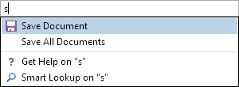

# AutoCompleteBox

The [AutoCompleteBox](xref:@ActiproUIRoot.Controls.Editors.AutoCompleteBox) control allows text entry and provides suggestions for auto-completion.  This kind of control is ideal for use in search query and quick launch kinds of scenarios.

The control supports automatic filtering of suggested items as the end user types via data filters.  Or you can also choose to completely rebuild the list of suggested items on each text edit for a more tailored suggestion display.

## Text and Text Changes

The [AutoCompleteBox](xref:@ActiproUIRoot.Controls.Editors.AutoCompleteBox) control renders like an editable `ComboBox` in that it has a text entry area and a drop-down button.

The [Text](xref:@ActiproUIRoot.Controls.Editors.AutoCompleteBox.Text) property provides access to the string value being edited in the control's text area and supports two-way binding.  The [TextChanged](xref:@ActiproUIRoot.Controls.Editors.AutoCompleteBox.TextChanged) event fires whenever the text is changed.  Event arguments pass the reason for the change, along with the new text.  Set the [AutoCompleteBoxEventArgs](xref:@ActiproUIRoot.Controls.Editors.AutoCompleteBoxEventArgs).[IsPopupAllowed](xref:@ActiproUIRoot.Controls.Editors.AutoCompleteBoxEventArgs.IsPopupAllowed) property to `false` to prevent the suggestion list popup from possibly opening in response to the change.

Set the [IsReadOnly](xref:@ActiproUIRoot.Controls.Editors.AutoCompleteBox.IsReadOnly) property to `true` to prevent editing of the text value.

## Populating the Suggestion List

The [AutoCompleteBox](xref:@ActiproUIRoot.Controls.Editors.AutoCompleteBox) control's template also contains an embedded list control that is used to render the suggestion list.  This list displays in a popup.  There are a number of common `ItemsControl` properties used to populate the list and determine how suggestion items render.

The [ItemsSource](xref:@ActiproUIRoot.Controls.Editors.AutoCompleteBox.ItemsSource) property should be set to a collection of suggestion items.  This collection is run through a data filter (if supplied) and the results are placed in the [FilteredItemsSource](xref:@ActiproUIRoot.Controls.Editors.AutoCompleteBox.FilteredItemsSource) property.  The suggestion list binds to this property.

For basic scenarios where you simply want to display a text property in the list for each suggestion, the [DisplayMemberPath](xref:@ActiproUIRoot.Controls.Editors.AutoCompleteBox.DisplayMemberPath) property can be used.  If your suggestion item objects have a `Name` property that should be shown to the end user, set the [DisplayMemberPath](xref:@ActiproUIRoot.Controls.Editors.AutoCompleteBox.DisplayMemberPath) property to "Name".

If you wish to customize the display of each suggestion item, the control provides [ItemContainerStyle](xref:@ActiproUIRoot.Controls.Editors.AutoCompleteBox.ItemContainerStyle), [ItemContainerStyleSelector](xref:@ActiproUIRoot.Controls.Editors.AutoCompleteBox.ItemContainerStyleSelector), [ItemTemplate](xref:@ActiproUIRoot.Controls.Editors.AutoCompleteBox.ItemTemplate), and [ItemTemplateSelector](xref:@ActiproUIRoot.Controls.Editors.AutoCompleteBox.ItemTemplateSelector) properties.  The container elements that are generated are of type [EmbeddedListBoxItem](xref:@ActiproUIRoot.Controls.Editors.Primitives.EmbeddedListBoxItem).  When using custom item templates, do not use the [DisplayMemberPath](xref:@ActiproUIRoot.Controls.Editors.AutoCompleteBox.DisplayMemberPath) property.

The suggestion list selects the first item by default.  If you wish to set another item as the default selection, use the [SelectedItem](xref:@ActiproUIRoot.Controls.Editors.AutoCompleteBox.SelectedItem) property.  The [SelectedItemChanged](xref:@ActiproUIRoot.Controls.Editors.AutoCompleteBox.SelectedItemChanged) event fires when this property is changed.

## Using Data Filters

Data filters provide a generic mechanism for filtering data objects based on string matching or custom predicate-based logic.  Any [IDataFilter](xref:@ActiproUIRoot.Data.Filtering.IDataFilter) object can be assigned to the [DataFilter](xref:@ActiproUIRoot.Controls.Editors.AutoCompleteBox.DataFilter) property.  When a data filter is assigned, it is used to automatically trim down the suggested items as the end user types without having to assign a new items source.

The [IDataFilter](xref:@ActiproUIRoot.Data.Filtering.IDataFilter).[Filter](xref:@ActiproUIRoot.Data.Filtering.IDataFilter.Filter*) method is called with the text of the suggested item (as determined by the [ConvertToString](xref:@ActiproUIRoot.Controls.Editors.AutoCompleteBox.ConvertToString*) method, which uses [TextMemberPath](xref:@ActiproUIRoot.Controls.Editors.AutoCompleteBox.TextMemberPath)) along with a context object, which is the value of the [FilterText](xref:@ActiproUIRoot.Controls.Editors.AutoCompleteBox.FilterText) property (defaults to returning the current [Text](xref:@ActiproUIRoot.Controls.Editors.AutoCompleteBox.Text) of the control).

A pre-built [AutoCompleteBoxStringFilter](xref:@ActiproUIRoot.Controls.Editors.AutoCompleteBoxStringFilter) class is available that automatically handles this for you.  The only requirement is that you set the [TextMemberPath](xref:@ActiproUIRoot.Controls.Editors.AutoCompleteBox.TextMemberPath) to the name of the property by which to filter against.  This property is similar to the [DisplayMemberPath](xref:@ActiproUIRoot.Controls.Editors.AutoCompleteBox.DisplayMemberPath) property, but only affects data filtering and what text gets inserted when a suggested item is selected.

### Maximizing Filtering Performance

As mentioned above, the [ConvertToString](xref:@ActiproUIRoot.Controls.Editors.AutoCompleteBox.ConvertToString*) method is used to convert each suggested item to a string for filtering and other purposes.  This method uses the [TextMemberPath](xref:@ActiproUIRoot.Controls.Editors.AutoCompleteBox.TextMemberPath) property to create a binding that can obtain the string.  While this process performs fine in scenarios with several hundred suggested items, it can become a performance bottleneck if there are a very large number of suggested items.

To maximize performance, it is recommended to create a class that inherits [AutoCompleteBox](xref:@ActiproUIRoot.Controls.Editors.AutoCompleteBox) and overrides the [ConvertToString](xref:@ActiproUIRoot.Controls.Editors.AutoCompleteBox.ConvertToString*) method.  In the method implementation, cast the item to the specific data type you are using and return an appropriate string value, such as from one of the object's properties.  This circumvents the use of a slow binding to obtain the value, and can add up to a significant performance gain, especially with large numbers of suggested items.

## Updating the Suggestion List

While data filters might handle many common scenarios, there are other cases where you may wish to completely rebuild the list whenever the text changes.  This is more commonly done for quick launch kinds of scenarios where you only show the most popular suggested items that match what has been typed.  Or you might want to actually include the typed text in the suggested items themselves (e.g. "Get help on 'foo'").

To accomplish this, set the [ItemsSource](xref:@ActiproUIRoot.Controls.Editors.AutoCompleteBox.ItemsSource) to a new collection in response to the [TextChanged](xref:@ActiproUIRoot.Controls.Editors.AutoCompleteBox.TextChanged) event firing.

## No Items Content

When the [FilteredItemsSource](xref:@ActiproUIRoot.Controls.Editors.AutoCompleteBox.FilteredItemsSource) returns an empty collection, either since the [ItemsSource](xref:@ActiproUIRoot.Controls.Editors.AutoCompleteBox.ItemsSource) is empty or all items were filtered out, the [NoItemsContent](xref:@ActiproUIRoot.Controls.Editors.AutoCompleteBox.NoItemsContent) and [NoItemsContentTemplate](xref:@ActiproUIRoot.Controls.Editors.AutoCompleteBox.NoItemsContentTemplate) will be displayed.

The [NoItemsContentTemplate](xref:@ActiproUIRoot.Controls.Editors.AutoCompleteBox.NoItemsContentTemplate) property's `DataTemplate` generally consists of a `TextBlock` whose text is bound to a string set to the [NoItemsContent](xref:@ActiproUIRoot.Controls.Editors.AutoCompleteBox.NoItemsContent) property, which says there are no results.

## Suggested Item Selection

When the end user clicks on a suggested item or presses `Enter` while the suggestion list is open, the [SuggestionChosen](xref:@ActiproUIRoot.Controls.Editors.AutoCompleteBox.SuggestionChosen) event is raised.

The [TextMemberPath](xref:@ActiproUIRoot.Controls.Editors.AutoCompleteBox.TextMemberPath) property is used to determine the text for the item.  The logic for converting an item to text is implemented in the virtual [ConvertToString](xref:@ActiproUIRoot.Controls.Editors.AutoCompleteBox.ConvertToString*) method.

The result of that item-to-text conversion is passed to the [SuggestionChosen](xref:@ActiproUIRoot.Controls.Editors.AutoCompleteBox.SuggestionChosen) event in its event arguments.  The text in the event arguments can be updated to a different value if desired, or set to `null` to prevent any text change.

If the [CanSelectAllOnUpdate](xref:@ActiproUIRoot.Controls.Editors.AutoCompleteBox.CanSelectAllOnUpdate) property is `true` (the default), the entire text will be selected.  Otherwise, the caret will move to the end of the inserted text.

## Popup Behavior

The popup containing the suggestion list displays whenever the drop-down button is clicked.  This button can be hidden by setting the [HasPopupButton](xref:@ActiproUIRoot.Controls.Editors.AutoCompleteBox.HasPopupButton) property to `false`.

The popup can also auto-open in other scenarios.  The [MinCharacterCountToOpenPopup](xref:@ActiproUIRoot.Controls.Editors.AutoCompleteBox.MinCharacterCountToOpenPopup) property specifies the minimum number of characters that must be typed before the popup automatically opens.  The default value is `1`.

The [IsPopupOpenedOnFocus](xref:@ActiproUIRoot.Controls.Editors.AutoCompleteBox.IsPopupOpenedOnFocus) property can be set to `true` to auto-open the popup whenever the control gains focus.  This feature should generally only be used if the [HasPopupButton](xref:@ActiproUIRoot.Controls.Editors.AutoCompleteBox.HasPopupButton) property is `false`.

The height of the popup can be restricted by setting the [MaxPopupHeight](xref:@ActiproUIRoot.Controls.Editors.AutoCompleteBox.MaxPopupHeight) property.

A header can be displayed within the popup by setting the [PopupHeader](xref:@ActiproUIRoot.Controls.Editors.AutoCompleteBox.PopupHeader), [PopupHeaderTemplate](xref:@ActiproUIRoot.Controls.Editors.AutoCompleteBox.PopupHeaderTemplate), and [PopupHeaderTemplateSelector](xref:@ActiproUIRoot.Controls.Editors.AutoCompleteBox.PopupHeaderTemplateSelector) properties.

## Submitting

When the end user clicks on a suggested item or presses `Enter` (even if the suggestion list is not open at the time), the [Submitted](xref:@ActiproUIRoot.Controls.Editors.AutoCompleteBox.Submitted) event is raised.  Handlers of this event should perform whichever search query or command execution is appropriate based on the supplied text.

## Clear Button

The [HasClearButton](xref:@ActiproUIRoot.Controls.Editors.AutoCompleteBox.HasClearButton) property determines whether a clear button is visible when the control isn't read-only and there is text.

When the [InputMode](xref:@ActiproUIRoot.Controls.Editors.AutoCompleteBox.InputMode) is `ComboBox`, the control must also have focus for the clear button to be visible.

## Input Modes

The [InputMode](xref:@ActiproUIRoot.Controls.Editors.AutoCompleteBox.InputMode) property determines the behavior of the control.  It has two values, `Search` and `ComboBox`.

The `Search` mode is the default.  This mode is intended for usage when the control is providing search-like functionality, commonly seen in application title bars.

The `ComboBox` mode is an alternate mode intended for use when the control should be used in more traditional `ComboBox`-like scenarios, where an items source is bound and the user should be able to easily choose an item from the list of items.  A big difference between the modes is that when in `ComboBox` mode, the popup list filter turns off when not typing in the control.  This allows the entire list to be browsed when interacting with the control purely via the popup.

## Placeholder Text

Edit boxes support placeholder text that is rendered when there is no value in the control.  This text can be designated via the [PlaceholderText](xref:@ActiproUIRoot.Controls.Editors.AutoCompleteBox.PlaceholderText) property.

@if (wpf) {

## Character Casing

Use the [CharacterCasing](xref:@ActiproUIRoot.Controls.Editors.AutoCompleteBox.CharacterCasing) property to determine how characters are cased when they are manually entered into the text box.  This property can force typed characters to uppercase or lowercase if desired.

}

@if (winrt) {

## Header

Header content that optionally appears above the control can also be used to label what data the control is collecting.  This header content is set via the [Header](xref:@ActiproUIRoot.Controls.Editors.AutoCompleteBox.Header) and [HeaderTemplate](xref:@ActiproUIRoot.Controls.Editors.AutoCompleteBox.HeaderTemplate) properties.

}
