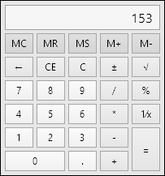

# Calculator

The [Calculator](xref:ActiproSoftware.Windows.Controls.Editors.Calculator) control provides a familiar calculator interface to interactively calculate numeric values.

## Overview

The calculator can be operated by tapping its various buttons or by focusing it and typing on the keyboard.

The [Calculator](xref:ActiproSoftware.Windows.Controls.Editors.Calculator).[Value](xref:ActiproSoftware.Windows.Controls.Editors.Calculator.Value) property gets or sets the current numeric calculator value, and supports data binding.  It is a `Double` value.

The [DisplayText](xref:ActiproSoftware.Windows.Controls.Editors.Calculator.DisplayText) property gets the current text that is rendered in the display area of the calculator.

## Customization

[Calculator](xref:ActiproSoftware.Windows.Controls.Editors.Calculator) offers several properties that can be used to customize the look of the control.

### General

There properties can be used to customize the overall look of the [Calculator](xref:ActiproSoftware.Windows.Controls.Editors.Calculator), as described below.

| Property | Description |
|-----|-----|
| [DisplayFontSize](xref:ActiproSoftware.Windows.Controls.Editors.Calculator.DisplayFontSize) | The display font size. |
| [HasDisplay](xref:ActiproSoftware.Windows.Controls.Editors.Calculator.HasDisplay) | Whether the calculator output is displayed. |
| [HasMemoryButtons](xref:ActiproSoftware.Windows.Controls.Editors.Calculator.HasMemoryButtons) | Whether the memory buttons are displayed. |

### Styles

The various buttons presented by the [Calculator](xref:ActiproSoftware.Windows.Controls.Editors.Calculator) can be customized using a `Style`.

| Property | Description |
|-----|-----|
| [DigitButtonStyle](xref:ActiproSoftware.Windows.Controls.Editors.Calculator.DigitButtonStyle) | Specifies the `Style` to use for digit buttons. |
| [MemoryButtonStyle](xref:ActiproSoftware.Windows.Controls.Editors.Calculator.MemoryButtonStyle) | Specifies the `Style` to use for memory buttons. |
| [OperationButtonStyle](xref:ActiproSoftware.Windows.Controls.Editors.Calculator.OperationButtonStyle) | Specifies the `Style` to use for operation buttons. |
