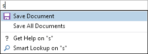

# Overview

Actipro Editors includes a number of additional helpful controls beyond edit boxes and pickers.

## Additional Controls

This table shows the additional controls that are included in the product:

<table>
<thead>

<tr>
<th>Name</th>
<th>Description</th>
</tr>

</thead>
<tbody>

<tr>
<td>

[AutoCompleteBox](autocompletebox.md)

</td>
<td>

The AutoCompleteBox control allows text entry and provides suggestions for auto-completion.  This kind of control is ideal for use in search query and quick launch kinds of scenarios.

</td>
</tr>

<tr>
<td>

[Calculator](calculator.md)

</td>
<td>

Provides a familiar calculator interface to interactively calculate numeric values.

</td>
</tr>

<tr>
<td>

[CountryComboBox](countrycombobox.md)

</td>
<td>

Allows for the selection of an ISO country.

</td>
</tr>

<tr>
<td>

[CurrencyComboBox](currencycombobox.md)

</td>
<td>

Allows for the selection of an ISO currency.

</td>
</tr>

<tr>
<td>

[EnumListBox](enumlistbox.md)

</td>
<td>

Presents the values of an enumeration in a list box.  The control supports both flags and non-flags enums.

</td>
</tr>

<tr>
<td>

[GradientStopSlider](gradientstopslider.md)

</td>
<td>

Allows for adding, changing, and removing the various gradient stops within a `GradientBrush`, such as a `LinearGradientBrush`.

</td>
</tr>

<tr>
<td>

[MaskedTextBox](maskedtextbox.md)

</td>
<td>

Used to restrict user input based on a specified regular expression mask.  Support for input prompts and literal completion is included.

</td>
</tr>

<tr>
<td>

[MonthCalendar](monthcalendar.md)

</td>
<td>

Allows for selection of a date from a calendar with animated view changes.

</td>
</tr>

<tr>
<td>

[Rating](rating.md)

</td>
<td>

Renders glyphs that can be used present an average rating or collect a user rating.

</td>
</tr>

</tbody>
</table>
