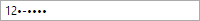

# MaskedTextBox

The [MaskedTextBox](xref:ActiproSoftware.Windows.Controls.Editors.MaskedTextBox) control can be used to restrict user input based on a specified regular expression mask.  Support for input prompts and literal completion is included.

Since the [MaskedTextBox](xref:ActiproSoftware.Windows.Controls.Editors.MaskedTextBox) control inherits the native `TextBox` control, it fully supports features such as UI automation, IME input, etc.

When typing text data, the control will attempt to move the caret past any literal (fixed) characters it encounters in the mask.

*The "12" were typed by the user and the remaining text with bullets/dashes is a prompt*

## Mask, Text, and MatchedText

The [Mask](xref:ActiproSoftware.Windows.Controls.Editors.MaskedTextBox.Mask) property can be used to define the desired mask pattern that must be input.  It defaults to using a regular expression pattern.  Any characters or input that violate this mask will be discarded.  This ensures that only data in the proper format is entered.

The [MaskKind](xref:ActiproSoftware.Windows.Controls.Editors.MaskedTextBox.MaskKind) property indicates whether the [Mask](xref:ActiproSoftware.Windows.Controls.Editors.MaskedTextBox.Mask) is a regular expression (the default) or wildcard pattern.  See the reference below for more details on each mask kind, as they have different pattern syntax.

The `Text` property can be used to retrieve any text entered by the end user, along with any prompt text that is currently displayed.

The [MatchedText](xref:ActiproSoftware.Windows.Controls.Editors.MaskedTextBox.MatchedText) property can be used to get/set the text entered by the end user, without any prompt text that is currently displayed.  This is typically the property you want to data-bind against, instead of `Text`.

## Prompts

Prompts can be appended to the end of the text in scenarios where further text input is required to properly match a mask.  The prompts do their best to indicate literal characters as themselves.  Any time there is a choice in character, a prompt character specified by the [PromptChar](xref:ActiproSoftware.Windows.Controls.Editors.MaskedTextBox.PromptChar) is inserted.

By default the prompts will only be appended when the control has focus.  The [PromptVisibility](xref:ActiproSoftware.Windows.Controls.Editors.MaskedTextBox.PromptVisibility) property can be changed to `Always` to always show prompts, even when the control doesn't has focus.  The `Never` option prevents prompts from ever showing.

## Case Sensitivity and Case-Correction

The control attempts to match the mask in a case-insensitive way by default, meaning that both 'A' and 'a' will match an "a" pattern.  If you wish to force your mask to be case sensitive, set the [IsCaseSensitive](xref:ActiproSoftware.Windows.Controls.Editors.MaskedTextBox.IsCaseSensitive) property to `true`.

If you wish to allow case-insensitivity and also coerce characters to match the pattern, set the [IsCaseAutoCorrected](xref:ActiproSoftware.Windows.Controls.Editors.MaskedTextBox.IsCaseAutoCorrected) property to `true`.  When this property is set, the [IsCaseSensitive](xref:ActiproSoftware.Windows.Controls.Editors.MaskedTextBox.IsCaseSensitive) property is ignored.  Say the mask pattern is "(Male|Female)".  This means only one of the two strings can be typed.  If the user types a 'm' into the control, it will convert the typed character to 'M'.  The control also will automatically insert the rest of the text, making it read "Male" since the "ale" characters are considered literals at those character offsets.  Note that this last feature occurs regardless of case options.

## Regular Expression Mask Syntax

The [MaskedTextBox](xref:ActiproSoftware.Windows.Controls.Editors.MaskedTextBox) uses a custom regular expression engine implementation with full support for Unicode categories.  The engine includes support for most common regular expression constructs, as described below, when the [MaskKind](xref:ActiproSoftware.Windows.Controls.Editors.MaskedTextBox.MaskKind) property is `Regex`.

### Literals

Literal characters can be included in the regular expression, but special characters must be escaped using the backslash character (\\).

Whitespace such as spaces are treated as a literal.

### Groups

Any number of regular expression elements can grouped together by enclosing them in parenthesis.  Alternations, which are described below, are a special type of group which are also enclosed in parenthesis.  Groups can be repeated using one of the support quantifiers after the closing paraenthesis.

For example, the regular expression "ABC*" requires A and B, then allows for zero or more of C. The regular expression "(ABC)\*", which groups "ABC" into a single element, allows for zero or more of "ABC" together.

In terms of literal completion, only the A character would ever be entered by the end-user for the "(ABC)\*" regular expresssion.  When the user types an A, then the BC are required and are therefore automatically inserted by the control.  If an additional A is typed, then again the BC would be auto completed, resulting in "ABCABC" as the text.

### Alternations

Alternation allows for two or more alternate branches to be taken and is defined by using the vertical bar in parenthesis. For example, the "(AB|CD)" regular expression can match the string "AB" or the string "CD". The alternate branches can be any other supported regular expression element, including other groups or alternations. This allows for very complex scenarioes to be defined and used as a mask.

When showing prompt indicators for uncompleted sections of the maks, the control will choose the shortest branch of an alternation that would result in completion of the mask.

### Quantifiers

Quantifiers can be used to specify the number of times a regular expression element should be repeated. There are several methods for defining quantifiers, which are:

| Quantifier | Description |
|-----|-----|
| ?   | Indicates that the regular expression element is optional. For example, the regular expression "AB?C" will match the string "ABC" or "AC". |
| \*  | Indicates that the regular expression element is can be repeated zero or more times, with no upper limit. For example, the regular expression "AB*C" will match the string "ABC" or "AC", as well as "ABBBBBBBC". |
| +   | Indicates that the regular expression element must occur once, but can be repeat any number of times. For example, the regular expression "AB+C" will match the string "ABC" or "ABBBBBBBC", but will not match "AC". |
| \{N} | Indicates that the regular expression element must occur exactly N times, where N is a postive integer value. For example, the regular expression "AB\{2}C" will only match the string "ABBC". |
| \{N,} | Indicates that the regular expression element must occur exactly N times, where N is a postive integer value, but can be repeated any number of times.  For example, the regular expression "AB\{2,}C" will match the string "ABBC" or "ABBBBBBC". |
| \{N,M} | Indicates that the regular expression element must occur exactly N times, where N is a postive integer value, but can be repeated M times, where M is a positive integer value greater than N.  For example, the regular expression "AB\{2,3}C" will match the string "ABBC" or "ABBBC", but not "ABBBBC". |

### Character Classes

Character classes can be used to define one or more characters, using ranges or by explicitly defining individual characters.

Custom character classes are enclosed in square brackets. Ranges can be defined using a start character, followed by a dash (-), followed by an end character.  For example, the character class "\[0-9]", includes all digits. Additional ranges can be appended to specify non-contiguous ranges. For example, the character class "\[0-357-9]", includes all digits except 4 and 6.  The caret (^) can be used to negate the character class. For example, the character class "\[^0-9]" includes all characters except the digits.

The following table summarizes character matching syntax for custom and built-in character classes.

| Character Class | Description |
|-----|-----|
| .   | Matches any character except \\n.  When within a character class, the `.` will be treated as a period character. |
| \[aeiou] | Matches any single character included in the specified set of characters. |
| \[^aeiou] | Matches any single character not in the specified set of characters. |
| \[0-9a-fA-F] | Use of a hyphen (`–`) allows specification of contiguous character ranges. |
| \\p\{name} | Matches any character in the Unicode general category specified by name (for example, `Ll`, `Nd`, `Z`). |
| \\P\{name} | Matches any character not in Unicode general category specified in name. |
| \\w | Matches any word character, which includes letters, digits, and underscores. |
| \\W | Matches any non-word character. |
| \\s | Matches any whitespace character. |
| \\S | Matches any non-whitespace character. |
| \\d | Matches any decimal digit. |
| \\D | Matches any non-digit. |
| \[.\\w\\s] | Escaped built-in character classes such as `\w` and `\s` may be used in a character class.  This example matches any period, word or whitespace character. |

### Supported Unicode General Categories

Unicode defines the general categories and descriptions listed in the following table.  These categories can be used with the `\p` and `\P` character classes described above.

| Category | Description |
|-----|-----|
| Lu  | Letter, Uppercase |
| Ll  | Letter, Lowercase |
| Lt  | Letter, Titlecase |
| Lm  | Letter, Modifier |
| Lo  | Letter, Other |
| Mn  | Mark, Nonspacing |
| Mc  | Mark, Spacing Combining |
| Me  | Mark, Enclosing |
| Nd  | Number, Decimal Digit |
| Nl  | Number, Letter |
| No  | Number, Other |
| Pc  | Punctuation, Connector |
| Pd  | Punctuation, Dash |
| Ps  | Punctuation, Open |
| Pe  | Punctuation, Close |
| Pi  | Punctuation, Initial quote |
| Pf  | Punctuation, Final quote |
| Po  | Punctuation, Other |
| Sm  | Symbol, Math |
| Sc  | Symbol, Currency |
| Sk  | Symbol, Modifier |
| So  | Symbol, Other |
| Zs  | Separator, Space |
| Zl  | Separator, Line |
| Zp  | Separator, Paragraph |
| Cc  | Other, Control |
| Cf  | Other, Format |
| Cs  | Other, Surrogate |
| Co  | Other, Private Use |
| Cn  | Other, Not Assigned |

Additional special categories are supported that represent a set of Unicode character categories, as shown in the following table:

| Category | Description |
|-----|-----|
| C   | (All control characters) `Cc`, `Cf`, `Cs`, `Co`, and `Cn`. |
| L   | (All letters) `Lu`, `Ll`, `Lt`, `Lm`, and `Lo`. |
| M   | (All diacritic marks) `Mm`, `Mc`, and `Me`. |
| N   | (All numbers) `Nd`, `Nl`, and `No`. |
| P   | (All punctuation) `Pc`, `Pd`, `Ps`, `Pe`, `Pi`, `Pf` and `Po`. |
| S   | (All symbols) `Sm`, `Sc`, `Sk`, and `So`. |
| Z   | (All separators) `Zs`, `Zl`, and `Zp`. |

## Wildcard Mask Syntax

Wildcard based patterns are supported when the [MaskKind](xref:ActiproSoftware.Windows.Controls.Editors.MaskedTextBox.MaskKind) property is `Wildcard`.  In this mode, the wildcard pattern is converted to an equivalent regular expression pattern behind the scenes.

Wildcard pattern providers search for text by using "wildcard" pattern matching.  The following wildcard patterns are recognized:

| Construct | Description |
|-----|-----|
| \*  | Specifies zero or more of any character, except the line feed character. |
| ?   | Specifies any single character, except the line feed character. |
| #   | Specifies any single digit. |
| \[aeiou] | Matches any one character in the set. |
| \[!aeiou] | Matches any one character not in the set. |

Any other character in the pattern matches the character.  An example wildcard pattern is "#####-####".
