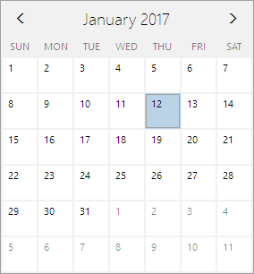

# MonthCalendar

The [MonthCalendar](xref:ActiproSoftware.Windows.Controls.Editors.MonthCalendar) control presents a calendar using several view levels.  It includes smooth animations when navigating and is highly customizable.



## Navigation

The current view presented by the [MonthCalendar](xref:ActiproSoftware.Windows.Controls.Editors.MonthCalendar) is controlled by the [ActiveDate](xref:ActiproSoftware.Windows.Controls.Editors.MonthCalendar.ActiveDate) and [ActiveViewMode](xref:ActiproSoftware.Windows.Controls.Editors.MonthCalendar.ActiveViewMode) properties.  There are various methods of navigating through the control, which are described below.

### Zooming In and Out

The [MonthCalendar](xref:ActiproSoftware.Windows.Controls.Editors.MonthCalendar) control supports four view modes: Month, Year, Decade, and Century.  The various view modes make it easier to navigate from one date to another, by allowing to user to zoom out and then drill back in to a specific date.


*The MonthCalendar control showing the year, decade, and century views, repsectively.*

The end-user can zoom out by clicking the title bar text (e.g. "August 2014" for the month view).  When an individual item is clicked, that item is zoomed in. So clicking on "August" in the year view, will zoom in to the month view for August.

> [!TIP]
> To zoom out using the keyboard, press the '-' key while holding down the Control key.  Similarly, pressing the '+' key while hold down the Control key will zoom in.

By default, the user can zoom out all the way out to the century view.  This can be restricted by setting the [MaxViewMode](xref:ActiproSoftware.Windows.Controls.Editors.MonthCalendar.MaxViewMode) property.

### Scrolling

Using the arrows in the title bar, the current view can be scrolled left or right. For the month view, scrolling left will move to the previous month and scrolling right will move to the next month. The other views move to their respective previous and next views (e.g. year, decade, century).

> [!TIP]
> To scroll left using the keyboard, press the PageDown key. Similarly, pressing the PageUp key will scroll right.

### Keyboard/Item Navigation

When the [MonthCalendar](xref:ActiproSoftware.Windows.Controls.Editors.MonthCalendar) has focus, the arrow keys can be used to navigate through the current view. When moving onto an overflow item, which is an item that actually belongs to the next or previous view, then the next/previous view will be scrolled into view.

### Today Button

A "today" command is available via the [MonthCalendar](xref:ActiproSoftware.Windows.Controls.Editors.MonthCalendar).[SelectTodayCommand](xref:ActiproSoftware.Windows.Controls.Editors.MonthCalendar.SelectTodayCommand) property that can be bound to any button.  When the button is tapped, the item that contains `DateTime.Today` will be selected and scrolled into view.

### View Reset

The view presented by the [MonthCalendar](xref:ActiproSoftware.Windows.Controls.Editors.MonthCalendar) can be reset to the Month view when it loses focus, by setting the [ViewResetMode](xref:ActiproSoftware.Windows.Controls.Editors.MonthCalendar.ViewResetMode) property.  This feature is useful when the calendar is being hosted in a `Popup`.

## Selection

The [MonthCalendar](xref:ActiproSoftware.Windows.Controls.Editors.MonthCalendar) can be used to select one or more dates.  The currently selected dates are available in the [SelectedDates](xref:ActiproSoftware.Windows.Controls.Editors.MonthCalendar.SelectedDates) collection.  Additionally, the first selected date can be retrieved using the [SelectedDate](xref:ActiproSoftware.Windows.Controls.Editors.MonthCalendar.SelectedDate) property.  The [SelectedDate](xref:ActiproSoftware.Windows.Controls.Editors.MonthCalendar.SelectedDate) property supports two-way binding.

> [!NOTE]
> Disabled dates, as described below, are automatically excluded from selection.

The [SelectionChanged](xref:ActiproSoftware.Windows.Controls.Editors.MonthCalendar.SelectionChanged) event fires whenever the [SelectedDate](xref:ActiproSoftware.Windows.Controls.Editors.MonthCalendar.SelectedDate) or [SelectedDates](xref:ActiproSoftware.Windows.Controls.Editors.MonthCalendar.SelectedDates) properties change.

The number of selected dates can be restricted using the [MaxSelectionCount](xref:ActiproSoftware.Windows.Controls.Editors.MonthCalendar.MaxSelectionCount) property.  When set to `-1` (the default value), no limit is imposed.

The calendar supports several selection modes, each with a unique behavior.  The selection mode is configured using the [SelectionMode](xref:ActiproSoftware.Windows.Controls.Editors.MonthCalendar.SelectionMode) property.

> [!NOTE]
> The selection mode only limits how the end-user can select dates.  The selection mode restrictions are not enforce when adding dates to [SelectedDates](xref:ActiproSoftware.Windows.Controls.Editors.MonthCalendar.SelectedDates) programmatically.

| Mode | Description |
|-----|-----|
| `Single` | Specifies that only a single date can be selected. |
| `Multiple` | Specifies that multiple dates can be selected, but must be done so explicitly (e.g. each item must be selected individually).  When clicking on an item it's selection state is toggled. |
| `Extended` | Specifies that multiple dates can be selected, by using the Control (to toggle a selected day) and Shift (to select a range) keys. |
| `Range` | Specifies that multiple dates can be selected, by using the Shift (to select a range) key.  Works like the Extended mode, but the selected dates must be in a continguous range (not including disabled dates). |

The day of week header items and week number items can be used for selection, when the [SelectionMode](xref:ActiproSoftware.Windows.Controls.Editors.MonthCalendar.SelectionMode) allows multiple dates to be selected.  This feature can be disabled by setting [IsDayOfWeekSelectionEnabled](xref:ActiproSoftware.Windows.Controls.Editors.MonthCalendar.IsDayOfWeekSelectionEnabled) and/or [IsWeekNumberSelectionEnabled](xref:ActiproSoftware.Windows.Controls.Editors.MonthCalendar.IsWeekNumberSelectionEnabled) properties to `false`.

A "clear" button can be included by setting [IsClearButtonVisible](xref:ActiproSoftware.Windows.Controls.Editors.MonthCalendar.IsClearButtonVisible) to `true`.  This button clears the current selection, which is useful when multiple date selection is enabled.

## Disabled Dates

The [Minimum](xref:ActiproSoftware.Windows.Controls.Editors.MonthCalendar.Minimum) and [Maximum](xref:ActiproSoftware.Windows.Controls.Editors.MonthCalendar.Maximum) properties can be used to restrict the date range over which the user can navigate and select a date.  Any dates falling outside of that range will appear disabled and won't be selectable.

Within the minimum and maximum range, other dates can be disabled as well.  All instances of dates that fall over certain days of week can be disabled by setting the [DisabledDaysOfWeek](xref:ActiproSoftware.Windows.Controls.Editors.MonthCalendar.DisabledDaysOfWeek) property, which accepts one or more values from the flags enumeration [DaysOfWeek](xref:ActiproSoftware.Windows.Controls.Editors.DaysOfWeek).  This is useful for scenarios like where you might not wish to allow weekend days to be selected.

> [!NOTE]
> When [DisabledDaysOfWeek](xref:ActiproSoftware.Windows.Controls.Editors.MonthCalendar.DisabledDaysOfWeek) is set to `DaysOfWeek.All` then the user will not be able to navigate away from the currently active date.

Finally, for any dates that would normally be enabled within the [Minimum](xref:ActiproSoftware.Windows.Controls.Editors.MonthCalendar.Minimum) and [Maximum](xref:ActiproSoftware.Windows.Controls.Editors.MonthCalendar.Maximum) range, and aren't disabled by the [DisabledDaysOfWeek](xref:ActiproSoftware.Windows.Controls.Editors.MonthCalendar.DisabledDaysOfWeek) property, a special [IsDateDisabledFunc](xref:ActiproSoftware.Windows.Controls.Editors.MonthCalendar.IsDateDisabledFunc) property can optionally supply a function that is passed a `DateTime` and returns `true` if the specified date should be disabled.  This function is called for each day cell that is rendered.

This example code shows how to set the [IsDateDisabledFunc](xref:ActiproSoftware.Windows.Controls.Editors.MonthCalendar.IsDateDisabledFunc) property with a function that disables the first Tuesday of each month.

```csharp
disabledDaysCalendar.IsDateDisabledFunc = d => (d.DayOfWeek == DayOfWeek.Tuesday) && (d.Day >= 8) && (d.Day <= 14);
```

## Customization

[MonthCalendar](xref:ActiproSoftware.Windows.Controls.Editors.MonthCalendar) offers several properties that can be used to customize the look of the control.

### General

There properties can be used to customize the overall look of the [MonthCalendar](xref:ActiproSoftware.Windows.Controls.Editors.MonthCalendar), as described below.

| Property | Description |
|-----|-----|
| [CalendarWeekRule](xref:ActiproSoftware.Windows.Controls.Editors.MonthCalendar.CalendarWeekRule) | By default the calender week rule, which determines how weeks are numbered, is retrieved from the current culture, but this property can be used to override the value. |
| [DayOfWeekFormatPattern](xref:ActiproSoftware.Windows.Controls.Editors.MonthCalendar.DayOfWeekFormatPattern) | Specifies the format used to display the values in the day of week header. |
| [FirstDayOfWeek](xref:ActiproSoftware.Windows.Controls.Editors.MonthCalendar.FirstDayOfWeek) | By default the first day of the week is retrieved from the current culture, but this property can be used to override the value. |
| [IsTodayButtonVisible](xref:ActiproSoftware.Windows.Controls.Editors.MonthCalendar.IsTodayButtonVisible) | Indicates whether the today button is visible. |
| [IsTodayHighlighted](xref:ActiproSoftware.Windows.Controls.Editors.MonthCalendar.IsTodayHighlighted) | Indicates whether today is highlighted with an outline. |
| [IsWeekNumberColumnVisible](xref:ActiproSoftware.Windows.Controls.Editors.MonthCalendar.IsWeekNumberColumnVisible) | Indicates whether the week number column is visible. |

### Styles

The various items presented by the [MonthCalendar](xref:ActiproSoftware.Windows.Controls.Editors.MonthCalendar) can be customized using a `DataTemplate` or `Style`.

| Property | Description |
|-----|-----|
| [ClearButtonStyle](xref:ActiproSoftware.Windows.Controls.Editors.MonthCalendar.ClearButtonStyle) | Specifies the `Style` to use for the Clear button within the calendar. |
| [DayItemTemplate](xref:ActiproSoftware.Windows.Controls.Editors.MonthCalendar.DayItemTemplate) | Specifies the `DataTemplate` to use for day items within the calendar. |
| [DayItemTemplateSelector](xref:ActiproSoftware.Windows.Controls.Editors.MonthCalendar.DayItemTemplateSelector) | Specifies the `DataTemplateSelector` to use for day items within the calendar. |
| [DayNameItemContainerStyle](xref:ActiproSoftware.Windows.Controls.Editors.MonthCalendar.DayNameItemContainerStyle) | Specifies the `Style` to use for day name items within the calendar. |
| [DayNameItemTemplate](xref:ActiproSoftware.Windows.Controls.Editors.MonthCalendar.DayNameItemTemplate) | Specifies the `DataTemplate` to use for day name items within the calendar. |
| [DecadeItemTemplate](xref:ActiproSoftware.Windows.Controls.Editors.MonthCalendar.DecadeItemTemplate) | Specifies the `DataTemplate` to use for decade items within the calendar. |
| [MonthItemTemplate](xref:ActiproSoftware.Windows.Controls.Editors.MonthCalendar.MonthItemTemplate) | Specifies the `DataTemplate` to use for month items within the calendar. |
| [NavigationButtonStyle](xref:ActiproSoftware.Windows.Controls.Editors.MonthCalendar.NavigationButtonStyle) | Specifies the `Style` to use for navigation buttons within the calendar. |
| [TitleButtonStyle](xref:ActiproSoftware.Windows.Controls.Editors.MonthCalendar.TitleButtonStyle) | Specifies the `Style` to use for the title button within the calendar. |
| [TodayButtonStyle](xref:ActiproSoftware.Windows.Controls.Editors.MonthCalendar.TodayButtonStyle) | Specifies the `Style` to use for the Today button within the calendar. |
| [WeekNumberItemContainerStyle](xref:ActiproSoftware.Windows.Controls.Editors.MonthCalendar.WeekNumberItemContainerStyle) | Specifies the `Style` to use for week number items within the calendar. |
| [WeekNumberItemTemplate](xref:ActiproSoftware.Windows.Controls.Editors.MonthCalendar.WeekNumberItemTemplate) | Specifies the `DataTemplate` to use for week number items within the calendar. |
| [YearItemTemplate](xref:ActiproSoftware.Windows.Controls.Editors.MonthCalendar.YearItemTemplate) | Specifies the `DataTemplate` to use for year items within the calendar. |
