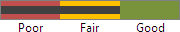

# Rating

The [Rating](xref:ActiproSoftware.Windows.Controls.Editors.Rating) control inherits from `ItemsControl` and renders glyphs that can be used present an average rating or collect a user rating.


## Average Value and Value

The [Rating](xref:ActiproSoftware.Windows.Controls.Editors.Rating) control has two different value properties, [AverageValue](xref:ActiproSoftware.Windows.Controls.Editors.Rating.AverageValue) and [Value](xref:ActiproSoftware.Windows.Controls.Editors.Rating.Value).

The [AverageValue](xref:ActiproSoftware.Windows.Controls.Editors.Rating.AverageValue) property is displayed when the [Value](xref:ActiproSoftware.Windows.Controls.Editors.Rating.Value) property is `null`.  Generally, this would be the average value of all the known ratings for the associated item.  The user cannot modify this value through use of the control, and it must be set programmatically.


*Rating showing an average value of 3.5*

The [Value](xref:ActiproSoftware.Windows.Controls.Editors.Rating.Value) property is displayed when non-`null` and effectively hides the `AverageValue`. This value indicates the user's selection and can be updated using a pointer or the keyboard.

## Populating the Rating

The [Rating](xref:ActiproSoftware.Windows.Controls.Editors.Rating) control is an `ItemsControl`, and as such, you can populate the `Items` collection directly with [RatingItem](xref:ActiproSoftware.Windows.Controls.Editors.RatingItem) instances, with each item representing a new "star" or rating value.

To simplify the use of the `Rating` control, the [ItemCount](xref:ActiproSoftware.Windows.Controls.Editors.Rating.ItemCount) property can be used to automatically populate the `Items` collection with 0 or more instances of `RatingItem`.

This XAML shows how five items can be created and the control's value bound to a view model property:

```xaml
<editors:Rating ItemCount="5" Value="{Binding Path=YourVMProperty, Mode=TwoWay}" />
```

## Glyphs and DataTemplates

The [RatingItem](xref:ActiproSoftware.Windows.Controls.Editors.RatingItem) class is used to present each "star" or rating glyph.  By default, a star glyph is shown, but this can easily be customized.  Using the following properties, one or more `DataTemplate`s can be specified to be used by the various states of a `RatingItem`:

- [NormalGlyphTemplate](xref:ActiproSoftware.Windows.Controls.Editors.RatingItem.NormalGlyphTemplate) - Used when the item is in the normal (unselected) state.

- [ActiveGlyphTemplate](xref:ActiproSoftware.Windows.Controls.Editors.RatingItem.ActiveGlyphTemplate) - Used when the end user's pointer actively over this item or one after it.

- [AverageGlyphTemplate](xref:ActiproSoftware.Windows.Controls.Editors.RatingItem.AverageGlyphTemplate) - Used when the item is involved in rendering an average value for the overall rating.

- [SelectedGlyphTemplate](xref:ActiproSoftware.Windows.Controls.Editors.RatingItem.SelectedGlyphTemplate) - Used when the item is involved in the end user's value selection.

These properties can be set using a `Style` that targets the [RatingItem](xref:ActiproSoftware.Windows.Controls.Editors.RatingItem) class with a setter for each of the glyph templates.  Set the style to the rating's `ItemContainerStyle` property.



*Custom glyph templates for each item*

Alternatively, if the `Rating` control is manually populated (i.e. one or more `RatingItem` instances are manually added to the `Items` collection), the `RatingItem` properties can be set directly.  This approach is needed to achieve advanced display scenarios like in the screenshot above.

## Item Content

The [RatingItem](xref:ActiproSoftware.Windows.Controls.Editors.RatingItem) class inherits `ContentControl` and thus has several properties like `Content`, `ContentTemplate`, etc.  Any content-related properties that are set will render the content below each item when in a horizontal orientation, or next to each item when in a vertical orientation.

In the screenshot above, the first item has "Poor" content, the second has "Fair" content, and the third has "Good" content.

## Orientation

The [Rating](xref:ActiproSoftware.Windows.Controls.Editors.Rating) control can be oriented horizontally (the default) or vertically by setting the [Orientation](xref:ActiproSoftware.Windows.Controls.Editors.Rating.Orientation) property.
