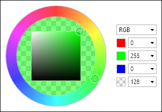

# ColorPicker

The [ColorPicker](xref:ActiproSoftware.Windows.Controls.Editors.ColorPicker) control makes it easy for end users to select a color via touch or a mouse.  It is generally intended for display within a popup, such as for the [ColorEditBox](../editboxes/coloreditbox.md) control.



It combines a [HsbColorPicker](hsbcolorpicker.md) with edit boxes for RGB (red, green, blue).  This allows the end user to select the color either via HSB (hue, saturation, brightness) or RGB values.  In addition, a drop-down allows selection of a HSB text input mode, where HSB edit boxes are displayed in place of the RGB ones.

Alpha transparency selection is also optionally supported.

## Alpha Transparency

The [ColorPicker](xref:ActiproSoftware.Windows.Controls.Editors.ColorPicker).[IsAlphaEnabled](xref:ActiproSoftware.Windows.Controls.Editors.ColorPicker.IsAlphaEnabled) property governs whether alpha transparency is supported.

When `false`, the edit box will only allow selection of an RGB color instead of an ARGB color.

## Embedded ColorEditBox

The [ColorPicker](xref:ActiproSoftware.Windows.Controls.Editors.ColorPicker).[HasColorEditBox](xref:ActiproSoftware.Windows.Controls.Editors.ColorPicker.HasColorEditBox) property, which defaults to `true`, defines whether a [ColorEditBox](xref:ActiproSoftware.Windows.Controls.Editors.ColorEditBox) is embedded within the picker.

The edit box is used to display and allow editing of the hex color value.

## Comparison Value

The [ColorPicker](xref:ActiproSoftware.Windows.Controls.Editors.ColorPicker).[IsComparisonValueVisible](xref:ActiproSoftware.Windows.Controls.Editors.ColorPicker.IsComparisonValueVisible) property can be set to `true` to display a comparison color value on the left side of the hue ring's fill area.  The color displayed is specified by the [ComparisonValue](xref:ActiproSoftware.Windows.Controls.Editors.ColorPicker.ComparisonValue) property.

This is useful when setting up a comparison of old/new color values.

## Sample XAML

This control can be placed within any other XAML container control, such as a `Page` or `Panel` with this sort of XAML:

```xaml
<editors:ColorPicker Value="{Binding Path=YourVMProperty, Mode=TwoWay}" />
```
