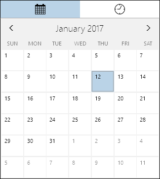

# DateTimePicker

The [DateTimePicker](xref:@ActiproUIRoot.Controls.Editors.DateTimePicker) control allows for the input of a `DateTime` value using a month calendar with animated view changes for date selection, and two radial sliders for time selection.  Its design is similar to the layout of a standard calendar and clock, making it instantly approachable by end users.



Use the previous/next buttons in the calendar's header to navigate to a nearby month, or tap the current view's title to 'zoom out' to year, decade, or century views.

The time portion's inner radial slider sets the hours value.  It can be rotated up to two full cycles, where each cycle represents a 12 hour period.  The outer radial slider sets the minutes value, and can be rotated freely.

The toggle at the top determines whether the [DateTimePicker](xref:@ActiproUIRoot.Controls.Editors.DateTimePicker) is currently modifying the date or time component of the `DateTime`.  The date component is edited with a [DatePicker](datepicker.md) and the time component is edited with a [TimePicker](timepicker.md).

## Minimum and Maximum Values

Minimum and maximum values may be assigned via the [Maximum](xref:@ActiproUIRoot.Controls.Editors.DateTimePicker.Maximum) and [Minimum](xref:@ActiproUIRoot.Controls.Editors.DateTimePicker.Minimum) properties.

No values can be committed that lay outside of the inclusive range created by those properties.

## Sample XAML

This control can be placed within any other XAML container control, such as a `Page` or `Panel` with this sort of XAML:

```xaml
<editors:DateTimePicker Value="{Binding Path=YourVMProperty, Mode=TwoWay}" />
```
