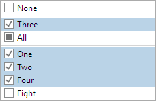

# EnumPicker

The [EnumPicker](xref:ActiproSoftware.Windows.Controls.Editors.EnumPicker) control allows for the input of an `Enum` value using a standard list presentation.  It supports both flags and non-flags enumerations, altering the user interface as appropriate.



The [EnumPicker](xref:ActiproSoftware.Windows.Controls.Editors.EnumPicker) directly embeds an [EnumListBox](../other-controls/enumlistbox.md) control to provide the functionality mentioned above.

## Enumeration Value and Type

The [Value](xref:ActiproSoftware.Windows.Controls.Editors.EnumPicker.Value) property provides a quick and easy way to setup to the list box.  The [EnumType](xref:ActiproSoftware.Windows.Controls.Editors.EnumPicker.EnumType) property is used to to build the items presented by the `EnumPicker`. The items are constructed by reflecting the enumeration type, with full support for the `FlagsAttribute`.

When the [Value](xref:ActiproSoftware.Windows.Controls.Editors.EnumPicker.Value) property is bound/set to a non-null enumeration value, then the enumeration type will be automatically set (if it has not been explicitly set).  Therefore, the [EnumType](xref:ActiproSoftware.Windows.Controls.Editors.EnumPicker.EnumType) only needs to be set when [Value](xref:ActiproSoftware.Windows.Controls.Editors.EnumPicker.Value) is bound to a nullable enumeration type.

## Using Display Attributes

Sometimes it is helpful to display an alternate text version of an enumeration value, especially when the values are made of multiple concatenated words.  For instance, an enumeration value named "FooBar" might appear nicer as "Foo Bar".

This scenario is fully supported by [EnumPicker](xref:ActiproSoftware.Windows.Controls.Editors.EnumPicker).  A `System.ComponentModel.DataAnnotations.DisplayAttribute` can be applied to a value to give it an alternate textual description.  Then as long as the [UseDisplayAttributes](xref:ActiproSoftware.Windows.Controls.Editors.EnumPicker.UseDisplayAttributes) property is set to `true`, that alternate text will be used.

If the `DisplayAttribute.ResourceType` property is left blank, it will use the direct value specified by the `Name` property.  Otherwise, it will look in the specified resource `Type` for a localized resource value within the property indicated by `Name`.

In this example, the `DisplayAttribute` will look for a property named `MyFirstValue` in the string resources type `MyResources` and use that property's value:

```csharp
public enum SampleEnum {

	[Display(ResourceType = typeof(MyResources), Name = "MyFirstValue")]
	MyFirstValue = 1

	...
}
```

> [!NOTE]
> The WPF version of [EnumPicker](xref:ActiproSoftware.Windows.Controls.Editors.EnumPicker) also supports `System.ComponentModel.DescriptionAttribute` to supply textual descriptions in place of `System.ComponentModel.DataAnnotations.DisplayAttribute`.

## Custom Sorting

By default, values are listed in the order they are defined.  The exception is that in flags enums, group values get placed together.

Sorting can be altered by implementing a custom `IComparer<Enum>` class and assigning it to the [EnumSortComparer](xref:ActiproSoftware.Windows.Controls.Editors.EnumPicker.EnumSortComparer) property.  The [EnumValueNameSortComparer](xref:ActiproSoftware.Windows.Controls.Editors.Primitives.EnumValueNameSortComparer).[Instance](xref:ActiproSoftware.Windows.Controls.Editors.Primitives.EnumValueNameSortComparer.Instance) static property provides access to a pre-built comparer for listing enumeration values alphabetically by name.

## Hiding Enumeration Values

By default, all values are listed in the control.  If you wish to hide a specific value from the end user, use `EditorBrowsableAttribute` on the value with `EditorBrowsableState.Never`.

In this example, the `EditorBrowsableAttribute` hides the `MyFirstValue` value from the user interface:

```csharp
public enum SampleEnum {

	[EditorBrowsable(EditorBrowsableState.Never)]
	MyFirstValue = 1

	...
}
```

## Sample XAML

This control can be placed within any other XAML container control, such as a `Page` or `Panel` with this sort of XAML:

```xaml
<editors:EnumPicker Value="{Binding Path=YourVMProperty, Mode=TwoWay}" />
```
