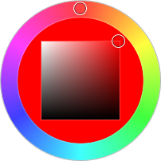

# HsbColorPicker

The [HsbColorPicker](xref:@ActiproUIRoot.Controls.Editors.HsbColorPicker) control combines several primitives ([RadialHuePicker](radialhuepicker.md) and [SaturationBrightnessPicker](saturationbrightness.md)) together to create a control that allows for easy selection of a HSB (hue, saturation, brightness) color.



The outer ring of the control is a radial slider for selecting the hue.  The inner square allows for selection of the saturation (x-axis) and brightness (y-axis).

## Comparison Value

The [HsbColorPicker](xref:@ActiproUIRoot.Controls.Editors.HsbColorPicker).[IsComparisonValueVisible](xref:@ActiproUIRoot.Controls.Editors.HsbColorPicker.IsComparisonValueVisible) property can be set to `true` to display a comparison color value on the left side of the hue ring's fill area.  The color displayed is specified by the [ComparisonValue](xref:@ActiproUIRoot.Controls.Editors.HsbColorPicker.ComparisonValue) property.

This is useful when setting up a comparison of old/new color values.

## Sample XAML

This control can be placed within any other XAML container control, such as a `Page` or `Panel` with this sort of XAML:

```xaml
<editors:HsbColorPicker Color="{Binding Path=YourVMProperty, Mode=TwoWay}" />
```
