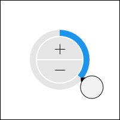

# Overview

Actipro Editors includes a number of pickers that are generally intended to be used within popups.  In many cases, the pickers are designed to work with a related [edit box](../editboxes/index.md) of a similar name.

## Picker Controls

This table shows the picker controls that are included in the product:

<table>
<thead>

<tr>
<th>Name</th>
<th>Description</th>
</tr>

</thead>
<tbody>

<tr>
<td>

[BrushPicker](brushpicker.md)

</td>
<td>

Allows for the input of a `Brush` value.

</td>
</tr>

@if (wpf) {
<tr>
<td>

[BytePicker](bytepicker.md)

</td>
<td>

Allows for the input of a `Byte` (8-bit positive integer) value.

</td>
</tr>
}

<tr>
<td>

[ColorPicker](colorpicker.md)

</td>
<td>

Allows for the input of a `Color` value.

</td>
</tr>

<tr>
<td>

[CornerRadiusPicker](cornerradiuspicker.md)

</td>
<td>

Allows for the input of a `CornerRadius` (top-left, top-right, bottom-right, bottom-left) value.

</td>
</tr>

<tr>
<td>

[DatePicker](datepicker.md)

</td>
<td>

Allows for the input of a `DateTime` value's date component.

</td>
</tr>

<tr>
<td>

[DateTimePicker](datetimepicker.md)

</td>
<td>

Allows for the input of a `DateTime` value.

</td>
</tr>

<tr>
<td>

[DoublePicker](doublepicker.md)

</td>
<td>

Allows for the input of a `Double` (floating-point number) value.

</td>
</tr>

<tr>
<td>

[EnumPicker](enumpicker.md)

</td>
<td>

Allows for the input of an `Enum` (flags and non-flags enumeration) value.

</td>
</tr>

<tr>
<td>

[HsbColorPicker](hsbcolorpicker.md)

</td>
<td>

Allows for the input of a `Color` value.

</td>
</tr>

<tr>
<td>

[Int16Picker](int16picker.md)

</td>
<td>

Allows for the input of an `Int16` (16-bit integer) value.

</td>
</tr>

<tr>
<td>

[Int32Picker](int32picker.md)

</td>
<td>

Allows for the input of an `Int32` (32-bit integer) value.

</td>
</tr>

@if (wpf) {
<tr>
<td>

[Int32RectPicker](int32rectpicker.md)

</td>
<td>

Allows for the input of an `Int32Rect` (X, Y, width, height) value.

</td>
</tr>
}

<tr>
<td>

[Int64Picker](int64picker.md)

</td>
<td>

Allows for the input of an `Int64` (64-bit integer) value.

</td>
</tr>

<tr>
<td>

[PointPicker](pointpicker.md)

</td>
<td>

Allows for the input of a `Point` (X, Y) value.

</td>
</tr>

<tr>
<td>

[RadialHuePicker](radialhuepicker.md)

</td>
<td>

Allows for the input of a color's hue component.

</td>
</tr>

<tr>
<td>

[RectPicker](rectpicker.md)

</td>
<td>

Allows for the input of a `Rect` (X, Y, width, height) value.

</td>
</tr>

<tr>
<td>

[SaturationBrightnessPicker](saturationbrightness.md)

</td>
<td>

Allows for the input of a color's saturation and brightness components.

</td>
</tr>

<tr>
<td>

[SinglePicker](singlepicker.md)

</td>
<td>

Allows for the input of a `Single` (floating-point number) value.

</td>
</tr>

<tr>
<td>

[SizePicker](sizepicker.md)

</td>
<td>

Allows for the input of a `Size` (width, height) value.

</td>
</tr>

<tr>
<td>

[ThicknessPicker](thicknesspicker.md)

</td>
<td>

Allows for the input of a `Thickness` (left, top, right, bottom) value.

</td>
</tr>

<tr>
<td>

[TimePicker](timepicker.md)

</td>
<td>

Allows for the input of a `DateTime` value's time component.

</td>
</tr>

<tr>
<td>

[TimeSpanPicker](timespanpicker.md)

</td>
<td>

Allows for the input of a `TimeSpan` (days, hours, minutes, seconds, milliseconds) value.

</td>
</tr>

@if (wpf) {
<tr>
<td>

[VectorPicker](vectorpicker.md)

</td>
<td>

Allows for the input of a `Vector` (X, Y) value.

</td>
</tr>
}

</tbody>
</table>
