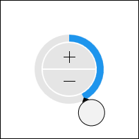

# Int64Picker

The [Int64EditBox](xref:@ActiproUIRoot.Controls.Editors.Int64EditBox) control allows for the input of an `Int64` (64-bit integer) value.  It is generally intended for display within a popup, such as for the [Int64EditBox](../editboxes/int64editbox.md) control.



The control allows for selection of an `Int64` value via the use of a radial slider and increment/decrement button combination.  The radial slider facilitates large changes to the value, while the increment/decrement buttons enable fine tuning.

The picker adjusts its radial slider functionality according to the range of specified minimum and maximum values.  Large ranges permit multiple slider rotation cycles and show an overall progress indicator towards the largest value.  Smaller ranges only allow for a single rotation cycle.

Negative values have a distinct appearance from positive values.

## Minimum and Maximum Values

Minimum and maximum values may be assigned via the [Maximum](xref:@ActiproUIRoot.Controls.Editors.Int64Picker.Maximum) and [Minimum](xref:@ActiproUIRoot.Controls.Editors.Int64Picker.Minimum) properties.

No values can be committed that lay outside of the inclusive range created by those properties.

## Incrementing/Decrementing

Value changes alter the current number component by `1`, which is the default for the [SmallChange](xref:@ActiproUIRoot.Controls.Editors.Int64Picker.SmallChange) property.

## Sample XAML

This control can be placed within any other XAML container control, such as a `Page` or `Panel` with this sort of XAML:

```xaml
<editors:Int64Picker Value="{Binding Path=YourVMProperty, Mode=TwoWay}" />
```
