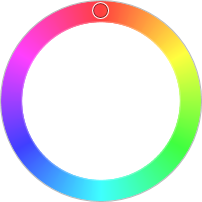

# RadialHuePicker

The [RadialHuePicker](xref:@ActiproUIRoot.Controls.Editors.RadialHuePicker) control renders a circular gradient of the color spectrum and uses a radial slider to select a color hue.



## Sample XAML

This control can be placed within any other XAML container control, such as a `Page` or `Panel` with this sort of XAML:

```xaml
<editors:RadialHuePicker Hue="{Binding Path=YourVMProperty, Mode=TwoWay}" />
```
