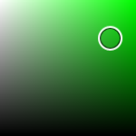

# SaturationBrightnessPicker

The [SaturationBrightnessPicker](xref:@ActiproUIRoot.Controls.Editors.SaturationBrightnessPicker) control allows for the input of color saturation and brightness values.



The control displays a two-dimensional gradient of color values for a given hue, where the vertical gradient represents brightness and the horizontal gradient represents saturation.

A gripper can be dragged to change the selected color.

## Setting the Hue

This picker shows the saturation and brightness cross-section for a particular hue.  Therefore it is important to set the [Hue](xref:@ActiproUIRoot.Controls.Editors.SaturationBrightnessPicker.Hue) property appropriately. `0` is red, `120` is green, and `240` is blue.  The hue may be set to any value between `0` and `360`.

## Sample XAML

This control can be placed within any other XAML container control, such as a `Page` or `Panel` with this sort of XAML:

```xaml
<editors:SaturationBrightnessPicker Hue="120" Saturation="{Binding Path=YourSVMProperty, Mode=TwoWay}" 
	Brightness="{Binding Path=YourBVMProperty, Mode=TwoWay}" />
```
