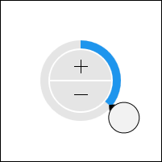

# SinglePicker

The [SinglePicker](xref:@ActiproUIRoot.Controls.Editors.SinglePicker) control allows for the input of a `Single` (floating-point number) value.  It is generally intended for display within a popup, such as for the [SingleEditBox](../editboxes/singleeditbox.md) control, and is also used within many other [pickers](index.md).



The control allows for selection of a `Single` value via the use of a radial slider and increment/decrement button combination.  The radial slider facilitates large changes to the value, while the increment/decrement buttons enable fine tuning.

The picker adjusts its radial slider functionality according to the range of specified minimum and maximum values.  Large ranges permit multiple slider rotation cycles and show an overall progress indicator towards the largest value.  Smaller ranges only allow for a single rotation cycle.

Negative values have a distinct appearance from positive values.

## Minimum and Maximum Values

Minimum and maximum values may be assigned via the [Maximum](xref:@ActiproUIRoot.Controls.Editors.SinglePicker.Maximum) and [Minimum](xref:@ActiproUIRoot.Controls.Editors.SinglePicker.Minimum) properties.

No values can be committed that lay outside of the inclusive range created by those properties.

## Incrementing/Decrementing

Value changes alter the current number component by `1`, which is the default for the [SmallChange](xref:@ActiproUIRoot.Controls.Editors.SinglePicker.SmallChange) property.

## Rounding Decimal Places

The [RoundingDecimalPlace](xref:@ActiproUIRoot.Controls.Editors.SinglePicker.RoundingDecimalPlace) property determines the maximum decimal place at which to round floating-point numbers.  It defaults to `7`, but can be set to any value in the range `0` to `7`.  Or set the value to `null` to prevent rounding.

## Sample XAML

This control can be placed within any other XAML container control, such as a `Page` or `Panel` with this sort of XAML:

```xaml
<editors:SinglePicker Value="{Binding Path=YourVMProperty, Mode=TwoWay}" />
```
