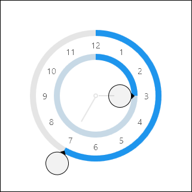

# TimePicker

The [TimePicker](xref:@ActiproUIRoot.Controls.Editors.TimePicker) control allows for the input of a `DateTime` value's time component.  Its design uses two radial sliders and is similar to the layout of a standard analog clock, making it instantly approachable by end users.



The inner radial slider sets the hours value.  It can be rotated up to two full cycles, where each cycle represents a 12 hour period.  The second cycle (for PM times) applies a subtle highlight effect on the track.  The outer radial slider sets the minutes value, and can be rotated freely.

## Minimum and Maximum Values

Minimum and maximum values may be assigned via the [Maximum](xref:@ActiproUIRoot.Controls.Editors.TimePicker.Maximum) and [Minimum](xref:@ActiproUIRoot.Controls.Editors.TimePicker.Minimum) properties.

No values can be committed that lay outside of the inclusive range created by those properties.

## Sample XAML

This control can be placed within any other XAML container control, such as a `Page` or `Panel` with this sort of XAML:

```xaml
<editors:TimePicker Value="{Binding Path=YourVMProperty, Mode=TwoWay}" />
```
