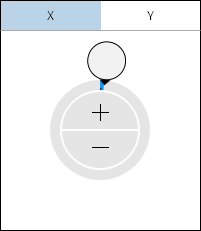

# VectorPicker

The [VectorPicker](xref:@ActiproUIRoot.Controls.Editors.VectorPicker) control allows for the input of a `Vector` (X, Y) value.  It is generally intended for display within a popup, such as for the [VectorEditBox](../editboxes/vectoreditbox.md) control.



The toggle at the top determines whether the embedded [DoublePicker](doublepicker.md) is currently modifying the `X` or `Y` component of the `Vector`.  See the [DoublePicker](doublepicker.md) for a description of how its UI functions.

## Minimum and Maximum Values

Minimum and maximum values may be assigned via the [Maximum](xref:@ActiproUIRoot.Controls.Editors.VectorPicker.Maximum) and [Minimum](xref:@ActiproUIRoot.Controls.Editors.VectorPicker.Minimum) properties.

No values can be committed that lay outside of the inclusive range created by those properties.

## Incrementing/Decrementing

Value changes alter the current number component by `1`, which is the default for the [SmallChange](xref:@ActiproUIRoot.Controls.Editors.VectorPicker.SmallChange) property.

## Rounding Decimal Places

The [RoundingDecimalPlace](xref:@ActiproUIRoot.Controls.Editors.VectorPicker.RoundingDecimalPlace) property determines the maximum decimal place at which to round floating-point numbers.  It defaults to `8`, but can be set to any value in the range `0` to `15`.  Or set the value to `null` to prevent rounding.

## Sample XAML

This control can be placed within any other XAML container control, such as a `Page` or `Panel` with this sort of XAML:

```xaml
<editors:VectorPicker Value="{Binding Path=YourVMProperty, Mode=TwoWay}" />
```
