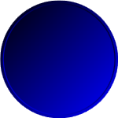
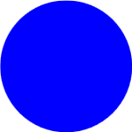
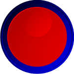
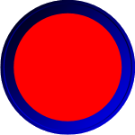
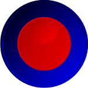
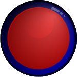

# Frames

The [CircularGauge](xref:ActiproSoftware.Windows.Controls.Gauge.CircularGauge) frame is made up of a rim and a background.  Each of which can be configured independenty to create a customized look.

## Frame Rim

The frame rim is rendered at the bottom most layer of the control and supports many styles, each with a special effect. The rim type can be set using the [RimType](xref:ActiproSoftware.Windows.Controls.Gauge.Primitives.CircularGaugeBase.RimType) property and the supported rim types can be seen using the sample project provided.

### Brush and Effect

The rim color can be customized by setting the [RimBrush](xref:ActiproSoftware.Windows.Controls.Gauge.Primitives.GaugeBase.RimBrush) property. The rim effect varies based on the rim type, but can be disabled entirely by setting [IsRimEffectEnabled](xref:ActiproSoftware.Windows.Controls.Gauge.Primitives.GaugeBase.IsRimEffectEnabled) to `false`.

*Two CircularGauge controls with a blue rim; the right image has the rim effect disabled*

> [!NOTE]
> The rim effect is only supported when [IsRimEffectEnabled](xref:ActiproSoftware.Windows.Controls.Gauge.Primitives.GaugeBase.IsRimEffectEnabled) is set to `true`**and**[RimBrush](xref:ActiproSoftware.Windows.Controls.Gauge.Primitives.GaugeBase.RimBrush) is set to a `SolidColorBrush`.

### Size

The size, or radius, of the frame rim is determined by the [Radius](xref:ActiproSoftware.Windows.Controls.Gauge.Primitives.CircularGaugeBase.Radius) property.

### Custom Geometry/ImageSource

When the built-in rim types are not flexible enough to achieve the look desired, a custom `Geometry` or `ImageSource` can be used.

When [RimType](xref:ActiproSoftware.Windows.Controls.Gauge.Primitives.CircularGaugeBase.RimType) is set to to [CustomRimGeometry](xref:ActiproSoftware.Windows.Controls.Gauge.CircularRimType.CustomRimGeometry), then the `Geometry` specified by [RimGeometry](xref:ActiproSoftware.Windows.Controls.Gauge.Primitives.CircularGaugeBase.RimGeometry) is used when rendering the rim.

> [!NOTE]
> Custom geometries will be automatically centered and scaled to fit inside the gauge control.

When [RimType](xref:ActiproSoftware.Windows.Controls.Gauge.Primitives.CircularGaugeBase.RimType) is set to to [CustomRimImage](xref:ActiproSoftware.Windows.Controls.Gauge.CircularRimType.CustomRimImage), then the `ImageSource` specified by [RimImageSource](xref:ActiproSoftware.Windows.Controls.Gauge.Primitives.CircularGaugeBase.RimImageSource) is used when rendering the rim.

## Frame Background

The frame background is rendered on top of the frame rim and supports many styles, each with a special effect.  The background type can be set using the [BackgroundType](xref:ActiproSoftware.Windows.Controls.Gauge.Primitives.CircularGaugeBase.BackgroundType) property and the supported background types types can be seen using the sample project provided.

### Brush and Effect

The background color can be customized by setting the [Background](xref:ActiproSoftware.Windows.Controls.Gauge.Primitives.GaugeBase.Background) property. The background effect varies based on the background type, but can be disabled entirely by setting [IsBackgroundEffectEnabled](xref:ActiproSoftware.Windows.Controls.Gauge.Primitives.GaugeBase.IsBackgroundEffectEnabled) to `false`.

*Two CircularGauge controls with a red background; the right image has the background effect disabled*

> [!NOTE]
> The background effect is only supported when [IsBackgroundEffectEnabled](xref:ActiproSoftware.Windows.Controls.Gauge.Primitives.GaugeBase.IsBackgroundEffectEnabled) is set to `true`**and**[Background](xref:ActiproSoftware.Windows.Controls.Gauge.Primitives.GaugeBase.Background) is set to a `SolidColorBrush`.

### Size

The size, or radius, of the frame background is determined by the [Radius](xref:ActiproSoftware.Windows.Controls.Gauge.Primitives.CircularGaugeBase.Radius) and [BackgroundRadiusRatio](xref:ActiproSoftware.Windows.Controls.Gauge.Primitives.CircularGaugeBase.BackgroundRadiusRatio) properties. This allows more or less of the frame background to cover the frame rim as needed.

*Two CircularGauge controls with a background radius ratio of 80% (left) and 60% (right)*

### Custom Geometry/ImageSource

When the built-in background types are not flexible enough to achieve the look desired, a custom `Geometry` or `ImageSource` can be used.

When [BackgroundType](xref:ActiproSoftware.Windows.Controls.Gauge.Primitives.CircularGaugeBase.BackgroundType) is set to to [CustomBackgroundGeometry](xref:ActiproSoftware.Windows.Controls.Gauge.CircularBackgroundType.CustomBackgroundGeometry), then the `Geometry` specified by [BackgroundGeometry](xref:ActiproSoftware.Windows.Controls.Gauge.Primitives.CircularGaugeBase.BackgroundGeometry) is used when rendering the background.

> [!NOTE]
> Custom geometries will be automatically centered and scaled to fit inside the gauge control.

When [BackgroundType](xref:ActiproSoftware.Windows.Controls.Gauge.Primitives.CircularGaugeBase.BackgroundType) is set to to [CustomBackgroundImage](xref:ActiproSoftware.Windows.Controls.Gauge.CircularBackgroundType.CustomBackgroundImage), then the `ImageSource` specified by [BackgroundImageSource](xref:ActiproSoftware.Windows.Controls.Gauge.Primitives.CircularGaugeBase.BackgroundImageSource) is used when rendering the rim.

## Glass Effect

A glass effect can be overlayed on the gauge, and any elements inside the gauge, by setting the [GlassType](xref:ActiproSoftware.Windows.Controls.Gauge.Primitives.CircularGaugeBase.GlassType) property.

*A CircularGauge with a circular glass effect*

> [!NOTE]
> 
> The glass effect has a z-index of `100`, therefore elements can be placed on top of the glass effect by setting their z-index to a value greater than `100`.
> 
> For more information on setting the z-index of elements, see the [Coordinate System](../coordinate-system.md) topic.
