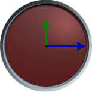
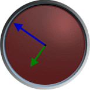

# Overview

To allow for easy customization, most of the functionality found in the [CircularGauge](xref:@ActiproUIRoot.Controls.Gauge.CircularGauge) control is actually provided through child elements. This topic will briefly describe each aspect of the [CircularGauge](xref:@ActiproUIRoot.Controls.Gauge.CircularGauge) control starting from the top and working down.  Additional topics are provided for areas that require more detailed explanations.

## Extents and Ascents

Most of the [CircularGauge](xref:@ActiproUIRoot.Controls.Gauge.CircularGauge) elements provide one or more properties that control the size of the rendered content. For example, [TickMarkExtent](xref:@ActiproUIRoot.Controls.Gauge.Primitives.CircularTickMarkBase.TickMarkExtent) and [TickMarkAscent](xref:@ActiproUIRoot.Controls.Gauge.Primitives.CircularTickMarkBase.TickMarkAscent) control the width/height of the tick marks.

Extent refers to the length of the element outward from the center. In other words, the extent runs along an imaginary line drawn from the center point outwards. This allows the extent to change direction depending on the current angle. Therefore, an element drawn on the right side of the gauge would be as wide as an element drawn at the top is tall. The ascent is always runs perpendicular to the extent.

*Two CircularGauges with blue extent lines, and their associated green ascent lines*

Both extents and ascents can be specified as a percentage of the frame radius, or as a fixed value. For example, `TickMarkExtent="5%"` will size the tick mark to be 5% of the frame radius, therefore if the frame radius is changed the tick mark size will change proportionally.

## Frames

Several frames are support and are rendered in the background of the control.

See the [Frames](frames.md) topic for more information.

## Scales

[CircularGauge](xref:@ActiproUIRoot.Controls.Gauge.CircularGauge) uses [CircularScale](xref:@ActiproUIRoot.Controls.Gauge.CircularScale) elements to host the remaining elements described below and is used for overall positioning.

See the [Scales](scales.md) topic for more information.

## Tick Sets

The [CircularScale](xref:@ActiproUIRoot.Controls.Gauge.CircularScale) elements can contain one or more [CircularTickSet](xref:@ActiproUIRoot.Controls.Gauge.CircularTickSet) elements, which specify the minimum value, maximum value, and intervals used by the remaining elements.

See the [Tick Sets](tick-sets.md) topic for more information.

## Tick Marks and Labels

The [CircularTickSet](xref:@ActiproUIRoot.Controls.Gauge.CircularTickSet) elements can contain one or more [CircularTickMarkMajor](xref:@ActiproUIRoot.Controls.Gauge.CircularTickMarkMajor), [CircularTickMarkMinor](xref:@ActiproUIRoot.Controls.Gauge.CircularTickMarkMinor), [CircularTickMarkCustom](xref:@ActiproUIRoot.Controls.Gauge.CircularTickMarkCustom), [CircularTickLabelMajor](xref:@ActiproUIRoot.Controls.Gauge.CircularTickLabelMajor), [CircularTickLabelMinor](xref:@ActiproUIRoot.Controls.Gauge.CircularTickLabelMinor), and/or [CircularTickLabelCustom](xref:@ActiproUIRoot.Controls.Gauge.CircularTickLabelCustom) elements, which render the tick marks/labels along the scale bar.

See the [Tick Marks and Labels](tick-marks-and-labels.md) topic for more information.

## Ranges

The [CircularTickSet](xref:@ActiproUIRoot.Controls.Gauge.CircularTickSet) elements can contain one or more [CircularRange](xref:@ActiproUIRoot.Controls.Gauge.CircularRange) elements, which are used to highlight a value range of interest.

See the [Ranges](ranges.md) topic for more information.

## Pointers

The [CircularTickSet](xref:@ActiproUIRoot.Controls.Gauge.CircularTickSet) elements can contain one or more [CircularPointerBar](xref:@ActiproUIRoot.Controls.Gauge.CircularPointerBar), [CircularPointerCap](xref:@ActiproUIRoot.Controls.Gauge.CircularPointerCap), [CircularPointerLabel](xref:@ActiproUIRoot.Controls.Gauge.CircularPointerLabel), [CircularPointerMarker](xref:@ActiproUIRoot.Controls.Gauge.CircularPointerMarker) and/or, [CircularPointerNeedle](xref:@ActiproUIRoot.Controls.Gauge.CircularPointerNeedle) elements, which provide visual feedback of a value.

See the [Pointers](pointers.md) topic for more information.
