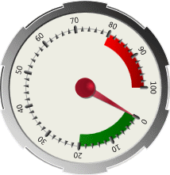
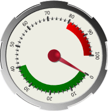
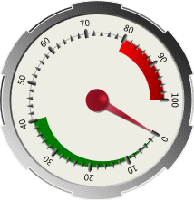

# Ranges

Ranges can be used to highlight a value range of interest, and can be included by adding an instance of [CircularRange](xref:@ActiproUIRoot.Controls.Gauge.CircularRange) to the [CircularTickSet](xref:@ActiproUIRoot.Controls.Gauge.CircularTickSet).[Ranges](xref:@ActiproUIRoot.Controls.Gauge.CircularTickSet.Ranges) collection.

*A CircularGauge with two ranges, one shown in green and one in red*

## Value Range

The area covered by a range is controlled using the [StartValue](xref:@ActiproUIRoot.Controls.Gauge.Primitives.RangeBase.StartValue) and [EndValue](xref:@ActiproUIRoot.Controls.Gauge.Primitives.RangeBase.EndValue) properties.

*A CircularGauge with the green range updated to span from 0 to 40*

## Appearance

There are several properties that control the appearance of the range.

### Colors/Brushes

There are two brushes used by the range: [Background](xref:@ActiproUIRoot.Controls.Gauge.Primitives.RangeBase.Background) and [BorderBrush](xref:@ActiproUIRoot.Controls.Gauge.Primitives.RangeBase.BorderBrush). The [BorderBrush](xref:@ActiproUIRoot.Controls.Gauge.Primitives.RangeBase.BorderBrush) property is only used when the [BorderWidth](xref:@ActiproUIRoot.Controls.Gauge.Primitives.RangeBase.BorderWidth) property is greater than `0`.

### Extents

Ranges can be configured to use the same extent for their entire length, or they can be used to produce sweeping arcs. Using the [StartExtent](xref:@ActiproUIRoot.Controls.Gauge.CircularRange.StartExtent) and [EndExtent](xref:@ActiproUIRoot.Controls.Gauge.CircularRange.EndExtent) properties, you can create a range with a varying thickness.

*A CircularGauge with the green start extent updated to 0*

## Scale Placement

Ranges are positioned relative to the scale bar defined by the associated [CircularScale](xref:@ActiproUIRoot.Controls.Gauge.CircularScale) element. By default, ranges will be overlayed and centered on the scale bar. The placement of the range can be altered using the [ScalePlacement](xref:@ActiproUIRoot.Controls.Gauge.Primitives.RangeBase.ScalePlacement) and [ScaleOffset](xref:@ActiproUIRoot.Controls.Gauge.Primitives.RangeBase.ScaleOffset) properties.

There are three possible values for the [ScalePlacement](xref:@ActiproUIRoot.Controls.Gauge.Primitives.RangeBase.ScalePlacement) property:

| Value | Description |
|-----|-----|
| `Inside` | Indicates that the range will be placed inside (or closer to the center) of the scale bar. The outer edge of the range will be aligned with the inner edge of the scale bar. |
| `Outside` | Indicates that the range will be placed outside (or further from the center) of the scale bar. The inner edge of the range will be aligned with the outer edge of the scale bar. |
| `Overlay` | Indicates that the range will be centered over (or on top) of the scale bar. The center line of the range will be aligned with the center line of the scale bar. |

In addition to the placement, the [ScaleOffset](xref:@ActiproUIRoot.Controls.Gauge.Primitives.RangeBase.ScaleOffset) can be used to further customize the location of the range.
