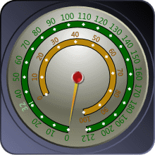
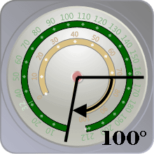
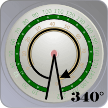

# Scales

[CircularScale](xref:@ActiproUIRoot.Controls.Gauge.CircularScale) is used to control the overall layout of tick marks, tick labels, pointers, and ranges, as well render an optional scale bar.

*A CircularGauge with two scales, one shown in green and the other in yellow*

## Scale Bar

The scale bar is rendered by the [CircularScale](xref:@ActiproUIRoot.Controls.Gauge.CircularScale) element as a continuous band spanning the entire sweep angle. The scale bar is also used as a basis for the placement of child elements, such as the tick marks.

The radius of the scale bar is controlled by the [Radius](xref:@ActiproUIRoot.Controls.Gauge.CircularScale.Radius) property, which can be specified as a percentage of the frame radius or using an fixed value. This allows the scale bar, and therefore all the child elements, to be moved in and out as needed. In the image above, the green scale has a larger radius than the yellow scale bar. This allows for several scales to be defined and positioned as desired.

In addition, the size (or thickness) of the scale bar can be altered using the [BarExtent](xref:@ActiproUIRoot.Controls.Gauge.Primitives.ScaleBase.BarExtent) property. The scale bar can also be hidden completely by setting [IsBarVisible](xref:@ActiproUIRoot.Controls.Gauge.Primitives.ScaleBase.IsBarVisible) to `false`.

## Range of Motion

The range of motion for all the child elements of a scale can be specified using the [StartAngle](xref:@ActiproUIRoot.Controls.Gauge.CircularScale.StartAngle) and [SweepAngle](xref:@ActiproUIRoot.Controls.Gauge.CircularScale.SweepAngle) properties.

The start angle determines the angle of origin of the scale, which will typically specify the location of the minimum value.  Following WPF standards, 0° points due east and positive angles result in a clockwise rotation.

> [!NOTE]
> It is possible to reverse the direction of the value range (by setting [IsReversed](xref:@ActiproUIRoot.Controls.Gauge.Primitives.TickSetBase.IsReversed) to `true` for any tick-sets specified in the scale), in this case the angle of origin will actually specify the location of the maximum value.

*The green scale has a start angle of 100°*

The sweep angle determines the overall travel or length of the scale. If the sweep angle is specified as 360°, then range of motion will be a complete circle and the minimum and maximum values will share the same location.

*The green scale has a sweep angle of 340°*
