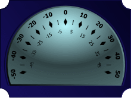
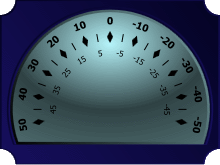
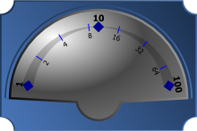
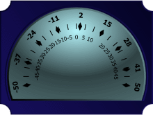
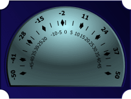

# Tick Sets

[CircularTickSet](xref:ActiproSoftware.Windows.Controls.Gauge.CircularTickSet) is used to specify the minimum value, maximum value, and intervals used by the tick marks, tick labels, pointers, and ranges.

## Value Range

The value range determines the overall range of values supported, as well as their placement along the sweep angle.

### Minimum/Maximum

The value range is defined by the [Minimum](xref:ActiproSoftware.Windows.Controls.Gauge.Primitives.TickSetBase.Minimum) and [Maximum](xref:ActiproSoftware.Windows.Controls.Gauge.Primitives.TickSetBase.Maximum) properties, much like a `ProgressBar` control.

*A CircularGauge with a value range from -50 to 50*

### Reversing Range

By default, the values start from the minimum value and move clock-wise to the maximum value. It is possible to reverse this direction by setting the [IsReversed](xref:ActiproSoftware.Windows.Controls.Gauge.Primitives.TickSetBase.IsReversed) property to `true`.

*A CircularGauge with a value range from 50 to -50*

### Logarithmic Range

A logarithmic value range can be specified by setting [IsLogarithmic](xref:ActiproSoftware.Windows.Controls.Gauge.Primitives.TickSetBase.IsLogarithmic) to `true`. The logarithmic base can be changed by setting [LogarithmicBase](xref:ActiproSoftware.Windows.Controls.Gauge.Primitives.TickSetBase.LogarithmicBase), which defaults to `10`.

> [!NOTE]
> When using a logarithmic value range, the minimum value will be coerced to be greater than or equal to zero, and the maximum value will be coerced to be greater than or equal to one.

*A CircularGauge with a logarithmic value range from 1 to 100, using a base of 10*

## Intervals

There are two intervals, major and minor, which are used by the various tick marks and tick labels. The major interval specifies where the major tick marks and tick labels will be rendered. The minor interval specifies where the minor tick marks and tick labels will be rendered.

See the [Tick Marks and Labels](tick-marks-and-labels.md) topic for more information.

> [!NOTE]
> Minor tick marks and tick labels are not rendered when their associated value also falls on the major interval.

### Interval Origin

The interval origin determines the value used as a basis for the intervals. By default, the minimum value is used, which means that the intervals will be added incrementally to the minimum value until the maximum value is reached, or exceeded.

*A CircularGauge with a major interval of 13, which uses the minimum value (-50) as the origin*

As you can see from the image above, the intervals start counting with the minimum value and work up to the maximum value. The first major tick is placed at `-50` (minimum value), then the next major tick is placed at `-37` (minimum value + major interval), and so on.

The basis, or origin, of the intervals can be altered by setting the [IntervalOrigin](xref:ActiproSoftware.Windows.Controls.Gauge.Primitives.TickSetBase.IntervalOrigin) property to one of three values: `Minimum` (default), `Zero`, or `Maximum`.

*Two CircularGauge controls with a major interval of 13 and an origin of Zero (left) and Maximum (right)*

When the interval origin is set to `Zero`, the intervals will be added incrementally starting from zero until the maximum value (if the maximum value is greater than 0) is reached, or exceeded. Additionally, the intervals will be subtracted incrementally starting from zero until the minimum value (if the minimum value is less than 0) is reached, or exceeded.

> [!NOTE]
> Any values outside the minimum/maximum range will be discarded, when the range does not contain zero.

When the interval origin is et to `Maximum`, the intervals will be subtracted incrementally from the maximum value until the minimum value is reached, or exceeded.

### Linear Intervals

By default, the intervals will added/subtracted cumulatively (or linearly) to the interval origin. As seen above, if the major interval is `13` and using the minimum value (`-50`) as the origin, major ticks would be placed at `-50`, `-37`, `-24`, etc.

The major and minor intervals can be set using [MajorInterval](xref:ActiproSoftware.Windows.Controls.Gauge.Primitives.TickSetBase.MajorInterval) and [MinorInterval](xref:ActiproSoftware.Windows.Controls.Gauge.Primitives.TickSetBase.MinorInterval), respectively. Both these properties support any positive value.

### Logarithmic Intervals

When `IsLogarithmic` is set to `true`, logarithmic intervals will also be used. Like linear intervals, the logarithmic interval will added/subtracted to the interval origin until the maximum/minimum value is reached. The value added/subtracted is calculated using exponential calculations, with the major/minor interval as the base.

As an example, assume a tick-set has a minimum value of `1`, a maximum value of `100`, a major interval of `10`, and an interval origin of `Zero`. The first tick will be placed at `1` (`0 + 10⁰`), the second tick will be placed at `10` (`0 + 10¹`), and the last tick will be placed at `100` (`0 + 10²`).  Therefore, the forumla equates to `0 + intervalⁿ` for an interval origin of `Zero`, `minimum value + intervalⁿ` for an interval origin of `Minimum`, and `maximum value - intervalⁿ` for an interval origin of `Maximum`, where `n` starts at zero and is incremented by one, until the minimum/maximum value is reached, or exceeded.

The major and minor intervals can be set using [MajorInterval](xref:ActiproSoftware.Windows.Controls.Gauge.Primitives.TickSetBase.MajorInterval) and [MinorInterval](xref:ActiproSoftware.Windows.Controls.Gauge.Primitives.TickSetBase.MinorInterval), respectively. Both these properties support any positive value, or can be set to `Double.NaN` to use the `CircularTickSet.LogarithmicBase`.
