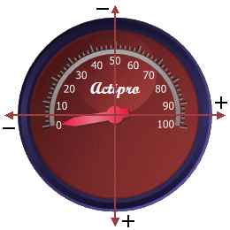
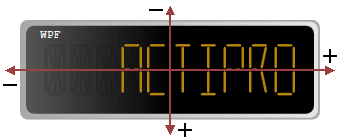
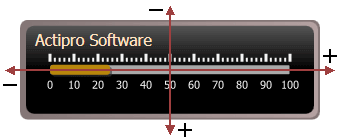
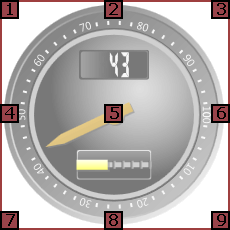

# Coordinate System

This section contains information regarding the Actipro Gauge coordinate system, which is used to position elements and controls.

## X/Y Coordinates

The X/Y coordinates specify an offset from an origin point, which by default is the center of the gauge. The values along the X-axis increase from left to right, while the values along the Y-axis increase from top to bottom.

The X/Y coordinates can be specified using a fixed pixel offset, or using a percentage. The basis of the percentage varies based on the control. For `CircularGaugeBase`-derived controls, the `Radius` is used as the basis. For the remaining controls, the `ActualWidth` and `ActualHeight` are used.

Percentage based sizes can be specified by appending the percent character (%) at then end of the value (e.g. `X="10%"`).

*The coordinate system shown on a CircularGauge*

*The coordinate system shown on a DigitalGauge*

*The coordinate system shown on a LinearGauge*

## Coordinate Origin

By default, the origin point of the X/Y coordinates is the center of the gauge. The origin point can be changed to any one of nine locations, defined by [CoordinateOrigin](xref:ActiproSoftware.Windows.Controls.Gauge.CoordinateOrigin).

*The coordinate origins shown on a CircularGauge*

| Value | Description |
|-----|-----|
| 1. `TopLeft` | Indicates that the top-left point will be used at the origin. |
| 2. `CenterTop` | Indicates that the center-top point will be used at the origin. |
| 3. `TopRight` | Indicates that the top-right point will be used at the origin. |
| 4. `MiddleLeft` | Indicates that the middle-left point will be used at the origin. |
| 5. `Center` | Indicates that the center point will be used at the origin. This is the default origin. |
| 6. `MiddleRight` | Indicates that the middle-right point will be used at the origin. |
| 7. `BottomLeft` | Indicates that the bottom-left point will be used at the origin. |
| 8. `CenterBottom` | Indicates that the center-bottom point will be used at the origin. |
| 9. `BottomRight` | Indicates that the bottom-right point will be used at the origin. |

## Z-Order

The z-order of the elements presented by the gauge controls is determined by the [ZIndexProperty](xref:ActiproSoftware.Windows.Controls.Gauge.Primitives.GaugeElement.ZIndexProperty) attached property. An element with a higher z-index will be rendered on top of an element with a lower z-index.

> [!NOTE]
> The gauge elements all derive from [GaugeElement](xref:ActiproSoftware.Windows.Controls.Gauge.Primitives.GaugeElement), which exposes the [ZIndex](xref:ActiproSoftware.Windows.Controls.Gauge.Primitives.GaugeElement.ZIndex) property. Therefore, the z-index of the gauge elements can be set without having to use the attached property syntax.

When one or more elements have the same z-index value, then the last one added to the gauge control will be rendered on top.
