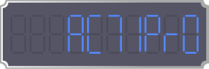
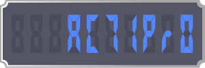
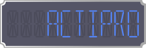
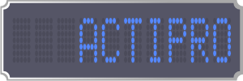
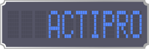

# Characters

This topic covers the options available for customizing the characters displayed by a [DigitalGauge](xref:ActiproSoftware.Windows.Controls.Gauge.DigitalGauge).

## Types

Five types of character segments are supported: 7-segment (normal), 7-segment (trapezoid), 14-segment (normal), and using 5-by-7 matrix with ellipses or rectangles.

> [!NOTE]
> Because of the number of segments is limited, certain letters/numbers may be rendered using the same segments.

*A DigitalGauge with characters displayed using 7-segments (normal)*

*A DigitalGauge with characters displayed using 7-segments (trapezoid)*

*A DigitalGauge with characters displayed using 14-segments (normal)*

*A DigitalGauge with characters displayed using 5-by-7 matrix (ellipse)*

*A DigitalGauge with characters displayed using 5-by-7 matrix (rectangle)*

## Appearance

The [DigitalGauge](xref:ActiproSoftware.Windows.Controls.Gauge.DigitalGauge) offers several options to customize the look of the characters displayed.

### Colors/Brushes

There are two brushes used by characters: [Foreground](xref:ActiproSoftware.Windows.Controls.Gauge.DigitalGauge.Foreground) and [DimmedBrush](xref:ActiproSoftware.Windows.Controls.Gauge.DigitalGauge.DimmedBrush). Each brush is used to render the lit and unlit segments, respectively.

### Skew Angles

The skew angle properties, [SkewAngleX](xref:ActiproSoftware.Windows.Controls.Gauge.DigitalGauge.SkewAngleX) and [SkewAngleY](xref:ActiproSoftware.Windows.Controls.Gauge.DigitalGauge.SkewAngleY), allow for the characters to be skewed along the x-axis and/or y-axis.

> [!NOTE]
> The [SkewAngleX](xref:ActiproSoftware.Windows.Controls.Gauge.DigitalGauge.SkewAngleX) can be used to produce italic characters.

### Segment Thickness

The [CharacterSegmentThickness](xref:ActiproSoftware.Windows.Controls.Gauge.DigitalGauge.CharacterSegmentThickness) property can be used to set a specific thickness for the segments that make up a character.  Please note that not all character types support this feature.  The [CharacterSegmentThickness](xref:ActiproSoftware.Windows.Controls.Gauge.DigitalGauge.CharacterSegmentThickness) property defaults to `Double.NaN`, which means that automatic thickness logic is applied, making the thickness a percentage of the character height.

## Casing

The [DigitalGauge](xref:ActiproSoftware.Windows.Controls.Gauge.DigitalGauge) offers the option to override whether characters are rendered uppercase or lowercase by setting the [CharacterCasing](xref:ActiproSoftware.Windows.Controls.Gauge.DigitalGauge.CharacterCasing) property.  Because of the limitations inherent to segmented displays, not all characters have uppercase and lowercase versions. In these instances, the character will be rendered in the case available.

## Placement

The [DigitalGauge](xref:ActiproSoftware.Windows.Controls.Gauge.DigitalGauge) offers several options to customize the placement of the characters displayed.

### Character Count

The [DigitalGauge](xref:ActiproSoftware.Windows.Controls.Gauge.DigitalGauge) will only display a certain number of characters, specified by the [CharacterCount](xref:ActiproSoftware.Windows.Controls.Gauge.DigitalGauge.CharacterCount) property. If the string representation of the current value is longer than the character count, then it is truncated.

### Character Size

The size of the characters displayed is determined by the [CharacterHeight](xref:ActiproSoftware.Windows.Controls.Gauge.DigitalGauge.CharacterHeight) and [CharacterWidthRatio](xref:ActiproSoftware.Windows.Controls.Gauge.DigitalGauge.CharacterWidthRatio) properties. By default, the [CharacterHeight](xref:ActiproSoftware.Windows.Controls.Gauge.DigitalGauge.CharacterHeight) is set to `Double.NaN`, which indicates that the height of the characters should be automatically calculated based on the height of the gauge control and the number of characters.

The width of the characters is calculated as a ratio of the [CharacterHeight](xref:ActiproSoftware.Windows.Controls.Gauge.DigitalGauge.CharacterHeight), as specified by the [CharacterWidthRatio](xref:ActiproSoftware.Windows.Controls.Gauge.DigitalGauge.CharacterWidthRatio) property.

### Character Padding/Spacing

The padding around all the characters can be set using the [CharacterPadding](xref:ActiproSoftware.Windows.Controls.Gauge.DigitalGauge.CharacterPadding) property.

The space between characters is controlled by the [CharacterSpacing](xref:ActiproSoftware.Windows.Controls.Gauge.DigitalGauge.CharacterSpacing) property, which specifies the number of pixels between each character. This space is used when rendering sub-characters, such as period or colon.

### Text Alignment

The [DigitalGauge](xref:ActiproSoftware.Windows.Controls.Gauge.DigitalGauge) can align the text characters to the left or the right (the default) side of the control.  The alignment is specified by the [TextAlignment](xref:ActiproSoftware.Windows.Controls.Gauge.DigitalGauge.TextAlignment) property.
