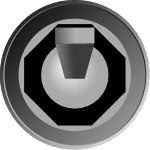
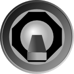
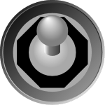
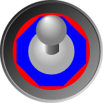
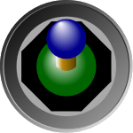
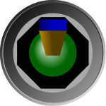

# Switch

[FlipSwitch](xref:@ActiproUIRoot.Controls.Gauge.FlipSwitch) supports two or three check states and includes several options for customizing the look of the switch.

## Checked State

The `FlipSwitch` mimics most of the functionality found in the native WPF `ToggleButton`, such as the [IsChecked](xref:@ActiproUIRoot.Controls.Gauge.FlipSwitch.IsChecked) and [IsThreeState](xref:@ActiproUIRoot.Controls.Gauge.FlipSwitch.IsThreeState) properties.

The [IsChecked](xref:@ActiproUIRoot.Controls.Gauge.FlipSwitch.IsChecked) property determines the position of the switch (up for `true`, down for `false`, or in the middle for `null`). By default, only `true` and `false` are supported, but if [IsThreeState](xref:@ActiproUIRoot.Controls.Gauge.FlipSwitch.IsThreeState) is set to `true` then `null` (or indeterminate) is also supported.

*Two FlipSwitch controls with one checked (left) and one unchecked (right)*

When animating from one state to another, the [SwitchInterval](xref:@ActiproUIRoot.Controls.Gauge.FlipSwitch.SwitchInterval) determines how long it takes the switch to travel to the new location.

## Appearance

### Switch Type

There are two switch types supported (circular and flat), which can be specified using the [SwitchType](xref:@ActiproUIRoot.Controls.Gauge.FlipSwitch.SwitchType) property.

*Two FlipSwitch controls with a flat switch (left) and one with a circular switch (right)*

### Switch Size

The size of the switch is control by the [SwitchRadiusRatio](xref:@ActiproUIRoot.Controls.Gauge.FlipSwitch.SwitchRadiusRatio) property, which is defined as a percentage of the [Radius](xref:@ActiproUIRoot.Controls.Gauge.Primitives.CircularGaugeBase.Radius).

### Brush and Effect

The switch can be broken down into two different parts: the base of the switch and then the switch itself. The brush used for each part can be customized independently.

The base color can be customized by setting the [BaseBackground](xref:@ActiproUIRoot.Controls.Gauge.FlipSwitch.BaseBackground) property. Additionally, the accent color (the octagon) can be customized by setting the [BaseAccentBrush](xref:@ActiproUIRoot.Controls.Gauge.FlipSwitch.BaseAccentBrush) property.

*FlipSwitch with the base in red and the base accent in blue*

The actual switch is made up of a ball, shaft, and a tip. The colors from these elements can be customized using [BallBrush](xref:@ActiproUIRoot.Controls.Gauge.FlipSwitch.BallBrush), [ShaftBrush](xref:@ActiproUIRoot.Controls.Gauge.FlipSwitch.ShaftBrush), and [TipBrush](xref:@ActiproUIRoot.Controls.Gauge.FlipSwitch.TipBrush) respectively.

*Two FlipSwitch control, one circular and one flat, with a green ball, yellow shaft, and blue tip*

The switch includes an effect that can be disabled by setting [IsSwitchEffectEnabled](xref:@ActiproUIRoot.Controls.Gauge.FlipSwitch.IsSwitchEffectEnabled) to `false`.

> [!IMPORTANT]
> The switch effect is only supported when [IsSwitchEffectEnabled](xref:@ActiproUIRoot.Controls.Gauge.FlipSwitch.IsSwitchEffectEnabled) is set to `true` *and* the associated brush is set to a `SolidColorBrush`.
