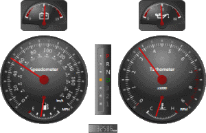

# Overview

Actipro Gauge provides circular, linear, and digital gauge controls, as well as led and toggle switch controls, all natively written for the Windows Presentation Foundation framework. Use these controls in your applications to more effectively present various data.

*A recreation of an automotive instrument cluster*

CircularGauge is a control that presents a value, within a given range, along the circumference of a circle. The control supports tick marks, labels, needles, bars, markers, and much more. Examples of circular gauges include Speedometers and Tachometers found in cars.

LinearGauge is a control that presents a value, within a given range, either horizontally or vertically. The control supports tick marks, labels, bars, markers, and much more. Examples of linear gauges include glass Thermometers.

DigitalGauge is a control that presents any string value using 7 or 14 segment displays or two 5-by-7 dot matrix displays. In addition, there are numerous options to customize the character display. Examples of digital gauges include digital clocks.

Led is a control that mimics an led light, which can be turned on or off, or can be set to blink.  The control supports color customization and animation, as well as several shapes.  Examples of led lights include power buttons on computers and monitors.

ToggleSwitch is a control that mimics a light switch, which can be turned on or off, or can be set to indeterminate.  The control supports color customization and animation, and includes a circular and a flat look.  Examples of toggle switches include every day light switches.

## What is a Gauge?

A gauge is a presentation tool that helps to monitor and regulate the level, state, and dimensions or forms of a variable, which is bounded within a range.

The most common example of gauges is seen in the dashboard of a car, which indicate the speed of the car, the temperature of the engine, available fuel, etc. The image above shows a recreation of a car's dashboard using all three gauge controls.

## Features

### General Features

- Data-binding is fully supported allowing for live updates and custom animations.
- Any WPF control can be [embedded](advanced-features/embedding-controls.md) and precisely positioned inside the gauge controls, including z-layer positioning.
- All gauge elements can be customized as desired to achieve a unique and consistent look.
- Includes built-in [converters](advanced-features/converters.md) that can be used by the gauge controls to present the average, maximum, and/or minimum values.
- Easily render a bitmap of the gauge control and save to any image format (.png, .gif, .jpg, etc.) supported by WPF.
- Gauge elements can automatically adjust their sized based on the size of the gauge control.

### CircularGauge Features

- Includes several built-in [frame rims and backgrounds](circular-gauge-features/frames.md), each with a unique effect.
- Any number of [scales](circular-gauge-features/scales.md) can be specified, which determine the placement of all other gauge elements.
- The start angle and sweep angle of the [scales](circular-gauge-features/scales.md) can be fully customized.
- [Tick sets](circular-gauge-features/tick-sets.md) can be used to specify the minimum and maximum values used by all child elements.
- Interval steps can be used to position tick marks and labels and the interval origin can be set to the minimum value, zero, or the maximum value.
- [Tick marks and/or labels](circular-gauge-features/tick-marks-and-labels.md) can be automatically included at the major and minor intervals with several customization options.
- [Tick marks and/or labels](circular-gauge-features/tick-marks-and-labels.md) can be manually added at a specific value.
- [Logarithmic](circular-gauge-features/tick-sets.md) tick-sets are fully supported with a configurable base.
- Includes five unique [pointer](circular-gauge-features/pointers.md) types, each with several styles.
- Needle and Marker pointers can render a custom image or Geometry.
- Ability to include any number of pointers, which can show unique values all on the same gauge.
- Caps can be used to cover the ends of needles, providing for a more realistic looking gauge.
- Support for interactive pointers, which can be dragged by the end-user using the mouse.
- Pointer values can be snapped to a configurable interval, such as restricting values to whole numbers.
- [Dampening](circular-gauge-features/pointers.md) allows for pointer movements to be smoothed and animated.
- Ability to include any number of [ranges](circular-gauge-features/ranges.md), which can highlight areas of interest.
- [Refresh rate](circular-gauge-features/pointers.md) can be used to limit the number of updates made to a pointer, which gives the user enough time to see the updated values.

### DigitalGauge Features

- Includes several built-in [frame rims and backgrounds](linear-gauge-features/frames.md), each with a unique effect.
- Supports five [character styles](digital-gauge-features/characters.md), which can be used to display characters as well as numbers.
- The [size and placement](digital-gauge-features/characters.md) of the character display is fully customizable.
- [Refresh rate](digital-gauge-features/index.md) can be used to limit the number of updates made to the display, which gives the user enough time to see the updated values.
- [Skew angles](digital-gauge-features/characters.md) can be used to produce italic characters.
- [Led lights](digital-gauge-features/index.md) can be turned on or off, or set to blink, all using smooth animations.
- Text display can be automatically [scrolled](digital-gauge-features/index.md) to the left or right, using a configurable interval.

### Led Features

- Includes several built-in [frame rims and backgrounds](circular-gauge-features/frames.md), each with a unique effect.
- Supports several led light [shapes](led-features/led-light.md) and customizable colors.
- [Led light](led-features/led-light.md) can be turned on or off, or set to blink, all using smooth animations.

### LinearGauge Features

- Includes several built-in [frame rims and backgrounds](linear-gauge-features/frames.md), each with a unique effect.
- Can be [oriented](linear-gauge-features/index.md) horizontally or vertically.
- Any number of [scales](linear-gauge-features/scales.md) can be specified, which determine the placement of all other gauge elements.
- [Tick sets](linear-gauge-features/tick-sets.md) can be used to specify the minimum and maximum values used by all child elements.
- Interval steps can be used to position tick marks and labels and the interval origin can be set to the minimum value, zero, or the maximum value.
- [Tick marks and/or labels](linear-gauge-features/tick-marks-and-labels.md) can be automatically included at the major and minor intervals with several customization options.
- [Tick marks and/or labels](linear-gauge-features/tick-marks-and-labels.md) can be manually added at a specific value.
- [Logarithmic](linear-gauge-features/tick-sets.md) tick-sets are fully supported with a configurable base.
- Includes three unique [pointer](linear-gauge-features/pointers.md) types, each with several styles.
- Marker pointers can render a custom image or Geometry.
- Ability to include any number of pointers, which can show unique values all on the same gauge.
- Bar pointers include continuous and segmented looks, and can include a blub tip similiar to glass mercury thermometers.
- [Dampening](linear-gauge-features/pointers.md) allows for pointer movements to be smoothed and animated.
- Support for interactive pointers, which can be dragged by the end-user using the mouse.
- Pointer values can be snapped to a configurable interval, such as restricting values to whole numbers.
- Ability to include any number of [ranges](linear-gauge-features/ranges.md), which can highlight areas of interest.
- [Refresh rate](linear-gauge-features/pointers.md) can be used to limit the number of updates made to a pointer, which gives the user enough time to see the updated values.

### ToggleSwitch Features

- Includes several built-in [frame rims and backgrounds](circular-gauge-features/frames.md), each with a unique effect.
- Supports two [switch](toggle-switch-features/switch.md) types and customizable colors.
- Allows for two or three [checked states](toggle-switch-features/switch.md), with smooth animations used when transitioning between states.

*This product is written in 100% pure C#, and includes detailed documentation and samples.*
