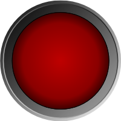
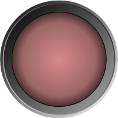
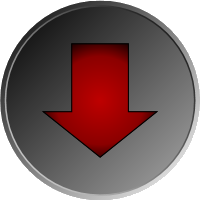
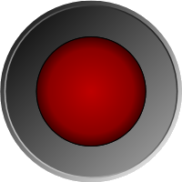
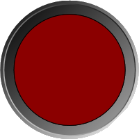

# Led Light

[Led](xref:@ActiproUIRoot.Controls.Gauge.Led) supports on, off, or blinking states, and includes several options for customizing the look of the LED light.

## State

The LED light can be in one of three states (on, off, or blinking), which is set using the [LedState](xref:@ActiproUIRoot.Controls.Gauge.Led.LedState) property.

*Two Led controls with the LED light on (left) and off (right)*

When blinking, the light will be toggle between on and off at the interval specified by the [BlinkInterval](xref:@ActiproUIRoot.Controls.Gauge.Led.BlinkInterval).

## Appearance

### Light Shape

The LED light defaults to a circle, but supports several shapes including arrows, triangles, rectangles, etc. The LED light type is specified using the [LedType](xref:@ActiproUIRoot.Controls.Gauge.Led.LedType) property.

*Led using an arrow that points down for the LED light*

When the built-in LED types are not flexible enough to achieve the desired look, a custom `Geometry` can be used.

When [LedType](xref:@ActiproUIRoot.Controls.Gauge.Led.LedType) is set to [CustomGeometry](xref:@ActiproUIRoot.Controls.Gauge.LedType.CustomGeometry), then the `Geometry` specified by [LedGeometry](xref:@ActiproUIRoot.Controls.Gauge.Led.LedGeometry) is used when rendering the LED light.

### Light Size

The size of the LED light is control by the [LedRadiusRatio](xref:@ActiproUIRoot.Controls.Gauge.Led.LedRadiusRatio) property, which is defined as a percentage of the [Radius](xref:@ActiproUIRoot.Controls.Gauge.Primitives.CircularGaugeBase.Radius).

> [!NOTE]
> When using an LED light that is not circular, the associated shape is sized such that it would fit inside a circle with the associated radius computed from `LedRadiusRatio` and `Radius`.

*Two Led controls with an LED radius ratio of 80% (left) and 60% (right)*

### Brush and Effect

The LED background and foreground colors can be customized by setting the [LedBackground](xref:@ActiproUIRoot.Controls.Gauge.Led.LedBackground) and [LedForeground](xref:@ActiproUIRoot.Controls.Gauge.Led.LedForeground), respectively.  The LED effect can be disabled entirely by setting [IsLedEffectEnabled](xref:@ActiproUIRoot.Controls.Gauge.Led.IsLedEffectEnabled) to `false`.

*Two Led controls with a red light; the right image has the LED effect disabled*

> [!IMPORTANT]
> The LED effect is only supported when [IsLedEffectEnabled](xref:@ActiproUIRoot.Controls.Gauge.Led.IsLedEffectEnabled) is set to `true` *and* [LedBackground](xref:@ActiproUIRoot.Controls.Gauge.Led.LedBackground)/[LedForeground](xref:@ActiproUIRoot.Controls.Gauge.Led.LedForeground) are set to a `SolidColorBrush`.

The `LedState` of the `Led` determines how the foreground of the light is rendered, but regardless of the state the LED light background is rendered using the `LedBackground` brush. Using the `LedState`, the LED light foreground is rendered on top of the background, using a varying opacity.  If the light is `On`, then [LedOnOpacity](xref:@ActiproUIRoot.Controls.Gauge.Led.LedOnOpacity) is used.  If the light is `Off`, then [LedOffOpacity](xref:@ActiproUIRoot.Controls.Gauge.Led.LedOffOpacity) is used.  If the light is `Blinking`, then the opacity is animated to and from `LedOnOpacity` and `LedOffOpacity`.

By default, the LED light includes a thin black border, but this can be customized by setting the [LedBorderBrush](xref:@ActiproUIRoot.Controls.Gauge.Led.LedBorderBrush) and/or [LedBorderThickness](xref:@ActiproUIRoot.Controls.Gauge.Led.LedBorderThickness) appropriately.

## Value Converters

A value converter, that can be used in data binding, is provided to convert between Boolean and `LedState` types.  See the [Advanced Features\Converters](../advanced-features/converters.md) topic for more information.
