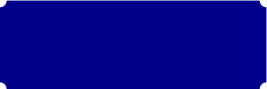
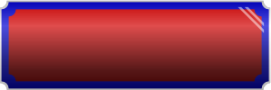

# Frames

The [LinearGauge](xref:@ActiproUIRoot.Controls.Gauge.LinearGauge) frame is made up of a rim and a background.  Each of which can be configured independently to create a customized look.

## Frame Rim

The frame rim is rendered at the bottom most layer of the control and supports many styles, each with a special effect. The rim type can be set using the [RimType](xref:@ActiproUIRoot.Controls.Gauge.Primitives.RectangularGaugeBase.RimType) property and the supported rim types can be seen using the sample project provided.

### Brush and Effect

The rim color can be customized by setting the [RimBrush](xref:@ActiproUIRoot.Controls.Gauge.Primitives.GaugeBase.RimBrush) property. The rim effect varies based on the rim type, but can be disabled entirely by setting [IsRimEffectEnabled](xref:@ActiproUIRoot.Controls.Gauge.Primitives.GaugeBase.IsRimEffectEnabled) to `false`.

*Two LinearGauge controls with a dark blue rim; the right image has the rim effect disabled*

> [!IMPORTANT]
> The rim effect is only supported when [IsRimEffectEnabled](xref:@ActiproUIRoot.Controls.Gauge.Primitives.GaugeBase.IsRimEffectEnabled) is set to `true` *and* [RimBrush](xref:@ActiproUIRoot.Controls.Gauge.Primitives.GaugeBase.RimBrush) is set to a `SolidColorBrush`.

### Custom Geometry/ImageSource

When the built-in rim types are not flexible enough to achieve the desired look, a custom `Geometry` or `ImageSource` can be used.

When [RimType](xref:@ActiproUIRoot.Controls.Gauge.Primitives.RectangularGaugeBase.RimType) is set to [CustomRimGeometry](xref:@ActiproUIRoot.Controls.Gauge.RectangularRimType.CustomRimGeometry), then the `Geometry` specified by [RimGeometry](xref:@ActiproUIRoot.Controls.Gauge.Primitives.RectangularGaugeBase.RimGeometry) is used when rendering the rim.

> [!NOTE]
> Custom geometries will be automatically centered and scaled to fit inside the gauge control.

When [RimType](xref:@ActiproUIRoot.Controls.Gauge.Primitives.RectangularGaugeBase.RimType) is set to [CustomRimImage](xref:@ActiproUIRoot.Controls.Gauge.RectangularRimType.CustomRimImage), then the `ImageSource` specified by [RimImageSource](xref:@ActiproUIRoot.Controls.Gauge.Primitives.RectangularGaugeBase.RimImageSource) is used when rendering the rim.

## Frame Background

The frame background is rendered on top of the frame rim and supports many styles, each with a special effect.  The background type can be set using the [BackgroundType](xref:@ActiproUIRoot.Controls.Gauge.Primitives.RectangularGaugeBase.BackgroundType) property and the supported background types can be seen using the sample project provided.

### Brush and Effect

The background color can be customized by setting the [Background](xref:@ActiproUIRoot.Controls.Gauge.Primitives.GaugeBase.Background) property. The background effect varies based on the background type, but can be disabled entirely by setting [IsBackgroundEffectEnabled](xref:@ActiproUIRoot.Controls.Gauge.Primitives.GaugeBase.IsBackgroundEffectEnabled) to `false`.

*Two LinearGauge controls with a dark red background; the right image has the background effect disabled*

> [!IMPORTANT]
> The background effect is only supported when [IsBackgroundEffectEnabled](xref:@ActiproUIRoot.Controls.Gauge.Primitives.GaugeBase.IsBackgroundEffectEnabled) is set to `true` *and* [Background](xref:@ActiproUIRoot.Controls.Gauge.Primitives.GaugeBase.Background) is set to a `SolidColorBrush`.

### Size

The size of the frame background is determined by the `ActualWidth`, `ActualHeight`, and [BackgroundSizeRatio](xref:@ActiproUIRoot.Controls.Gauge.Primitives.RectangularGaugeBase.BackgroundSizeRatio) properties. This allows more or less of the frame background to cover the frame rim as needed.

*Two LinearGauge controls with a background radius ratio of 80% (left) and 60% (right)*

### Custom Geometry/ImageSource

When the built-in background types are not flexible enough to achieve the look desired, a custom `Geometry` or `ImageSource` can be used.

When [BackgroundType](xref:@ActiproUIRoot.Controls.Gauge.Primitives.RectangularGaugeBase.BackgroundType) is set to [CustomBackgroundGeometry](xref:@ActiproUIRoot.Controls.Gauge.RectangularBackgroundType.CustomBackgroundGeometry), then the `Geometry` specified by [BackgroundGeometry](xref:@ActiproUIRoot.Controls.Gauge.Primitives.RectangularGaugeBase.BackgroundGeometry) is used when rendering the background.

> [!NOTE]
> Custom geometries will be automatically centered and scaled to fit inside the gauge control.

When [BackgroundType](xref:@ActiproUIRoot.Controls.Gauge.Primitives.RectangularGaugeBase.BackgroundType) is set to [CustomBackgroundImage](xref:@ActiproUIRoot.Controls.Gauge.RectangularBackgroundType.CustomBackgroundImage), then the `ImageSource` specified by [BackgroundImageSource](xref:@ActiproUIRoot.Controls.Gauge.Primitives.RectangularGaugeBase.BackgroundImageSource) is used when rendering the rim.

## Glass Effect

A glass effect can be overlayed on the gauge, and any elements inside the gauge, by setting the [GlassType](xref:@ActiproUIRoot.Controls.Gauge.Primitives.RectangularGaugeBase.GlassType) property.

*A LinearGauge with a glass effect*

> [!NOTE]
>
> The glass effect has a z-index of `100`, therefore elements can be placed on top of the glass effect by setting their z-index to a value greater than `100`.
>
> For more information on setting the z-index of elements, see the [Coordinate System](../coordinate-system.md) topic.
