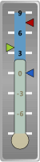
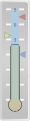
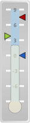

# Pointers

Pointers can be used to show the current value, or values, represented by a gauge. There are three supported pointer types: bars, labels, and markers.

Any number of pointers can be included by adding an instance of [LinearPointerBar](xref:ActiproSoftware.Windows.Controls.Gauge.LinearPointerBar), [LinearPointerLabel](xref:ActiproSoftware.Windows.Controls.Gauge.LinearPointerLabel), and/or [LinearPointerMarker](xref:ActiproSoftware.Windows.Controls.Gauge.LinearPointerMarker) to the [LinearTickSet](xref:ActiproSoftware.Windows.Controls.Gauge.LinearTickSet).[Pointers](xref:ActiproSoftware.Windows.Controls.Gauge.LinearTickSet.Pointers) collection. In addition, each pointer can present a separate and specific value by setting the [Value](xref:ActiproSoftware.Windows.Controls.Gauge.Primitives.PointerBase.Value) property.

*A LinearGauge showing both pointer types*

## Bars

Bars show a continuous band to the current value, much like ranges. By default, the bars are shown from the minimum value to the current value (as seen in the images). It is possible to "anchor" the bar to zero or the maximum value by setting the [BarOrigin](xref:ActiproSoftware.Windows.Controls.Gauge.LinearPointerBar.BarOrigin) property appropriately.

*A LinearGauge with the bar highlighted*

### Colors/Brushes

There are two brushes used by bars: [Background](xref:ActiproSoftware.Windows.Controls.Gauge.Primitives.PointerBase.Background) and [BorderBrush](xref:ActiproSoftware.Windows.Controls.Gauge.Primitives.PointerBase.BorderBrush). The [BorderBrush](xref:ActiproSoftware.Windows.Controls.Gauge.Primitives.PointerBase.BorderBrush) property is only used when the [BorderWidth](xref:ActiproSoftware.Windows.Controls.Gauge.Primitives.PointerBase.BorderWidth) property is greater than `0`.

### Extents/Ascents

Bars use the [PointerExtent](xref:ActiproSoftware.Windows.Controls.Gauge.Primitives.PointerBase.PointerExtent) property to determine the thickness of the band. The [PointerAscent](xref:ActiproSoftware.Windows.Controls.Gauge.Primitives.PointerBase.PointerAscent) property is used when rendering a blub at the end of the bar. In this case, the ascent determines the radius of the blub.

## Labels

Labels are pointers that render text at the specified value.

### Text

When [Text](xref:ActiproSoftware.Windows.Controls.Gauge.LinearPointerLabel.Text) is non-null, then that sting is used.  When null, the text is determined by the [DisplayValue](xref:ActiproSoftware.Windows.Controls.Gauge.Primitives.PointerBase.DisplayValue), [RoundMode](xref:ActiproSoftware.Windows.Controls.Gauge.LinearPointerLabel.RoundMode), and [TextFormat](xref:ActiproSoftware.Windows.Controls.Gauge.LinearPointerLabel.TextFormat) properties.

### Font and Foreground

There are several properties for setting the appropriate font and/or foreground.

## Markers

Markers are indicators or shapes rendered at the specified value.

*A LinearGauge with the three separate markers highlighted*

### Types

Several marker types are supported and can be configured by setting the [MarkerType](xref:ActiproSoftware.Windows.Controls.Gauge.LinearPointerMarker.MarkerType) property.

### Colors/Brushes

There are two brushes used by markers: [Background](xref:ActiproSoftware.Windows.Controls.Gauge.Primitives.PointerBase.Background) and [BorderBrush](xref:ActiproSoftware.Windows.Controls.Gauge.Primitives.PointerBase.BorderBrush). The [BorderBrush](xref:ActiproSoftware.Windows.Controls.Gauge.Primitives.PointerBase.BorderBrush) property is only used when the [BorderWidth](xref:ActiproSoftware.Windows.Controls.Gauge.Primitives.PointerBase.BorderWidth) property is greater than `0`.

### Extents/Ascents

Markers use the [PointerExtent](xref:ActiproSoftware.Windows.Controls.Gauge.Primitives.PointerBase.PointerExtent) and [PointerAscent](xref:ActiproSoftware.Windows.Controls.Gauge.Primitives.PointerBase.PointerAscent) properties to determine the overall bounding rectangle of the shape rendered.

## Dampening

Both pointer types can be configured to animate value changes, using a dampening feature. The [DampeningMaximumDuration](xref:ActiproSoftware.Windows.Controls.Gauge.Primitives.PointerBase.DampeningMaximumDuration) determines the amount of time it should take the pointer to travel the entire length of the scale. The pointers will use a relative duration when only traveling a portion of the scale. For example, if the pointer needs to travel half the length of the scale, then it will take half of the [DampeningMaximumDuration](xref:ActiproSoftware.Windows.Controls.Gauge.Primitives.PointerBase.DampeningMaximumDuration) to animate to the new location.

When making small value changes then the relative duration may be too short, resulting in a pointer that "jumps". To ensure the duration is not too small, the [DampeningMinimumDuration](xref:ActiproSoftware.Windows.Controls.Gauge.Primitives.PointerBase.DampeningMinimumDuration) can be used to set a minimum duration.

## Refresh Rate

When using a [LinearGauge](xref:ActiproSoftware.Windows.Controls.Gauge.LinearGauge) to display real-time data, it is possible that the value displayed by the gauge will change to quickly for the user to read the individual values. The [PointerBase](xref:ActiproSoftware.Windows.Controls.Gauge.Primitives.PointerBase).[RefreshRate](xref:ActiproSoftware.Windows.Controls.Gauge.Primitives.PointerBase.RefreshRate) property can be used to limit the number of updates displayed to the user.

The refresh rate is specified as the amount of time to wait between updates. Therefore, if the refresh rate is set to `500` milliseconds, then there will be two updates to the display every second. If several hundreds value changes are made during that second, then only two of the values will actually be displayed.

## Snapping

The values presented by the various pointers, can be any real value between the minimum and maximum values, including fractions.  Pointer values can be "snapped" to a configurable interval, by setting [IsSnappingEnabled](xref:ActiproSoftware.Windows.Controls.Gauge.Primitives.PointerBase.IsSnappingEnabled) to `true`. When snapping is enabled, the pointer value will be coerced so that it is evenly divisible by the snapping interval, which is specified by the [SnappingInterval](xref:ActiproSoftware.Windows.Controls.Gauge.Primitives.PointerBase.SnappingInterval) property.

For example, if snapping is enabled with an interval of 1, then the pointer value will be automatically rounded to the nearest whole number.

> [!TIP]
> Snapping can be used in conjunction with interactive pointers.

The [SnappingMode](xref:ActiproSoftware.Windows.Controls.Gauge.Primitives.PointerBase.SnappingMode) property allows you to determine when snapping occurs.  Its default value will always apply snapping when snapping is enabled.  Other values allow you to only snap when dragging the pointer, or only when the value is changed programmatically.

## Interactive Pointers

Pointer values can be interctively changed, by the end-user, using the mouse when [CanDrag](xref:ActiproSoftware.Windows.Controls.Gauge.Primitives.PointerBase.CanDrag) is set to `true`. When enabled, the cursor is changed to `Cursors.Hand` when the mouse is hovered over the pointer. The cursor can be customized by setting [DragCursor](xref:ActiproSoftware.Windows.Controls.Gauge.Primitives.PointerBase.DragCursor).

> [!TIP]
> By setting `IsFocusable` to `true` on a pointer element, the end-user can press the Escape key to cancel a drag operation.

By default, the pointer is not animated when the value is changed using the mouse. This behavior can be altered by setting [IsDraggingAnimated](xref:ActiproSoftware.Windows.Controls.Gauge.Primitives.PointerBase.IsDraggingAnimated) to `true`.

## Scale Placement

Bar and marker pointers are positioned relative to the scale bar defined by the associated [LinearScale](xref:ActiproSoftware.Windows.Controls.Gauge.LinearScale) element. By default, these pointers will be overlayed and centered on the scale bar. The placement of these pointers can be altered using the [ScalePlacement](xref:ActiproSoftware.Windows.Controls.Gauge.Primitives.PointerBase.ScalePlacement) and [ScaleOffset](xref:ActiproSoftware.Windows.Controls.Gauge.Primitives.PointerBase.ScaleOffset) properties.

There are three possible values for the [ScalePlacement](xref:ActiproSoftware.Windows.Controls.Gauge.Primitives.RangeBase.ScalePlacement) property:

| Value | Description |
|-----|-----|
| `Inside` | Indicates that the bar or marker pointer will be placed below, when oriented horizontally, or to the left, when oriented vertically, of the scale bar. The outer edge of the bar or marker pointer will be aligned with the inner edge of the scale bar. |
| `Outside` | Indicates that the bar or marker pointer will be placed above, when oriented horizontally, or to the right, when oriented vertically, of the scale bar. The inner edge of the bar or marker pointer will be aligned with the outer edge of the scale bar. |
| `Overlay` | Indicates that the bar or marker pointer will be centered over (or on top) of the scale bar. The center line of the bar or marker pointer will be aligned with the center line of the scale bar. |

In addition to the placement, the [ScaleOffset](xref:ActiproSoftware.Windows.Controls.Gauge.Primitives.RangeBase.ScaleOffset) can be used to further customize the location of the bar or marker pointers.

## Value Events

The [ValueChanging](xref:ActiproSoftware.Windows.Controls.Gauge.Primitives.PointerBase.ValueChanging) and [ValueChanged](xref:ActiproSoftware.Windows.Controls.Gauge.Primitives.PointerBase.ValueChanged) are raised before and after the pointer's value is changed, respectively.  Using the [IsValueChangingEventRaised](xref:ActiproSoftware.Windows.Controls.Gauge.Primitives.PointerBase.IsValueChangingEventRaised) and [IsValueChangedEventRaised](xref:ActiproSoftware.Windows.Controls.Gauge.Primitives.PointerBase.IsValueChangedEventRaised) properties these events can either be enabled or disabled, for performance reasons.  By default, the `ValueChanging` is disabled and the `ValueChanged` event is enabled.
