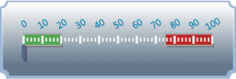
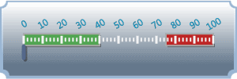
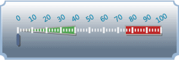

# Ranges

Ranges can be used to highlight a value range of interest, and can be included by adding an instance of [LinearRange](xref:ActiproSoftware.Windows.Controls.Gauge.LinearRange) to the [LinearTickSet](xref:ActiproSoftware.Windows.Controls.Gauge.LinearTickSet).[Ranges](xref:ActiproSoftware.Windows.Controls.Gauge.LinearTickSet.Ranges) collection.

*A LinearGauge with two ranges, one shown in green and one in red*

## Value Range

The area covered by a range is controled using the [StartValue](xref:ActiproSoftware.Windows.Controls.Gauge.Primitives.RangeBase.StartValue) and [EndValue](xref:ActiproSoftware.Windows.Controls.Gauge.Primitives.RangeBase.EndValue) properties.

*A LinearGauge with the green range updated to span from 0 to 40*

## Appearance

There are several properties that control the appearance of the range.

### Colors/Brushes

There are two brushes used by the range: [Background](xref:ActiproSoftware.Windows.Controls.Gauge.Primitives.RangeBase.Background) and [BorderBrush](xref:ActiproSoftware.Windows.Controls.Gauge.Primitives.RangeBase.BorderBrush). The [BorderBrush](xref:ActiproSoftware.Windows.Controls.Gauge.Primitives.RangeBase.BorderBrush) property is only used when the [BorderWidth](xref:ActiproSoftware.Windows.Controls.Gauge.Primitives.RangeBase.BorderWidth) property is greater than `0`.

### Ascents

Ranges can be configured to use the same ascent for their entire length, or they can be used to produce slopes. Using the [StartAscent](xref:ActiproSoftware.Windows.Controls.Gauge.LinearRange.StartAscent) and [EndAscent](xref:ActiproSoftware.Windows.Controls.Gauge.LinearRange.EndAscent) properties, you can create a range with a varying thickness.

*A LinearGauge with the green start ascent updated to 0*

## Scale Placement

Ranges are positioned relative to the scale bar defined by the associated [LinearScale](xref:ActiproSoftware.Windows.Controls.Gauge.LinearScale) element. By default, ranges will be overlayed and centered on the scale bar. The placement of the range can be altered using the [ScalePlacement](xref:ActiproSoftware.Windows.Controls.Gauge.Primitives.RangeBase.ScalePlacement) and [ScaleOffset](xref:ActiproSoftware.Windows.Controls.Gauge.Primitives.RangeBase.ScaleOffset) properties.

There are three possible values for the [ScalePlacement](xref:ActiproSoftware.Windows.Controls.Gauge.Primitives.RangeBase.ScalePlacement) property:

| Value | Description |
|-----|-----|
| `Inside` | Indicates that the range will be placed below, when oriented horizontally, or to the left, when oriented vertically, of the scale bar. The outer edge of the range will be aligned with the inner edge of the scale bar. |
| `Outside` | Indicates that the range will be placed above, when oriented horizontally, or to the right, when oriented vertically, of the scale bar. The inner edge of the range will be aligned with the outer edge of the scale bar. |
| `Overlay` | Indicates that the range will be centered over (or on top) of the scale bar. The center line of the range will be aligned with the center line of the scale bar. |

In addition to the placement, the [ScaleOffset](xref:ActiproSoftware.Windows.Controls.Gauge.Primitives.RangeBase.ScaleOffset) can be used to further customize the location of the range.
