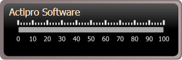

# Scales

[LinearScale](xref:ActiproSoftware.Windows.Controls.Gauge.LinearScale) is used to control the overall layout of tick marks, tick labels, pointers, and ranges, as well render an optional scale bar.

*A LinearGauge with one scale with a gray scale bar*

## Scale Bar

The scale bar is rendered by the [LinearScale](xref:ActiproSoftware.Windows.Controls.Gauge.LinearScale) element as a continuous band. The scale bar is also used as a basis for the placement of child elements, such as the tick marks.

The extent of the scale bar is controlled by the [BarExtent](xref:ActiproSoftware.Windows.Controls.Gauge.Primitives.ScaleBase.BarExtent) property. Depending on the orientation of the gauge, the extent refers to either the width (oriented horizontally) or the height (oriented vertically) of the bar.

In addition, the ascent of the scale bar can be altered using the [BarAscent](xref:ActiproSoftware.Windows.Controls.Gauge.LinearScale.BarAscent) property. The scale bar can also be hidden completely by setting [IsBarVisible](xref:ActiproSoftware.Windows.Controls.Gauge.Primitives.ScaleBase.IsBarVisible) to `false`.

## Range of Motion

The range of motion for all the child elements follow the associated scale bar.
