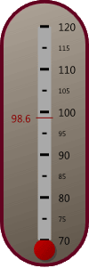

# Tick Marks and Labels

Tick marks and tick labels can be included and make it easier to visually determine the current value of a pointer.

*A LinearGauge with various tick marks and tick labels*

## Tick Marks

Tick marks are indicators or shapes rendered at a given interval along a value range. Both the interval and the value range are defined on the associated [LinearTickSet](xref:@ActiproUIRoot.Controls.Gauge.LinearTickSet) element. See the [Tick Sets](tick-sets.md) topic for more information.

There are three types of tick marks: major, minor, and custom.

### Major Tick Marks

Major tick marks are rendered at the [MajorInterval](xref:@ActiproUIRoot.Controls.Gauge.Primitives.TickSetBase.MajorInterval) specified on the associated [LinearTickSet](xref:@ActiproUIRoot.Controls.Gauge.LinearTickSet). By default, major tick marks are larger than minor tick marks.

*A LinearGauge with the major tick marks highlighted*

Major tick marks can be included by adding an instance of [LinearTickMarkMajor](xref:@ActiproUIRoot.Controls.Gauge.LinearTickMarkMajor) to the [LinearTickSet](xref:@ActiproUIRoot.Controls.Gauge.LinearTickSet).[Ticks](xref:@ActiproUIRoot.Controls.Gauge.LinearTickSet.Ticks) collection. A single instance of [LinearTickMarkMajor](xref:@ActiproUIRoot.Controls.Gauge.LinearTickMarkMajor) is typically used to render all of the major tick marks.

Which tick marks are rendered by an instance of [LinearTickMarkMajor](xref:@ActiproUIRoot.Controls.Gauge.LinearTickMarkMajor) can be restricted using the following properties:

| Property | Description |
|-----|-----|
| [EndValue](xref:@ActiproUIRoot.Controls.Gauge.LinearTickMarkMajor.EndValue) | Specifies the last (or largest) value that should be rendered by the element. Set to `Double.NaN` to specify that there is no end value. |
| [MaximumTickVisibility](xref:@ActiproUIRoot.Controls.Gauge.LinearTickMarkMajor.MaximumTickVisibility) | Specifies when the tick mark for the maximum value should be rendered. |
| [MinimumTickVisibility](xref:@ActiproUIRoot.Controls.Gauge.LinearTickMarkMajor.MinimumTickVisibility) | Specifies when the tick mark for the minimum value should be rendered. |
| [SkipValues](xref:@ActiproUIRoot.Controls.Gauge.LinearTickMarkMajor.SkipValues) | Specifies zero or more specific values that should not be rendered. |
| [StartValue](xref:@ActiproUIRoot.Controls.Gauge.LinearTickMarkMajor.StartValue) | Specifies the first (or smallest) value that should be rendered by the element. Set to `Double.NaN` to specify that there is no start value. |

> [!TIP]
> You can use multiple instances of [LinearTickMarkMajor](xref:@ActiproUIRoot.Controls.Gauge.LinearTickMarkMajor) to show tick marks in a specific range using a unique look.
>
> Using the images above as an example, one instance could be set to use a black background (as shown) and have an end value of `90`. A second instance could be set to use a red background and have a start value of `100`.

### Minor Tick Marks

Minor tick marks are rendered at the [MinorInterval](xref:@ActiproUIRoot.Controls.Gauge.Primitives.TickSetBase.MinorInterval) specified on the associated [LinearTickSet](xref:@ActiproUIRoot.Controls.Gauge.LinearTickSet). Additionally, minor tick marks are *not* rendered when they fall on the major interval.

*A LinearGauge with the minor tick marks highlighted*

Minor tick marks can be included by adding an instance of [LinearTickMarkMinor](xref:@ActiproUIRoot.Controls.Gauge.LinearTickMarkMinor) to the [LinearTickSet](xref:@ActiproUIRoot.Controls.Gauge.LinearTickSet).[Ticks](xref:@ActiproUIRoot.Controls.Gauge.LinearTickSet.Ticks) collection. A single instance of [LinearTickMarkMinor](xref:@ActiproUIRoot.Controls.Gauge.LinearTickMarkMinor) is typically used to render all of the minor tick marks.

Which tick marks are rendered by an instance of [LinearTickMarkMinor](xref:@ActiproUIRoot.Controls.Gauge.LinearTickMarkMinor) can be restricted using the following properties:

| Property | Description |
|-----|-----|
| [EndValue](xref:@ActiproUIRoot.Controls.Gauge.LinearTickMarkMinor.EndValue) | Specifies the last (or largest) value that should be rendered by the element. Set to `Double.NaN` to specify that there is no end value. |
| [SkipValues](xref:@ActiproUIRoot.Controls.Gauge.LinearTickMarkMinor.SkipValues) | Specifies zero or more specific values that should not be rendered. |
| [StartValue](xref:@ActiproUIRoot.Controls.Gauge.LinearTickMarkMinor.StartValue) | Specifies the first (or smallest) value that should be rendered by the element. Set to `Double.NaN` to specify that there is no start value. |

> [!TIP]
> You can use multiple instances of [LinearTickMarkMinor](xref:@ActiproUIRoot.Controls.Gauge.LinearTickMarkMinor) to show tick marks in a specific range using a unique look.
>
> Using the images above as an example, one instance could be set to use a black background (as shown) and have an end value of `95`. A second instance could be set to use a red background and have a start value of `105`.

### Custom Tick Marks

When the major and minor tick marks do not offer enough customization, custom tick marks may be used. Custom tick marks can be placed at a specific value (shown at value `98.6` in the images above) by setting the [Value](xref:@ActiproUIRoot.Controls.Gauge.LinearTickMarkCustom.Value) property. Just like the major and minor tick marks, the look of the custom tick marks can be fully customized.

## Tick Labels

Tick labels are textual representations of a value rendered at a given interval along a value range. Both the interval and the value range are defined on the associated [LinearTickSet](xref:@ActiproUIRoot.Controls.Gauge.LinearTickSet) element. See the [Tick Sets](tick-sets.md) topic for more information.

There are three types of tick labels: major, minor, and custom.

### Major Tick Labels

Major tick labels are rendered at the [MajorInterval](xref:@ActiproUIRoot.Controls.Gauge.Primitives.TickSetBase.MajorInterval) specified on the associated [LinearTickSet](xref:@ActiproUIRoot.Controls.Gauge.LinearTickSet).

*A LinearGauge with the major tick labels highlighted*

Major tick labels can be included by adding an instance of [LinearTickLabelMajor](xref:@ActiproUIRoot.Controls.Gauge.LinearTickLabelMajor) to the [LinearTickSet](xref:@ActiproUIRoot.Controls.Gauge.LinearTickSet).[Ticks](xref:@ActiproUIRoot.Controls.Gauge.LinearTickSet.Ticks) collection. A single instance of [LinearTickLabelMajor](xref:@ActiproUIRoot.Controls.Gauge.LinearTickLabelMajor) is typically used to render all of the major tick labels.

Which tick labels are rendered by an instance of [LinearTickLabelMajor](xref:@ActiproUIRoot.Controls.Gauge.LinearTickLabelMajor) can be restricted using the following properties:

| Property | Description |
|-----|-----|
| [EndValue](xref:@ActiproUIRoot.Controls.Gauge.LinearTickLabelMajor.EndValue) | Specifies the last (or largest) value that should be rendered by the element. Set to `Double.NaN` to specify that there is no end value. |
| [MaximumTickVisibility](xref:@ActiproUIRoot.Controls.Gauge.LinearTickLabelMajor.MaximumTickVisibility) | Specifies when the tick label for the maximum value should be rendered. |
| [MinimumTickVisibility](xref:@ActiproUIRoot.Controls.Gauge.LinearTickLabelMajor.MinimumTickVisibility) | Specifies when the tick label for the minimum value should be rendered. |
| [SkipValues](xref:@ActiproUIRoot.Controls.Gauge.LinearTickLabelMajor.SkipValues) | Specifies zero or more specific values that should not be rendered. |
| [StartValue](xref:@ActiproUIRoot.Controls.Gauge.LinearTickLabelMajor.StartValue) | Specifies the first (or smallest) value that should be rendered by the element. Set to `Double.NaN` to specify that there is no start value. |

> [!TIP]
> You can use multiple instances of [LinearTickLabelMajor](xref:@ActiproUIRoot.Controls.Gauge.LinearTickLabelMajor) to show tick labels in a specific range using a unique look.
>
> Using the images above as an example, one instance could be set to use a black foreground (as shown) and have an end value of `90`. A second instance could be set to use a red foreground and have a start value of `100`.

### Minor Tick Labels

Minor tick labels are rendered at the [MinorInterval](xref:@ActiproUIRoot.Controls.Gauge.Primitives.TickSetBase.MinorInterval) specified on the associated [LinearTickSet](xref:@ActiproUIRoot.Controls.Gauge.LinearTickSet). Additionally, minor tick labels are *not* rendered when they fall on the major interval.

*A LinearGauge with the minor tick labels highlighted*

Minor tick labels can be included by adding an instance of [LinearTickLabelMinor](xref:@ActiproUIRoot.Controls.Gauge.LinearTickLabelMinor) to the [LinearTickSet](xref:@ActiproUIRoot.Controls.Gauge.LinearTickSet).[Ticks](xref:@ActiproUIRoot.Controls.Gauge.LinearTickSet.Ticks) collection. A single instance of [LinearTickLabelMinor](xref:@ActiproUIRoot.Controls.Gauge.LinearTickLabelMinor) is typically used to render all of the minor tick labels.

Which tick labels are rendered by an instance of [LinearTickLabelMinor](xref:@ActiproUIRoot.Controls.Gauge.LinearTickLabelMinor) can be restricted using the following properties:

| Property | Description |
|-----|-----|
| [EndValue](xref:@ActiproUIRoot.Controls.Gauge.LinearTickLabelMinor.EndValue) | Specifies the last (or largest) value that should be rendered by the element. Set to `Double.NaN` to specify that there is no end value. |
| [SkipValues](xref:@ActiproUIRoot.Controls.Gauge.LinearTickLabelMinor.SkipValues) | Specifies zero or more specific values that should not be rendered. |
| [StartValue](xref:@ActiproUIRoot.Controls.Gauge.LinearTickLabelMinor.StartValue) | Specifies the first (or smallest) value that should be rendered by the element. Set to `Double.NaN` to specify that there is no start value. |

> [!TIP]
> You can use multiple instances of [LinearTickLabelMinor](xref:@ActiproUIRoot.Controls.Gauge.LinearTickLabelMinor) to show tick labels in a specific range using a unique look.
>
> Using the images above as an example, one instance could be set to use a black foreground (as shown) and have an end value of `95`. A second instance could be set to use a red foreground and have a start value of `105`.

### Custom Tick Labels

When the major and minor tick labels do not offer enough customization, custom tick labels may be used. Custom tick labels can be placed at a specific value (shown at value `98.6` in the images above) by setting the [Value](xref:@ActiproUIRoot.Controls.Gauge.LinearTickLabelCustom.Value) property. Additionally, the text displayed by the custom label can be specified using the [Text](xref:@ActiproUIRoot.Controls.Gauge.LinearTickLabelCustom.Text) property. Just like the major and minor tick labels, the look of the custom tick labels can be fully customized.

### Rounding and Text Format

By default, the tick labels will round the associated value(s) to the nearest whole number and convert that to a string, which is displayed on the gauge. Both the method of rounding and the text format can be customized using the [RoundMode](xref:@ActiproUIRoot.Controls.Gauge.Primitives.LinearTickLabelBase.RoundMode) and [TextFormat](xref:@ActiproUIRoot.Controls.Gauge.Primitives.LinearTickLabelBase.TextFormat) properties, respectively.

The rounding used is specified using the [RoundMode](xref:@ActiproUIRoot.Controls.RoundMode) enumeration, which offers several rounding methods.  See the [PixelSnapper](../../shared/windows-controls/pixelsnapper.md) topic for more information on the various round modes.

The format is used to convert `double` values to a string using the `String.Format` method, which uses the associated value as the only input parameter (e.g., `"{0}"`).

## Scale Placement

Tick marks and tick labels are positioned relative to the scale bar defined by the associated [LinearScale](xref:@ActiproUIRoot.Controls.Gauge.LinearScale) element. By default, the ticks will be overlayed and centered on the scale bar. The placement of the ticks can be altered using the [ScalePlacement](xref:@ActiproUIRoot.Controls.Gauge.Primitives.TickBase.ScalePlacement) and [ScaleOffset](xref:@ActiproUIRoot.Controls.Gauge.Primitives.TickBase.ScaleOffset) properties.

There are three possible values for the [ScalePlacement](xref:@ActiproUIRoot.Controls.Gauge.Primitives.TickBase.ScalePlacement) property:

| Value | Description |
|-----|-----|
| `Inside` | Indicates that the tick will be placed below, when oriented horizontally, or to the left, when oriented vertically, of the scale bar. The outer edge of the tick will be aligned with the inner edge of the scale bar. |
| `Outside` | Indicates that the tick will be placed above, when oriented horizontally, or to the right, when oriented vertically, of the scale bar. The inner edge of the tick will be aligned with the outer edge of the scale bar. |
| `Overlay` | Indicates that the tick will be centered over (or on top) of the scale bar. The center line of the tick will be aligned with the center line of the scale bar. |

In addition to the placement, the [ScaleOffset](xref:@ActiproUIRoot.Controls.Gauge.Primitives.TickBase.ScaleOffset) can be used to further customize the location of the ticks.
