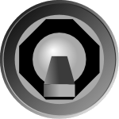
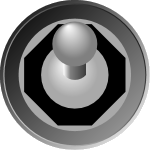
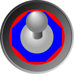
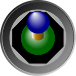
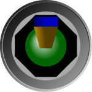

# Switch

[ToggleSwitch](xref:ActiproSoftware.Windows.Controls.Gauge.ToggleSwitch) supports two or three check states, and includes several options for customizing the look of the switch.

## Checked State

The `ToggleSwitch` mimics most of the functionality found in the native WPF `ToggleButton`, such as the [IsChecked](xref:ActiproSoftware.Windows.Controls.Gauge.ToggleSwitch.IsChecked) and [IsThreeState](xref:ActiproSoftware.Windows.Controls.Gauge.ToggleSwitch.IsThreeState) properties.

The [IsChecked](xref:ActiproSoftware.Windows.Controls.Gauge.ToggleSwitch.IsChecked) property determines the position of the switch (up for `true`, down for `false`, or in the middle for `null`). By default, only `true` and `false` are supported, but if [IsThreeState](xref:ActiproSoftware.Windows.Controls.Gauge.ToggleSwitch.IsThreeState) is set to `true` then `null` (or indeterminate) is also supported.

*Two ToggleSwitch controls with one checked (left) and one unchecked (right)*

When animating from one state to another, the [SwitchInterval](xref:ActiproSoftware.Windows.Controls.Gauge.ToggleSwitch.SwitchInterval) determines how long it takes the switch to travel to the new location.

## Appearance

### Switch Type

There are two switch types supported (circular and flat), which can be specified using the [SwitchType](xref:ActiproSoftware.Windows.Controls.Gauge.ToggleSwitch.SwitchType) property.

*Two ToggleSwitch controls with a flat switch (left) and one with a circular switch (right)*

### Switch Size

The size of the switch is control by the [SwitchRadiusRatio](xref:ActiproSoftware.Windows.Controls.Gauge.ToggleSwitch.SwitchRadiusRatio) property, which is defined as a percentage of the [Radius](xref:ActiproSoftware.Windows.Controls.Gauge.Primitives.CircularGaugeBase.Radius).

### Brush and Effect

The switch can be broken down into two different parts; the base of the switch and then the switch itself. The brushed used for each part can be customized independenty.

The base color can be customized by setting the [BaseBackground](xref:ActiproSoftware.Windows.Controls.Gauge.ToggleSwitch.BaseBackground) property. Additionally, the accent color (the octagon) can be customized by setting the [BaseAccentBrush](xref:ActiproSoftware.Windows.Controls.Gauge.ToggleSwitch.BaseAccentBrush) property.

*ToggleSwitch with the base in red and the base accent in blue*

The actual switch is made up of a ball, shaft, and a tip. The colors from these elements can be customized using [BallBrush](xref:ActiproSoftware.Windows.Controls.Gauge.ToggleSwitch.BallBrush), [ShaftBrush](xref:ActiproSoftware.Windows.Controls.Gauge.ToggleSwitch.ShaftBrush), and [TipBrush](xref:ActiproSoftware.Windows.Controls.Gauge.ToggleSwitch.TipBrush) respectively.

*Two ToggleSwitch control, one circular and one flat, with a green ball, yellow shaft, and blue tip*

The switch includes an effect that can be disabled by setting [IsSwitchEffectEnabled](xref:ActiproSoftware.Windows.Controls.Gauge.ToggleSwitch.IsSwitchEffectEnabled) to `false`.

> [!NOTE]
> The led effect is only supported when [IsSwitchEffectEnabled](xref:ActiproSoftware.Windows.Controls.Gauge.ToggleSwitch.IsSwitchEffectEnabled) is set to `true`**and** the associated brush is set to a `SolidColorBrush`.
