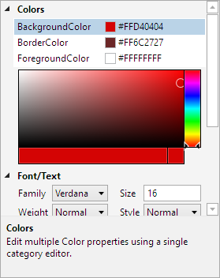

# Category Editors

Category editors provide a way to consume several properties within a category and provide a custom user interface for them.



*A property grid showing a category editor*

## Defining a Category Editor

The [CategoryEditor](xref:@ActiproUIRoot.Controls.Grids.PropertyEditors.CategoryEditor) class represents a category editor.  Add each [CategoryEditor](xref:@ActiproUIRoot.Controls.Grids.PropertyEditors.CategoryEditor) instance that should be active to the [PropertyGrid](xref:@ActiproUIRoot.Controls.Grids.PropertyGrid).[CategoryEditors](xref:@ActiproUIRoot.Controls.Grids.PropertyGrid.CategoryEditors) collection.

Category editors consist of three main aspects:

- Standard display properties like [Category](xref:@ActiproUIRoot.Controls.Grids.PropertyEditors.CategoryEditor.Category) (the category that the category editor should fall under), [DisplayName](xref:@ActiproUIRoot.Controls.Grids.PropertyEditors.CategoryEditor.DisplayName), and [Description](xref:@ActiproUIRoot.Controls.Grids.PropertyEditors.CategoryEditor.Description).

- A [Properties](xref:@ActiproUIRoot.Controls.Grids.PropertyEditors.CategoryEditor.Properties) collection of [CategoryEditorProperty](xref:@ActiproUIRoot.Controls.Grids.PropertyEditors.CategoryEditorProperty) objects that are the properties to be consumed.

- Editor `DataTemplate` selection properties like [EditorTemplate](xref:@ActiproUIRoot.Controls.Grids.PropertyEditors.CategoryEditor.EditorTemplate) and [EditorTemplateKey](xref:@ActiproUIRoot.Controls.Grids.PropertyEditors.CategoryEditor.EditorTemplateKey).  The `DataTemplate` provides the user interface for the collection editor.

The [Category](xref:@ActiproUIRoot.Controls.Grids.PropertyEditors.CategoryEditor.Category) property indicates which category the editor should be under.

> [!NOTE]
> If the category associated with a `CategoryEditor` is not used, then the category editor will not be used.

Properties to be consumed by a category editor are defined in the [Properties](xref:@ActiproUIRoot.Controls.Grids.PropertyEditors.CategoryEditor.Properties) collection.  Each [CategoryEditorProperty](xref:@ActiproUIRoot.Controls.Grids.PropertyEditors.CategoryEditorProperty) object specifies the criteria used to match properties to be consumed, such as [ObjectType](xref:@ActiproUIRoot.Controls.Grids.PropertyEditors.CategoryEditorProperty.ObjectType), [PropertyName](xref:@ActiproUIRoot.Controls.Grids.PropertyEditors.CategoryEditorProperty.PropertyName), and/or [PropertyType](xref:@ActiproUIRoot.Controls.Grids.PropertyEditors.CategoryEditorProperty.PropertyType).  When a property is consumed, it is not displayed in the property grid and the category editor is responsible for presenting it.

The [data factory](data-models.md) creates an [ICategoryEditorModel](xref:@ActiproUIRoot.Controls.Grids.PropertyData.ICategoryEditorModel) whenever a category editor needs to be displayed.  This model has a [Children](xref:@ActiproUIRoot.Controls.Grids.PropertyData.IDataModel.Children) collection property that provides access to each of the consumed [IPropertyModel](xref:@ActiproUIRoot.Controls.Grids.PropertyData.IPropertyModel) objects.  The collection is enumerable and can be indexed by property name as well.  The `DataTemplate` used by a category editor can access any of the aggregated property models and their values through that collection, such as for binding to UI controls.  Although there is no requirement that a category editor allow a property to be modified.

## Example Category Editor

This code shows how category editor is used to consume all properties in a `"Colors"` category that have a return type of `Color`:

@if (winrt) {

```xaml
<grids:PropertyGrid DataObject="{Binding}">
	<grids:PropertyGrid.CategoryEditors>

		<gridsPropertyEditors:CategoryEditor Category="Colors" DisplayName="Colors" Description="Edit multiple Color properties using a single category editor.">
			<gridsPropertyEditors:CategoryEditor.Properties>
				<propEditors:CategoryEditorProperty PropertyType="Color" />
			</gridsPropertyEditors:CategoryEditor.Properties>
			<gridsPropertyEditors:CategoryEditor.EditorTemplate>
				<DataTemplate>
					<StackPanel>
						<ListBox x:Name="propertyListBox" BorderThickness="0" ItemsSource="{Binding Children}" HorizontalContentAlignment="Stretch" IsTabStop="False"
								 SelectedItem="{Binding Children[BackgroundColor]}">
							<ListBox.ItemTemplate>
								<DataTemplate>
									<Grid Margin="0,-2">
										<Grid.ColumnDefinitions>
											<ColumnDefinition Width="150" />
											<ColumnDefinition Width="Auto" />
											<ColumnDefinition Width="80" />
										</Grid.ColumnDefinitions>

										<TextBlock Text="{Binding Name}" TextTrimming="CharacterEllipsis" VerticalAlignment="Center" />

										<Grid Grid.Column="1" Margin="5,3,3,3" Height="14" Width="14" Background="#ffffff" VerticalAlignment="Center">
											<Path Margin="1" Fill="#cccccc" Data="M4,0 L8,0 L8,4 L4,4 Z  M0,4 L4,4 L4,8 L0,8 Z  M8,4 L12,4 L12,8 L8,8 Z  M4,8 L8,8 L8,12 L4,12 Z" />

											<Border BorderThickness="1" BorderBrush="#808080">
												<Border.Background>
													<SolidColorBrush Color="{Binding Value}" />
												</Border.Background>
											</Border>
										</Grid>

										<TextBlock Grid.Column="2" Text="{Binding ValueAsString}" TextTrimming="CharacterEllipsis" VerticalAlignment="Center" />
									</Grid>
								</DataTemplate>
							</ListBox.ItemTemplate>
						</ListBox>

						<editors:ColorPicker Margin="6,3" Value="{Binding ElementName=propertyListBox, Path=SelectedItem.Value, Mode=TwoWay}">
							<editors:ColorPicker.Template>
								<ControlTemplate TargetType="editors:ColorPicker">
									<editors:HsbColorPicker A="{Binding RelativeSource={RelativeSource TemplatedParent}, Path=A, Mode=OneWay}"
															Hue="{Binding RelativeSource={RelativeSource TemplatedParent}, Path=Hue, Mode=TwoWay}"
															Saturation="{Binding RelativeSource={RelativeSource TemplatedParent}, Path=Saturation, Mode=TwoWay}"
															Brightness="{Binding RelativeSource={RelativeSource TemplatedParent}, Path=Brightness, Mode=TwoWay}"
															/>
								</ControlTemplate>
							</editors:ColorPicker.Template>
						</editors:ColorPicker>
					</StackPanel>
				</DataTemplate>
			</gridsPropertyEditors:CategoryEditor.EditorTemplate>
		</gridsPropertyEditors:CategoryEditor>

	</grids:PropertyGrid.CategoryEditors>
</grids:PropertyGrid>
```

}

@if (wpf) {

```xaml
<grids:PropertyGrid DataObject="{Binding}">
	<grids:PropertyGrid.CategoryEditors>

		<grids:CategoryEditor Category="Colors" DisplayName="Colors" Description="Edit multiple Color properties using a single category editor.">
			<grids:CategoryEditor.Properties>
				<grids:CategoryEditorProperty PropertyType="Color" />
			</grids:CategoryEditor.Properties>
			<grids:CategoryEditor.EditorTemplate>
				<DataTemplate>
					<StackPanel>
						<ListBox x:Name="propertyListBox" BorderThickness="0" ItemsSource="{Binding Children}" SelectedIndex="0" HorizontalContentAlignment="Stretch" IsTabStop="False">
							<ListBox.ItemTemplate>
								<DataTemplate>
									<Grid Margin="0,-2">
										<Grid.ColumnDefinitions>
											<ColumnDefinition Width="*" />
											<ColumnDefinition Width="Auto" />
											<ColumnDefinition Width="*" />
										</Grid.ColumnDefinitions>

										<TextBlock Text="{Binding Name}" TextTrimming="CharacterEllipsis" VerticalAlignment="Center" />

										<Grid Grid.Column="1" Margin="5,3,3,3" Height="14" Width="14" Background="#ffffff" VerticalAlignment="Center">
											<Path Margin="1" Fill="#cccccc" Data="M4,0 L8,0 L8,4 L4,4 Z  M0,4 L4,4 L4,8 L0,8 Z  M8,4 L12,4 L12,8 L8,8 Z  M4,8 L8,8 L8,12 L4,12 Z" />

											<Border BorderThickness="1" BorderBrush="{DynamicResource {x:Static themes:AssetResourceKeys.BulletBorderDisabledBrushKey}}" SnapsToDevicePixels="True">
												<Border.Background>
													<SolidColorBrush Color="{Binding Value}" />
												</Border.Background>
											</Border>
										</Grid>

										<TextBlock Grid.Column="2" Text="{Binding ValueAsString}" TextTrimming="CharacterEllipsis" VerticalAlignment="Center" />
									</Grid>
								</DataTemplate>
							</ListBox.ItemTemplate>
						</ListBox>

						<shared:SpectrumColorPicker Margin="6,3" Width="Auto" Height="120" IsInitialColorVisible="False"
							SelectedColor="{Binding ElementName=propertyListBox, Path=SelectedItem.Value, Mode=TwoWay}" />
					</StackPanel>
				</DataTemplate>
			</grids:CategoryEditor.EditorTemplate>
		</grids:CategoryEditor>

	</grids:PropertyGrid.CategoryEditors>
</grids:PropertyGrid>
```

}
