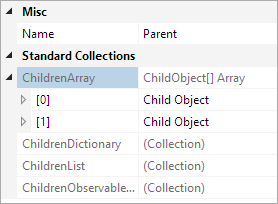
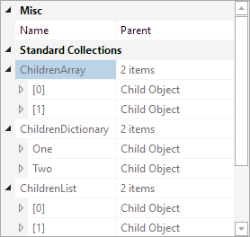
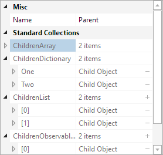

# Collections

The property grid supports inline collection display and even editing in some cases.

## Collection Property Display Mode

@if (winrt) {

By default, collections are simply displayed without expansion or inline editing support.  The [PropertyGrid](xref:@ActiproUIRoot.Controls.Grids.PropertyGrid).[CollectionPropertyDisplayMode](xref:@ActiproUIRoot.Controls.Grids.PropertyGrid.CollectionPropertyDisplayMode) property can be used to override this behavior.

}

@if (wpf) {

By default, collections are simply displayed using their associated type converter.  Out of the box, only the type converter for arrays (`ArrayConverter`) allows expansion.  The default type converter used for other collection types, such as lists and dictionaries, does not allow expansion.  The [PropertyGrid](xref:@ActiproUIRoot.Controls.Grids.PropertyGrid).[CollectionPropertyDisplayMode](xref:@ActiproUIRoot.Controls.Grids.PropertyGrid.CollectionPropertyDisplayMode) property can be used to override this behavior.

}

*A property grid showing several collections using Default*

If [PropertyGrid](xref:@ActiproUIRoot.Controls.Grids.PropertyGrid).[CollectionPropertyDisplayMode](xref:@ActiproUIRoot.Controls.Grids.PropertyGrid.CollectionPropertyDisplayMode) is set to `Expandable`, the type converter for supported collection types will be overridden to allow expansion.  In addition, the item count of the collection is used when converting a collection to a string (as seen in the following image).

*A property grid showing several collections using Expandable*

`EditableInline` works exactly like `Expandable` but adds inline editing buttons for collections that support them.

*A property grid showing several collections using EditableInline*

## Collection TypeConverter

When `CollectionDisplayMode` property is set to `Default` (which is the default value), collections with continue to use their default type converters.  If this property is changed to `Expandable` or `EditableInline`, then the default collection type converters will be overridden/replaced.

When using `Expandable` or `EditableInline`, the built-in data factory will check for properties that implement `ICollection`, `IList`, `IDictionary`, and their generic variations.  When a collection property is encountered, it is represented using [CollectionPropertyDescriptorPropertyModel](xref:@ActiproUIRoot.Controls.Grids.PropertyData.CollectionPropertyDescriptorPropertyModel) instead of [PropertyDescriptorPropertyModel](xref:@ActiproUIRoot.Controls.Grids.PropertyData.PropertyDescriptorPropertyModel).

@if (winrt) {

The [CollectionPropertyDescriptorPropertyModel](xref:@ActiproUIRoot.Controls.Grids.PropertyData.CollectionPropertyDescriptorPropertyModel) will call its virtual [CreateExpandableCollectionConverter](xref:@ActiproUIRoot.Controls.Grids.PropertyData.CollectionPropertyDescriptorPropertyModel.CreateExpandableCollectionConverter*) method and will use the type converter that is returned.  By default, an instance of [ExpandableCollectionConverter](xref:@ActiproUIRoot.Controls.Grids.PropertyData.ExpandableCollectionConverter) is returned.

}

@if (wpf) {

[CollectionPropertyDescriptorPropertyModel](xref:@ActiproUIRoot.Controls.Grids.PropertyData.CollectionPropertyDescriptorPropertyModel) overrides the type converter of the collection, when it is one of the known default types.  These types include:

- TypeConverter
- ArrayConverter
- CollectionConverter
- ReferenceConverter

 If the collection uses one of these type converters, then the [CollectionPropertyDescriptorPropertyModel](xref:@ActiproUIRoot.Controls.Grids.PropertyData.CollectionPropertyDescriptorPropertyModel) will call its virtual [CreateExpandableCollectionConverter](xref:@ActiproUIRoot.Controls.Grids.PropertyData.CollectionPropertyDescriptorPropertyModel.CreateExpandableCollectionConverter*) method and will use the type converter that is returned.  By default, an instance of [ExpandableCollectionConverter](xref:@ActiproUIRoot.Controls.Grids.PropertyData.ExpandableCollectionConverter) is returned.

}

[ExpandableCollectionConverter](xref:@ActiproUIRoot.Controls.Grids.PropertyData.ExpandableCollectionConverter) supports expanding any object that implements `ICollection`, `IList`, `IDictionary`, and their generic variations.  If more control is required over the generation of the sub-items, a derivation of `ExpandableCollectionConverter` can be created to customize the behavior/look.

## Related Events

There are several [PropertyGrid](xref:@ActiproUIRoot.Controls.Grids.PropertyGrid) events that are raised before and after a child is added or removed, which are: [ChildPropertyAdding](xref:@ActiproUIRoot.Controls.Grids.PropertyGrid.ChildPropertyAdding), [ChildPropertyAdded](xref:@ActiproUIRoot.Controls.Grids.PropertyGrid.ChildPropertyAdded), [ChildPropertyRemoving](xref:@ActiproUIRoot.Controls.Grids.PropertyGrid.ChildPropertyRemoving), and [ChildPropertyRemoved](xref:@ActiproUIRoot.Controls.Grids.PropertyGrid.ChildPropertyRemoved).

The [PropertyModelChildChangeEventArgs](xref:@ActiproUIRoot.Controls.Grids.PropertyModelChildChangeEventArgs) event arguments class used for the [ChildPropertyAdding](xref:@ActiproUIRoot.Controls.Grids.PropertyGrid.ChildPropertyAdding) and [ChildPropertyAdded](xref:@ActiproUIRoot.Controls.Grids.PropertyGrid.ChildPropertyAdded) events includes references to the parent [IPropertyModel](xref:@ActiproUIRoot.Controls.Grids.PropertyData.IPropertyModel) (the collection property), the child [IPropertyModel](xref:@ActiproUIRoot.Controls.Grids.PropertyData.IPropertyModel) (the item if known), and the child value being added.  The [ChildPropertyAdding](xref:@ActiproUIRoot.Controls.Grids.PropertyGrid.ChildPropertyAdding) event is raised before the item is added to the collection and the event args' `Cancel` property can be set to `true` to prevent the add.  Changing the [ChildValue](xref:@ActiproUIRoot.Controls.Grids.PropertyModelChildChangeEventArgs.ChildValue) in this event handler will also change the item being added.

The [PropertyModelChildChangeEventArgs](xref:@ActiproUIRoot.Controls.Grids.PropertyModelChildChangeEventArgs) event arguments class used for the [ChildPropertyRemoving](xref:@ActiproUIRoot.Controls.Grids.PropertyGrid.ChildPropertyRemoving) and [ChildPropertyRemoved](xref:@ActiproUIRoot.Controls.Grids.PropertyGrid.ChildPropertyRemoved) events includes references to the parent [IPropertyModel](xref:@ActiproUIRoot.Controls.Grids.PropertyData.IPropertyModel) (the collection property), the child [IPropertyModel](xref:@ActiproUIRoot.Controls.Grids.PropertyData.IPropertyModel) (the item if known), and the child value being removed.  The [ChildPropertyRemoving](xref:@ActiproUIRoot.Controls.Grids.PropertyGrid.ChildPropertyRemoving) event is raised before the item is removed from the collection and the event args' `Cancel` property can be set to `true` to prevent the remove.
