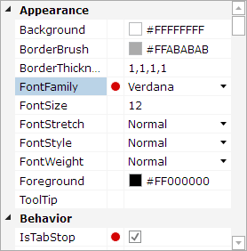

# Columns

The property grid contains two resizable columns by default (a name and a value column), and also supports custom columns.



*A custom column that shows a red dot for modified properties*

## Resizing Support

By default, the columns in the property grid are resizable within their defined bounds.  The [CanColumnsResize](xref:@ActiproUIRoot.Controls.Grids.TreeListView.CanColumnsResize) property can be set to `false` to prevent resizing.

## Default Columns and Widths

The two columns that are generated by default are the name and value columns.  The name column's cells show the display names of categories and properties, while the value column's cells provide for the display/editing of property values.

The two columns have certain width settings and restrictions configured by default.  These are intended to handle most common scenarios so that the end user never needs to resize the columns.

The name column and value column are set to use star (`*`) sizing, similar to as in a `Grid` where each one is equal width.  However, with the goals of keeping the name column cells readable and maximizing editing space in the value column cells, there are certain minimum and maximum width restrictions on each column.

The name column has a minimum width of `100` and a maximum width of [NameColumnMaxWidth](xref:@ActiproUIRoot.Controls.Grids.PropertyGrid.NameColumnMaxWidth), which defaults to `180`.  This means that the name column will always stay within the range of `100` to `180` pixels wide.  This is a good range to keep display name text visible.

The value column has a minimum width of `60` and no maximum width.

If you wish to allow the end user to make the name column larger, you can increase the value of the [NameColumnMaxWidth](xref:@ActiproUIRoot.Controls.Grids.PropertyGrid.NameColumnMaxWidth) property.  You also can examine the [Columns](xref:@ActiproUIRoot.Controls.Grids.TreeListView.Columns) collection yourself to locate the appropriate column and manually tweak any of the width values to suit your needs.

## Adding a Custom Column

It's very easy to add a custom column.  Simply initialize a new [TreeListViewColumn](xref:@ActiproUIRoot.Controls.Grids.TreeListViewColumn) object and add it to the [Columns](xref:@ActiproUIRoot.Controls.Grids.TreeListView.Columns) collection.

This code shows how to add a custom column that renders a red dot for any modified properties:

```csharp
var column = new TreeListViewColumn();
column.CellBorderThickness = new Thickness(0, 0, 1, 0);
column.CellPadding = new Thickness(3, 0, 3, 0);
column.CellTemplate = this.FindResource("IsModifiedTemplate") as DataTemplate;
column.MinWidth = 16;
column.Width = GridLength.Auto;
propGrid.Columns.Insert(1, column);

```

This code shows the `DataTemplate` referenced above:

```xaml
<BooleanToVisibilityConverter x:Key="BooleanToVisibilityConverter" />

<DataTemplate x:Key="IsModifiedTemplate">
	<Ellipse Width="12" Height="12" StrokeThickness="1" Stroke="#ffffff" Fill="#d40404" HorizontalAlignment="Center" VerticalAlignment="Center"
				Visibility="{Binding IsModified, Mode=OneWay, Converter={StaticResource BooleanToVisibilityConverter}}" ToolTip="Modified" />
</DataTemplate>
```
