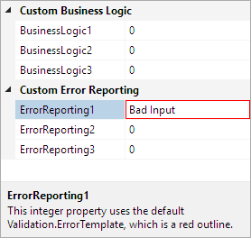
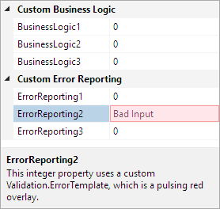

# Data Validation

The property grid supports native data validation features.

## Validation Rules

All the built-in property editors use `ExceptionValidationRule` and `DataErrorValidationRule` for data validations.  Custom validation rules can be used as well, by customizing the `Binding` statement between the property value and the associated control.

`ExceptionValidationRule` requires that the data validation be performed in the property setter method and when invalid data is encountered an exception should be thrown. This exception will be caught and handled by the `ExceptionValidationRule`.

This code shows how the input for a property is validated in the property setter:

```csharp
set {
    if (value == "BadInput")
        throw new ArgumentException("Bad input");
    this.myProperty = value;
}
```

`DataErrorValidationRule` requires that the associated object implement the `IDataErrorInfo` interface. This allows the object to provide custom data validation without using exceptions.

It is possible to add custom `ValidationRule` objects to a `Binding`, which allows the input to be validated before the underlying property is set. To use a custom `ValidationRule` with the `PropertyGrid` a new property editor must be defined, whose `Binding` includes the rule.

This code shows a custom `ValidationRule` that requires an integer value to be greater than zero:

```csharp
public class PositiveInt32ValidationRule : ValidationRule {
    public override ValidationResult Validate(object value, CultureInfo cultureInfo) {
        int i = Convert.ToInt32(value);
        if (i > 0)
            return new ValidationResult(true, null);
        else
            return new ValidationResult(false, "Value is not positive");
    }
}
```

This code shows how to use the custom `ValidationRule` in a `DataTemplate` which can be used in a property editor:

```xaml
xmlns:sample="clr-namespace:CustomRuleNamespace"
						
...

<DataTemplate x:Key="CustomTextBoxValueTemplate">
    <TextBox IsReadOnly="{Binding IsReadOnly}" Style="{StaticResource {x:Static themes:SharedResourceKeys.EmbeddedTextBoxStyleKey}}">
        <TextBox.Text>
			<Binding Path="Value" Mode="TwoWay" NotifyOnValidationError="True">
                <Binding.ValidationRules>
                    <sample:PositiveInt32ValidationRule />
                    <ExceptionValidationRule />
                </Binding.ValidationRules>
            </Binding>
        </TextBox.Text>
    </TextBox>
</DataTemplate>
```

See the [Property Editors](property-editors.md) topic for more information on using a custom `DataTemplate` in a property editor.

## Customizing the ErrorTemplate

When a validation rule reports that the data input is invalid, a visual indicator is used to indicate that there is a problem.  The visual indicator is defined by `Validation.ErrorTemplate`, which is shown in an adorner layer above the control with the offending data.  By default, the control is highlight with a red border, but this can be customized by setting the `ErrorTemplate` on the control.



*A property grid with invalid data highlight using the default ErrorTemplate*

The type of the `ErrorTemplate` property is `ControlTemplate`, and a special placement element called `AdornedElementPlaceholder` which is used to indicate the location of the associated control.

This code shows how to define a custom `ErrorTemplate` that shows a pulsing red indicator:

```xaml
<ControlTemplate x:Key="CustomValidationTemplate">
    <Grid>
        <Border IsHitTestVisible="False" Background="Pink" BorderBrush="Red" BorderThickness="1" Opacity="0.1">
            <Border.Triggers>
                <EventTrigger RoutedEvent="Control.Loaded">
                    <BeginStoryboard>
                        <Storyboard RepeatBehavior="Forever">
                            <DoubleAnimation Storyboard.TargetProperty="Opacity" From="0.1" To="0.4"
                                    DecelerationRatio="0.25" AccelerationRatio="0.25" AutoReverse="True"
                                    Duration="0:0:0.75" />
                        </Storyboard>
                    </BeginStoryboard>
                </EventTrigger>
            </Border.Triggers>
        </Border>
        <AdornedElementPlaceholder />
    </Grid>
</ControlTemplate>
```



*A PropertyGrid with invalid data highlight using a custom ErrorTemplate*

> [!TIP]
> There is known issue where the visual indicator is not hidden when the associated control is hidden, which is covered in the [Troubleshooting](../troubleshooting.md) topic.

There are two ways to associate the custom `ErrorTemplate` with a control in the `PropertyGrid`.  The first requires that a custom property editor `DataTemplate` be used (as shown above), which would have the `Validation.ErrorTemplate` set appropriately.  The second method uses a custom `Style` to set the `Validation.ErrorTemplate` property.  This can be done through a property editor or implicit styles.

## Handling Error Event

When more control is needed over the handling of invalid input, the `Validation.Error` event can be used.  This event is raised when one or more rules on a `Binding` object indicate that the data is invalid, including the `ExceptionValidationRule`.  The only requirement is that the `NotifyOnValidationError` property on the `Binding` object must be explicitly set to `true`.

Once the `Binding` is properly setup, an event handler can be defined on the `PropertyGrid`.  The event handler can then perform any action required, such as displaying an error dialog.

This code shows how to hook up an event handler for the `Validation.Error` event:

```xaml
<grids:PropertyGrid Validation.Error="OnPropertyGridValidationError">
    ...
</grids:PropertyGrid>

```
