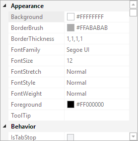

# Getting Started

It's very easy to get up and running with the [PropertyGrid](xref:@ActiproUIRoot.Controls.Grids.PropertyGrid) control.  In fact, setting a single property is often enough to start.

`PropertyGrid` is extremely customizable and allows you to alter everything from sorting, to filtering, to even the properties that are allowed to display.  Be sure to read through this and other documentation topics to learn all about the advanced capabilities property grid supports.

The various Actipro Editors [edit box](../../editors/editboxes/index.md) and [MaskedTextBox](../../editors/other-controls/maskedtextbox.md) controls can be quickly integrated with a property grid too.  These editors help provide enhanced editing features for certain .NET data types.  See the [Editors/PropertyGrid Interoperability](../../editors/interoperability/propertygrid.md) topic for more information.

## Displaying Properties of a Data Object

This code shows the base XAML that creates a simple [PropertyGrid](xref:@ActiproUIRoot.Controls.Grids.PropertyGrid) used to modify the properties of a .NET object, which is the most common usage scenario:

```xaml
<grids:PropertyGrid DataObject="{Binding YourVMProperty}" />
```

The [PropertyGrid](xref:@ActiproUIRoot.Controls.Grids.PropertyGrid).[DataObject](xref:@ActiproUIRoot.Controls.Grids.PropertyGrid.DataObject) property allows for a single data object's properties to be displayed in the control.  If multiple data objects need their common properties displayed, bind to the [DataObjects](xref:@ActiproUIRoot.Controls.Grids.PropertyGrid.DataObjects) property instead.

> [!NOTE]
> There are other ways to populate property items, such as explicitly defining them, all of which are described in the [Data Models and Factories](data-models.md) topic.

## Read-Only Display

While most property grid usage scenarios involve wanting end users to be able to alter property values, the property grid is also great for displaying property values in a read-only fashion.



*The PropertyGrid control in read-only mode*

Set the [PropertyGrid](xref:@ActiproUIRoot.Controls.Grids.PropertyGrid).[IsReadOnly](xref:@ActiproUIRoot.Controls.Grids.PropertyGrid.IsReadOnly) property to `true` to prevent any values from being changed.
