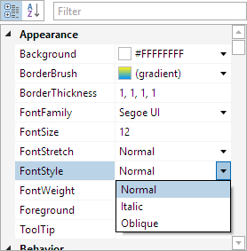

# Overview

[PropertyGrid](xref:@ActiproUIRoot.Controls.Grids.PropertyGrid) allows for all the properties of one or more objects to be displayed, optionally using categories.  Pre-defined editors for modifying properties are auto-generated based on property type, and custom property/category editors can be easily created, allowing for total customization of the property editing experience.

*The PropertyGrid control showing properties for a UI control*

The PropertyGrid control's items can be populated simply by binding to a target data object (or data objects), by adding pre-defined property models to a properties collection, or by making a custom data factory.

Several property editors are included, which leverage existing native controls for value display and editing.  Custom property or category editors can be used as well, to provide a highly-tailored presentation for your needs.

## Features

### PropertyGrid Control

- Displays a grid of all accessible properties for one or more objects, with full UI virtualization support.
- Based on TreeListView, thereby inheriting all of it and TreeListBox's UI customization features.
- Numerous built-in property editors are provided, and custom property editors can be created to customize the look and/or feel of a given property.
- Property editors can be tied to a property by name, Type, or both, which allows for all properties of a specified Type to use the same editor.
- A model-based data factory architecture allows for complete low-level customization of the property item presented.
- Explicitly-defined property models can be used in place of, or in addition to, any property models dynamically-generated by a factory.
@if (winrt) {
- Support for DisplayAttribute, EditableAttribute, and several other ComponentModel attributes.
}
@if (wpf) {
- Support for BrowsableAttribute, DisplayNameAttribute, DescriptionAttribute, and several other ComponentModel attributes.
}
@if (winrt) {
- Properties can be automatically categorized via usage of DisplayAttribute, and nested categories can be created with a special syntax.
}
@if (wpf) {
- Properties can be automatically categorized via usage of CategoryAttribute, and nested categories can be created with a special syntax.
}
- Built-in and custom filters can be used to exclude items from being displayed.
- Properties can be automatically sorted and custom sort comparers can be defined.
- Options for determining whether categories and properties are expanded by default.
- Advanced expansion and inline editing (including adding/removing items where appropriate) support for collections, lists and dictionaries.
- Ability to merge multiple objects, which means only properties common to all objects are presented.
- Support for custom category editors, which can be used to provide more complex interfaces for presenting/modifying specified properties.
- Support for expandable properties and lazy loading, which allows for cyclic references and faster load times.
@if (wpf) {
- Full support and integration with the standard platform data validation infrastructure.
}
@if (wpf) {
- Attached properties are supported and can be filtered.
}
- Includes fully customizable and resizable summary area, which shows details about the selected property item.
- Columns can be resized or customized as needed to provide a different appearance, and new columns can even be added.
- Read-only state can be used to prevent changes to items through the UI.
- Customizable built-in context menu.
- Events for property value changes and collection children add/removes.
